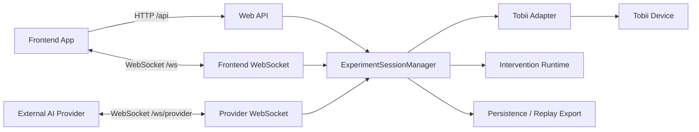
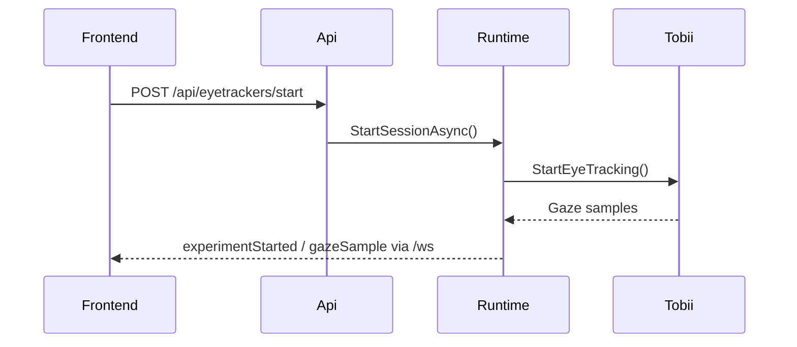

# Backend Architecture

## Purpose

The backend is the authoritative runtime for Reading the Reader. It owns:

- experiment session state
- calibration state
- reading session state
- decision configuration and proposal lifecycle
- intervention validation and application
- realtime transport to frontend clients and external providers

## Integration Surfaces

- **REST endpoints** under `/api` for explicit configuration, setup, and export operations
- **Frontend WebSocket** on `/ws` for researcher and participant realtime synchronization
- **Provider WebSocket** on `/ws/provider` for external AI decision providers

## High-Level Component Diagram

## Current Backend Layers

- `ReadingTheReader.WebApi`: transport and composition root
- `ReadingTheReader.core.Application`: orchestration and application contracts
- `ReadingTheReader.core.Domain`: domain snapshots and entities
- `ReadingTheReader.TobiiEyetracker`: hardware integration
- `ReadingTheReader.RealtimeMessenger`: WebSocket transport
- `ReadingTheReader.Realtime.Persistence`: checkpointing and replay/export storage

## Example Request Flow

## Why This Matters For Docs Consumers

Other teams should treat the backend as:

- the single source of truth for experiment state
- the place where interventions are validated and applied
- the stable boundary for frontend and external AI integrations
