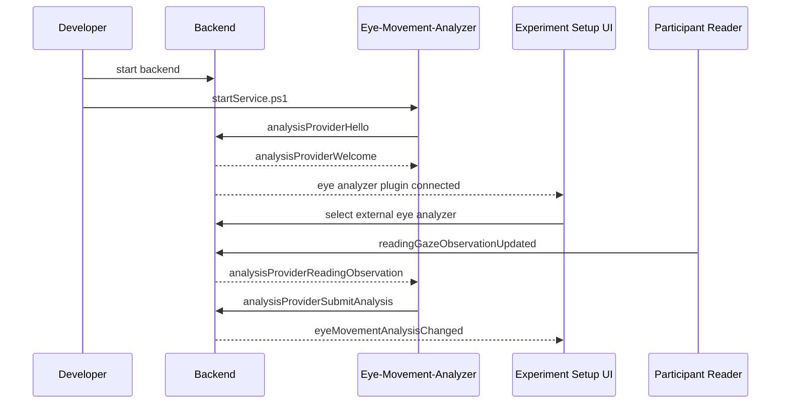

# Mock Eye Movement Analyzer

The `Eye-Movement-Analyzer/` app is a mock external fixation and saccade provider for the thesis platform. It exists to exercise the eye movement analysis provider contract without putting analyzer implementation logic inside the backend.

## What It Does

- connects to `/ws/analysis-provider`
- registers with `analysisProviderHello`
- sends `analysisProviderHeartbeat`
- consumes backend-published reading observations, gaze samples, viewport changes, and session snapshots
- derives token-level fixations and token-transition saccades from browser token-hit observations
- submits full authoritative analysis snapshots with `analysisProviderSubmitAnalysis`

## Current Rule Set

The mock analyzer mirrors the built-in backend thresholds:

| Setting | Default |
| --- | ---: |
| Initial fixation candidate | `90ms` |
| Same-line token transition | `70ms` |
| New-line token transition | `135ms` |
| Skim threshold | `45ms` |
| Fixation threshold | `130ms` |
| Observation stream stale after | `650ms` |
| Clear active fixation after | `1500ms` |

Saccades are derived from token transitions:

- same-line increasing token index: `forward`
- same-line decreasing token index: `backward`
- line increase: `line-change-forward`
- line decrease: `line-change-backward`
- otherwise: `unknown`

## Setup and Run

```powershell
cd Eye-Movement-Analyzer
python -m venv .venv
.\.venv\Scripts\activate
pip install -e .
python -m eye_movement_analyzer
```

Or use the launcher:

```powershell
.\Eye-Movement-Analyzer\scripts\startService.ps1
```

## Key Config Values

- `EYE_MOVEMENT_ANALYZER_WS_URL`
- `EYE_MOVEMENT_ANALYZER_SHARED_SECRET`
- `EYE_MOVEMENT_ANALYZER_PROVIDER_ID`
- `EYE_MOVEMENT_ANALYZER_DISPLAY_NAME`

Default local endpoint:

```text
ws://localhost:5190/ws/analysis-provider
```

Default provider id:

```text
mock-python-analysis
```

The shared secret must match backend `ExternalAnalysisProvider:SharedSecret`.

## Using It With The App



## Why It Matters

This app proves that:

- fixation and saccade analysis can live outside the backend
- backend state remains authoritative after external analysis submissions
- future teams can replace the mock analyzer without changing participant or researcher UI contracts
- the browser remains responsible only for DOM-aware token hit-testing

## Recommended Companion Pages

- [/integration/eye-movement-analysis-provider/](/integration/eye-movement-analysis-provider/)
- [/integration/provider-protocol/](/integration/provider-protocol/)
