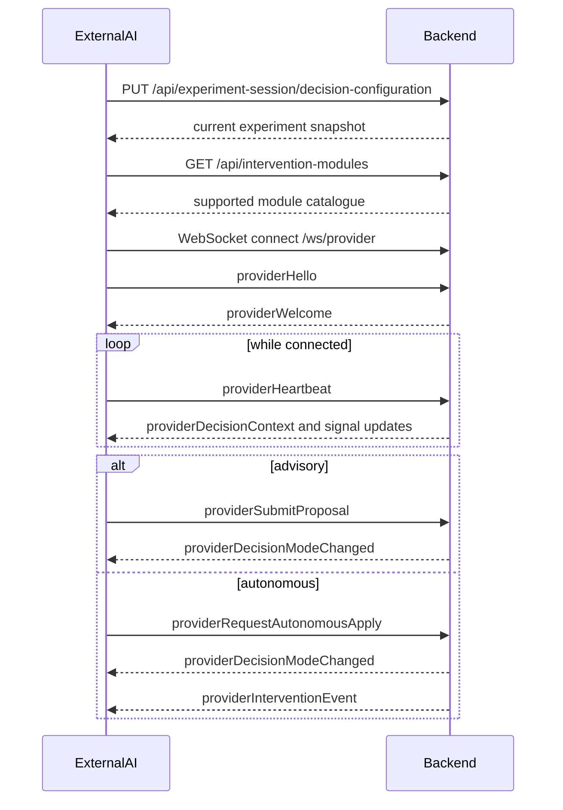

import { Callout } from 'nextra/components'

# External AI and Backend Black-Box Contract

This document defines the interface contract between the Reading the Reader backend and an external AI decision module, while keeping both systems independent from each other's internals.

<Callout type="warning">
  Treat the intervention module catalogue as an executable contract, not just descriptive metadata.
</Callout>

## What Each Side Owns

### Backend

- experiment state
- session state
- decision state
- intervention validation
- intervention application

### External AI

- signal interpretation
- decision logic
- proposal or autonomous-apply requests
- provider-side error handling

## REST Examples

### Discover supported modules

```http
GET /api/intervention-modules HTTP/1.1
Accept: application/json
```

Example response excerpt:

```json
[
  {
    "moduleId": "font-size",
    "displayName": "Font size",
    "description": "Changes the participant reading font size.",
    "group": "presentation",
    "sortOrder": 20,
    "parameters": [
      {
        "key": "fontSizePx",
        "displayName": "Font size",
        "description": "Font size in pixels for participant reading text.",
        "valueKind": "integer",
        "required": true,
        "defaultValue": "18",
        "unit": "px",
        "minValue": 14,
        "maxValue": 28,
        "step": 2,
        "options": []
      }
    ]
  }
]
```

## How To Interpret The Catalogue

### `moduleId`

- backend meaning: canonical execution identifier
- external AI meaning: exact operation id to send back

### `parameters[].key`

- backend meaning: exact required parameter key
- external AI meaning: exact key name to send in the `parameters` object

Good example:

```json
{
  "moduleId": "font-size",
  "parameters": {
    "fontSizePx": "20"
  }
}
```

Bad example:

```json
{
  "moduleId": "font-size",
  "parameters": {
    "font_size": "20"
  }
}
```

### `valueKind`

- `string`
- `integer`
- `number`
- `boolean`

The backend parses these values from strings and rejects invalid input.

### `minValue`, `maxValue`, and `step`

The backend uses these as the supported range and intended granularity. The external AI should keep its generated values inside the range and aligned with the step size.

Examples:

- `fontSizePx`: `14..28`, step `2`
- `lineWidthPx`: `520..920`, step `20`
- `lineHeight`: `1.2..2.2`, step `0.05`
- `letterSpacingEm`: `0..0.12`, step `0.01`

## Example From The Mock Decision Maker

The current built-in mock strategy is the `rule-based` decision strategy. It behaves like a minimal external AI reference implementation:

- waits until current token duration is at least `1200 ms`
- checks that focus is inside the reading area
- avoids intervening too soon after a recent intervention
- chooses `font-size`
- proposes `current font size + 2`

Concrete example:

```json
{
  "moduleId": "font-size",
  "parameters": {
    "fontSizePx": "20"
  }
}
```

Why this works:

- correct `moduleId`
- correct parameter key
- correct integer value
- respects the backend's intended step size
- stays inside allowed range

## Black-Box Sequence Diagram



## Black-Box Rules

- backend must not depend on the AI model internals
- external AI must not depend on backend implementation internals
- both sides must depend only on the published HTTP and WebSocket contracts
