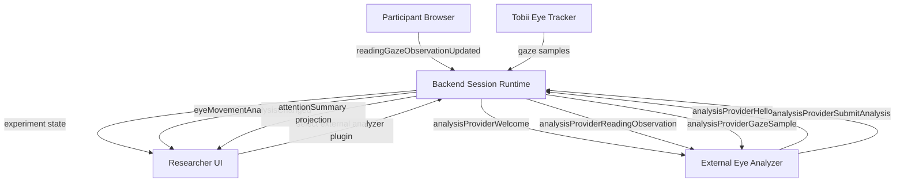
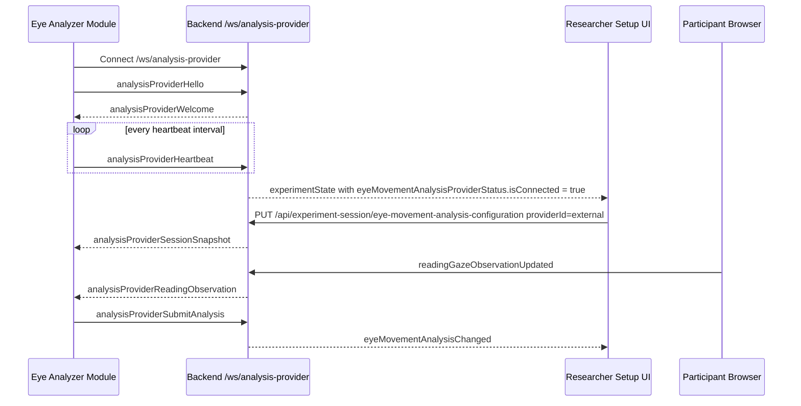
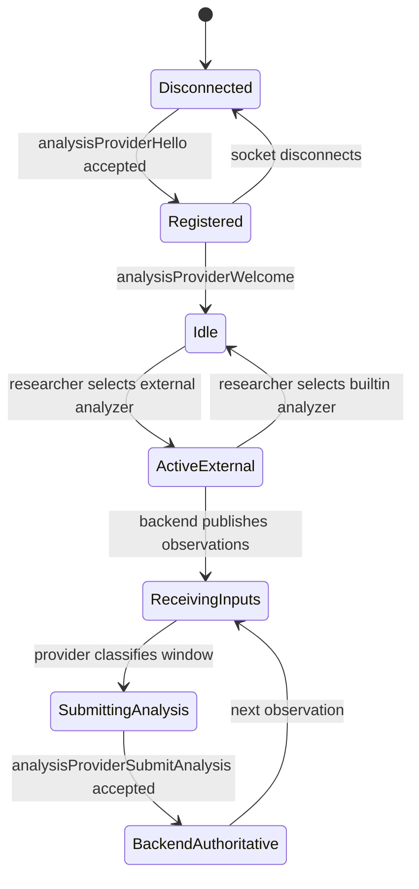

# Eye Movement Analysis Provider Modules

This page defines how to add a new external fixation and saccade analysis module to Reading the Reader.

The integration is intentionally parallel to the Decision-Maker provider contract, but it is a separate runtime boundary. Decision providers connect to `/ws/provider`; fixation and saccade analyzers connect to `/ws/analysis-provider`.

## Runtime Responsibility

The backend remains authoritative for:

- experiment session state
- active analysis provider selection
- final eye movement analysis state
- broadcasts to researcher and participant clients
- replay/export persistence of backend-owned session state
- projection into the compatibility `readingSession.attentionSummary`

An external eye analyzer is responsible only for:

- receiving backend-published gaze and reading-observation inputs
- deriving fixation, saccade, and token aggregate state
- submitting the full authoritative analysis result for an observation window

The participant browser still performs DOM-aware token hit-testing. The backend cannot infer rendered token layout from raw Tobii samples alone, so the browser sends token-hit observations to the backend first. When external analysis is selected, the backend forwards those observations to the analyzer module.

## Existing Mock Service

The repository includes a mock implementation:

```text
Eye-Movement-Analyzer/
```

It connects to `/ws/analysis-provider`, registers as `mock-python-analysis`, mirrors the built-in fixation thresholds, and submits analysis through `analysisProviderSubmitAnalysis`.

Local run path:

```powershell
.\Eye-Movement-Analyzer\scripts\startService.ps1
```

## Activation Requirements

The backend will communicate runtime analysis inputs to your module only when all of these are true:

1. Your analyzer opens a WebSocket connection to `/ws/analysis-provider`.
2. Your analyzer sends a valid `analysisProviderHello`.
3. The `authToken` matches backend `ExternalAnalysisProvider:SharedSecret`.
4. The backend accepts registration and returns `analysisProviderWelcome`.
5. The researcher selects the external eye analyzer plugin in the experiment setup flow.
6. The backend session is producing relevant gaze, viewport, or reading-observation inputs.

The selection is stored through:

```http
PUT /api/experiment-session/eye-movement-analysis-configuration
```

Request:

```json
{
  "providerId": "external"
}
```

Use `"builtin"` to return to the backend built-in analyzer.

## High-Level Flow



## Connection Sequence



## Endpoint And Authentication

WebSocket endpoint:

```text
ws://localhost:5190/ws/analysis-provider
```

Production should use `wss://<host>/ws/analysis-provider`.

Backend config:

```json
{
  "ExternalAnalysisProvider": {
    "SharedSecret": "change-me-local-analysis-provider-secret",
    "HeartbeatTimeoutMilliseconds": 15000
  }
}
```

Current runtime constraints:

- protocol version must be `analysis-provider.v1`
- only one active analysis provider may be registered at a time
- duplicate provider ids are rejected
- invalid shared secrets are rejected
- submissions are rejected unless the selected analysis provider is `external`
- submissions are rejected unless `sessionId` matches the active experiment session

## Envelope Contract

Every analysis-provider WebSocket message uses this envelope:

```json
{
  "type": "analysisProviderHello",
  "protocolVersion": "analysis-provider.v1",
  "providerId": "my-eye-analyzer",
  "sessionId": null,
  "correlationId": null,
  "sentAtUnixMs": 1710000000000,
  "payload": {}
}
```

Envelope fields:

- `type`: message type
- `protocolVersion`: currently `analysis-provider.v1`
- `providerId`: provider identity when known
- `sessionId`: active experiment session id when relevant
- `correlationId`: id used to correlate submitted analysis with a provider-side observation window
- `sentAtUnixMs`: sender-side Unix timestamp in milliseconds
- `payload`: message-specific body

## Provider To Backend Messages

### `analysisProviderHello`

Send this immediately after connecting.

```json
{
  "providerId": "my-eye-analyzer",
  "displayName": "My Eye Analyzer",
  "protocolVersion": "analysis-provider.v1",
  "authToken": "shared-secret-here"
}
```

Validation:

- `providerId` is required
- `displayName` is required
- `protocolVersion` must equal `analysis-provider.v1`
- `authToken` must match `ExternalAnalysisProvider:SharedSecret`

Backend success response:

- `analysisProviderWelcome`

Backend failure response:

- `analysisProviderError`
- connection closes

### `analysisProviderHeartbeat`

Send periodically after `analysisProviderWelcome`.

```json
{
  "providerId": "my-eye-analyzer",
  "protocolVersion": "analysis-provider.v1",
  "sentAtUnixMs": 1710000005000
}
```

Validation:

- provider must already be registered
- `providerId` must match the registered connection
- `protocolVersion` must equal `analysis-provider.v1`

### `analysisProviderSubmitAnalysis`

Submit the authoritative analysis result for one observation window.

```json
{
  "providerId": "my-eye-analyzer",
  "sessionId": "f0c2ce58-9249-489a-ae5f-4c5d8e2cb8b5",
  "correlationId": "analysis-1710000001234",
  "observedAtUnixMs": 1710000001234,
  "currentFixation": {
    "tokenId": "token-42",
    "blockId": "block-3",
    "tokenIndex": 42,
    "lineIndex": 8,
    "blockIndex": 3,
    "startedAtUnixMs": 1710000001000,
    "lastObservedAtUnixMs": 1710000001234,
    "durationMs": 234,
    "endedAtUnixMs": null
  },
  "completedFixation": null,
  "completedSaccade": null,
  "analysisState": {
    "latestObservation": {
      "observedAtUnixMs": 1710000001234,
      "isInsideReadingArea": true,
      "normalizedContentX": 0.42,
      "normalizedContentY": 0.31,
      "tokenId": "token-42",
      "blockId": "block-3",
      "tokenIndex": 42,
      "lineIndex": 8,
      "blockIndex": 3,
      "isStale": false,
      "staleReason": "none"
    },
    "currentFixation": {
      "tokenId": "token-42",
      "blockId": "block-3",
      "tokenIndex": 42,
      "lineIndex": 8,
      "blockIndex": 3,
      "startedAtUnixMs": 1710000001000,
      "lastObservedAtUnixMs": 1710000001234,
      "durationMs": 234,
      "endedAtUnixMs": null
    },
    "recentFixations": [],
    "recentSaccades": [],
    "tokenStats": {
      "token-42": {
        "fixationMs": 234,
        "fixationCount": 0,
        "skimCount": 0,
        "maxFixationMs": 234,
        "lastFixationMs": 234
      }
    },
    "currentTokenId": "token-42",
    "currentTokenDurationMs": 234,
    "fixatedTokenCount": 1,
    "skimmedTokenCount": 0
  }
}
```

Backend behavior:

- validates provider registration
- validates configured provider is `external`
- validates session id matches the active session
- validates provider id matches the active provider connection
- copies the submitted `analysisState` into backend runtime state
- broadcasts `eyeMovementAnalysisChanged`
- projects backend-authored analysis into `readingSession.attentionSummary`

### `analysisProviderError`

Use this when the analyzer is degraded or cannot process a window.

```json
{
  "providerId": "my-eye-analyzer",
  "code": "analysis-window-failed",
  "message": "The analyzer could not classify the current observation window.",
  "detail": "Token observations were missing required indices."
}
```

The backend records the latest provider error against the active analysis provider connection.

## Backend To Provider Messages

### `analysisProviderWelcome`

Sent after successful registration.

```json
{
  "providerId": "my-eye-analyzer",
  "displayName": "My Eye Analyzer",
  "acceptedProtocolVersion": "analysis-provider.v1",
  "status": "active",
  "registeredAtUnixMs": 1710000000000,
  "heartbeatTimeoutMilliseconds": 15000
}
```

### `analysisProviderSessionSnapshot`

Payload type:

- `ExperimentSessionSnapshot`

Sent when the external analyzer path is active and the backend publishes a provider-facing full session snapshot.

### `analysisProviderReadingObservation`

Payload type:

- `ReadingGazeObservationSnapshot`

This is the primary input for fixation and token-transition saccade analysis.

```json
{
  "observedAtUnixMs": 1710000001234,
  "isInsideReadingArea": true,
  "normalizedContentX": 0.42,
  "normalizedContentY": 0.31,
  "tokenId": "token-42",
  "blockId": "block-3",
  "tokenIndex": 42,
  "lineIndex": 8,
  "blockIndex": 3,
  "isStale": false,
  "staleReason": "none"
}
```

Allowed `staleReason` values:

- `none`
- `no-point`
- `point-stale`
- `outside-reading-area`
- `no-token-hit`

### `analysisProviderGazeSample`

Payload type:

- `GazeData`

This is raw gaze data from the backend sensing path. In phase 1, token-hit observations remain the primary source for fixation and saccade derivation.

### `analysisProviderViewportChanged`

Payload type:

- `ParticipantViewportSnapshot`

Use this for optional context if your analyzer cares about scroll or viewport changes.

### `analysisProviderStateChanged`

Payload type:

- `EyeMovementAnalysisSnapshot`

Use this to resynchronize with backend-owned analysis state after backend-side updates.

### `analysisProviderError`

Sent by the backend when a provider message is rejected.

```json
{
  "providerId": "my-eye-analyzer",
  "code": "analysis-rejected",
  "message": "External eye movement analysis provider is not active for the current session.",
  "detail": null
}
```

## Snapshot Schemas

### `FixationSnapshot`

```ts
type FixationSnapshot = {
  tokenId: string
  blockId: string | null
  tokenIndex: number
  lineIndex: number
  blockIndex: number
  startedAtUnixMs: number
  lastObservedAtUnixMs: number
  durationMs: number
  endedAtUnixMs: number | null
}
```

### `SaccadeSnapshot`

```ts
type SaccadeSnapshot = {
  fromTokenId: string
  toTokenId: string
  fromBlockId: string | null
  toBlockId: string | null
  fromTokenIndex: number
  toTokenIndex: number
  lineDelta: number
  blockDelta: number
  startedAtUnixMs: number
  endedAtUnixMs: number
  durationMs: number
  direction: "forward" | "backward" | "line-change-forward" | "line-change-backward" | "unknown"
}
```

### `EyeMovementAnalysisSnapshot`

```ts
type EyeMovementAnalysisSnapshot = {
  latestObservation: ReadingGazeObservationSnapshot | null
  currentFixation: FixationSnapshot | null
  recentFixations: FixationSnapshot[]
  recentSaccades: SaccadeSnapshot[]
  tokenStats: Record<string, {
    fixationMs: number
    fixationCount: number
    skimCount: number
    maxFixationMs: number
    lastFixationMs: number
  }>
  currentTokenId: string | null
  currentTokenDurationMs: number | null
  fixatedTokenCount: number
  skimmedTokenCount: number
}
```

## Expected Analyzer Semantics

An analyzer module may implement its own classification logic, but it must preserve the backend contract shape and submit complete analysis snapshots.

For compatibility with the built-in analyzer and current heatmap behavior, use these defaults unless your experiment intentionally changes them:

| Setting | Default |
| --- | ---: |
| Initial fixation candidate | `90ms` |
| Same-line token transition | `70ms` |
| New-line token transition | `135ms` |
| Skim threshold | `45ms` |
| Fixation threshold | `130ms` |
| Observation stream stale after | `650ms` |
| Clear active fixation after | `1500ms` |

Phase-1 saccades are token-transition reading saccades, not raw velocity-classified physiological saccades.

Direction rules:

| Transition | Direction |
| --- | --- |
| same line, `toTokenIndex > fromTokenIndex` | `forward` |
| same line, `toTokenIndex < fromTokenIndex` | `backward` |
| `lineDelta > 0` | `line-change-forward` |
| `lineDelta < 0` | `line-change-backward` |
| otherwise | `unknown` |

## State Ownership



The provider owns only its local computation memory. The backend owns the accepted analysis state.

## Minimal Implementation Checklist

1. Create a process outside the backend.
2. Connect to `ws://localhost:5190/ws/analysis-provider`.
3. Send `analysisProviderHello`.
4. Wait for `analysisProviderWelcome`.
5. Send `analysisProviderHeartbeat` every few seconds.
6. Handle `analysisProviderSessionSnapshot`.
7. Handle `analysisProviderReadingObservation`.
8. Submit `analysisProviderSubmitAnalysis` with a complete `analysisState`.
9. Handle `analysisProviderError` and stop submitting until the rejected condition is fixed.

## Common Rejection Cases

The backend rejects analyzer submissions when:

- the provider never registered successfully
- `providerId` does not match the registered connection
- selected analyzer is still `builtin`
- no active experiment session exists
- `sessionId` does not match the active session
- the active registered provider has a different provider id
- submitted payload shape cannot deserialize into backend snapshot records

## Operator Workflow

```mermaid
sequenceDiagram
    participant Dev as Module Developer
    participant Analyzer as Analyzer Process
    participant Backend
    participant UI as Experiment Setup UI
    participant Participant

    Dev->>Analyzer: start service
    Analyzer->>Backend: connect and register
    Backend-->>UI: analyzer plugin connected
    UI->>Backend: select external eye analyzer
    Participant->>Backend: reading gaze observations
    Backend-->>Analyzer: analysisProviderReadingObservation
    Analyzer->>Backend: analysisProviderSubmitAnalysis
    Backend-->>UI: fixation heatmap and current-token state update
```

## Related Pages

- [/integration/provider-protocol/](/integration/provider-protocol/)
- [/development/mock-decision-maker/](/development/mock-decision-maker/)
