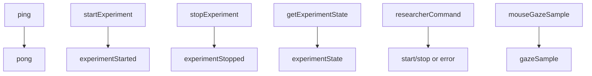
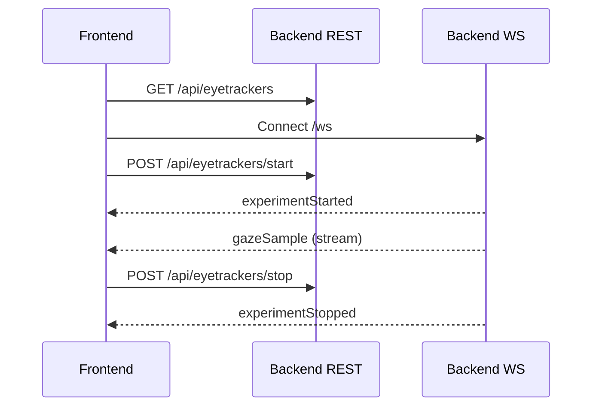
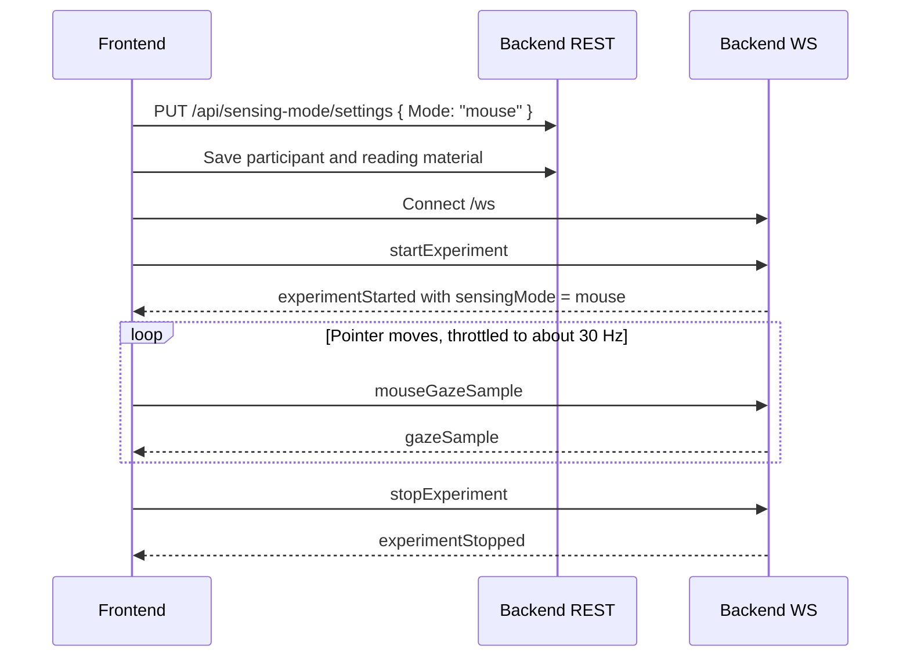

# Frontend Integration Guide

This guide is for browser and frontend clients that connect to `/ws`.

External decision providers should not use this contract. Provider clients will use the dedicated provider protocol documented in [/integration/provider-protocol/](/integration/provider-protocol/).

## Goal
Connect a frontend client to the backend to:

1. Read or update the active sensing mode.
2. Discover available eye trackers when using Tobii-backed input.
3. Start/stop an experiment session.
4. Receive realtime gaze samples over WebSocket.

## Prerequisites
- Backend is running.
- Frontend can reach backend host/port.
- For real Tobii data: backend running on Windows with compatible Tobii device/SDK.
- For mouse-mode demos: no Tobii hardware is required.

## Base URLs
Adjust for your environment:

- REST base: `https://<backend-host>:<port>/api`
- WebSocket base: `wss://<backend-host>:<port>/ws`

If running locally without TLS, use `http://` and `ws://`.

## Step 1: Read Or Update Sensing Mode

The backend owns the active sensing mode. Supported values are:

- `eyeTracker`: normal Tobii-backed operation.
- `mouse`: demo mode that uses participant pointer coordinates as synthetic gaze.

Read the current mode:

```http
GET /api/sensing-mode/settings
```

Example response:

```json
{
  "mode": "mouse",
  "canChangeMode": true,
  "blockReason": null
}
```

Update the mode:

```http
PUT /api/sensing-mode/settings
Content-Type: application/json

{
  "Mode": "mouse"
}
```

If a session is active, the backend rejects mode changes with `409 Conflict`. The settings response also reports `canChangeMode: false` and a `blockReason` so the UI can disable the mode control.

## Step 2: Discover Eye Trackers
Request:

```http
GET /api/eyetrackers
```

Example response:

```json
[
  {
    "name": "Tobii Pro Nano",
    "model": "IS5",
    "serialNumber": "TPN-12345"
  }
]
```

This step is only required for `eyeTracker` mode. In `mouse` mode, the setup flow can skip hardware discovery, licence handling, calibration, and validation.

## Step 3: Open WebSocket Connection
Create one persistent WebSocket connection and keep it alive for the session.

Browser example:

```js
const ws = new WebSocket("wss://localhost:5001/ws");

ws.onopen = () => {
  console.log("WS connected");

  // optional keepalive
  ws.send(JSON.stringify({
    type: "ping",
    payload: {}
  }));

  // optional: ask current session snapshot
  ws.send(JSON.stringify({
    type: "getExperimentState",
    payload: {}
  }));
};

ws.onmessage = (event) => {
  const message = JSON.parse(event.data);
  const { type, sentAtUnixMs, payload } = message;

  switch (type) {
    case "gazeSample":
      // payload is GazeData
      // e.g., update UI/heatmap/store
      console.log("gaze", payload);
      break;

    case "experimentStarted":
    case "experimentStopped":
    case "experimentState":
      // payload is ExperimentSessionSnapshot
      console.log(type, payload);
      break;

    case "pong":
      console.log("pong", sentAtUnixMs);
      break;

    case "error":
      console.error("server error", payload);
      break;

    default:
      console.log("other", message);
  }
};

ws.onerror = (err) => console.error("WS error", err);
ws.onclose = () => console.log("WS closed");
```

## Step 4: Start Tracking
You can start through REST or WebSocket command.

REST option:

```http
POST /api/eyetrackers/start
```

WebSocket option:

```json
{
  "type": "startExperiment",
  "payload": {}
}
```

When started successfully, clients receive:

- `experimentStarted` snapshot
- then continuous `gazeSample` messages while session is active

In `mouse` mode, start readiness only depends on participant information and reading material. Tobii device selection and calibration are bypassed.

## Step 5: Send Mouse Gaze Samples

Only browser clients should send mouse samples, and only when the active snapshot reports `sensingMode: "mouse"` and the experiment session is active.

Client-to-server message:

```json
{
  "type": "mouseGazeSample",
  "payload": {
    "deviceTimeStamp": 1740000000000,
    "leftEyeX": 0.42,
    "leftEyeY": 0.51,
    "leftEyeValidity": "Valid",
    "rightEyeX": 0.42,
    "rightEyeY": 0.51,
    "rightEyeValidity": "Valid"
  }
}
```

The current participant reading page normalizes `PointerEvent.clientX` and `PointerEvent.clientY` against the browser viewport. It sends at most one sample every `33ms`, which is about `30.3` samples per second. Samples are event-driven, so the actual rate is lower when the mouse is still or browser pointer events are throttled.

The backend accepts `mouseGazeSample` only during an active mouse-mode session. Accepted samples are rebroadcast as normal server-side `gazeSample` messages, so live overlays, researcher mirror, replay persistence, export, analysis providers, and decision providers consume the same shape as Tobii samples.

## Step 6: Consume Gaze Data
Each realtime gaze message:

```json
{
  "type": "gazeSample",
  "sentAtUnixMs": 1740000000000,
  "payload": {
    "deviceTimeStamp": 123,
    "leftEyeX": 0.42,
    "leftEyeY": 0.51,
    "leftEyeValidity": "Valid",
    "rightEyeX": 0.44,
    "rightEyeY": 0.52,
    "rightEyeValidity": "Valid"
  }
}
```

Recommended client handling:

- Drop or flag samples with invalid eye validity.
- Buffer samples in memory by timestamp for charting.
- Throttle heavy rendering (for example every 50-100ms) to keep UI smooth.
- Keep raw stream in a store and compute derived metrics in selectors/workers.
- Treat `mouse` mode samples as demo data, not Tobii-backed research measurements.

## Step 7: Stop Tracking
REST option:

```http
POST /api/eyetrackers/stop
```

WebSocket option:

```json
{
  "type": "stopExperiment",
  "payload": {}
}
```

You should receive `experimentStopped` with final snapshot stats.

## Live Replay File
- Active sessions are continuously persisted as one replay-ready JSON file while the experiment is running.
- The file uses the same replay schema that the replay page imports, so an unfinished run can still be opened manually in replay if the backend stops unexpectedly.
- File mode stores each unfinished run in its own backend folder, for example `data/live-experiments/<sessionId>/experiment-session-live.json`.
- The default live-save interval is 10 seconds; finish/reset/shutdown still force a flush immediately.
- The backend does not restore interrupted runs into the live UI on startup. After restart, the frontend should show the normal idle or no-active-session state.
- Final JSON/CSV exports are still produced only when the researcher finishes the experiment normally.

Current default storage layout:

- `data/live-experiments/<sessionId>/experiment-session-live.json` for unfinished live runs
- `data/latest/experiment-session-export.json` for the latest finished export
- `data/saved-exports/` for named finished exports saved from the UI

## Message Reference
### Client -> Server (`/ws`)


Envelope shape:

```json
{
  "type": "<messageType>",
  "payload": { }
}
```

### Server -> Client (`/ws`)
Envelope shape:

```json
{
  "type": "<messageType>",
  "sentAtUnixMs": 1740000000000,
  "payload": { }
}
```

## Minimal End-to-End Sequence


## Minimal Mouse-Mode Demo Sequence


## Troubleshooting
- No gaze data but start succeeded:
  - Verify backend is on Windows with Tobii SDK/device.
  - Confirm frontend actually connected to `/ws` and receives non-gaze messages.
  - In mouse mode, confirm the pointer is moving over the participant reading page.
- WebSocket closes immediately:
  - Ensure URL uses correct scheme (`ws://` vs `wss://`) and host/port.
- Start fails:
  - In `eyeTracker` mode, ensure at least one Tobii device is connected and discoverable.
  - In `mouse` mode, ensure participant information and reading material are saved.
- State looks stale:
  - Send `getExperimentState` over WebSocket to fetch latest snapshot.

