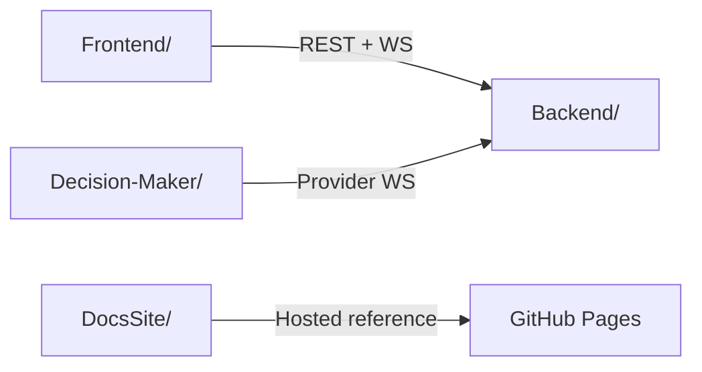

# Repository Structure

The monorepo is intentionally split into separate application roots instead of one full-stack app.

## Top-Level Layout

- `Backend/`: .NET solution, API host, infrastructure adapters, and tests
- `Frontend/`: Next.js application for researcher and participant experiences
- `Decision-Maker/`: Python mock external decision-provider service
- `docs/`: source documentation that is copied into the hosted docs app
- `DocsSite/`: static docs website hosted on GitHub Pages
- `.github/workflows/`: CI and Pages deployment workflows

## Practical Ownership Map

### `Frontend/`

Use this when working on:

- participant reading UI
- researcher control surfaces
- calibration UI
- replay UI
- frontend WebSocket and RTK Query integration

### `Backend/`

Use this when working on:

- experiment-session authority
- Tobii integration
- REST endpoints
- `/ws` and `/ws/provider`
- decision and intervention runtime logic
- replay/export persistence

### `Decision-Maker/`

Use this when working on:

- the mock external provider
- provider hello/heartbeat behavior
- external-provider end-to-end validation against the backend contract

### `DocsSite/`

Use this when working on:

- contributor-facing docs
- hosted architecture notes
- integration handoff material
- thesis and analysis reference pages

## Monorepo Runtime Relationship

## Useful Follow-Up Pages

- [/development/local-setup/](/development/local-setup/) for run commands
- [/backend/architecture/](/backend/architecture/) for the backend boundary map
- [/overview/constraints-and-scope/](/overview/constraints-and-scope/) for thesis-level limits that should shape implementation decisions
