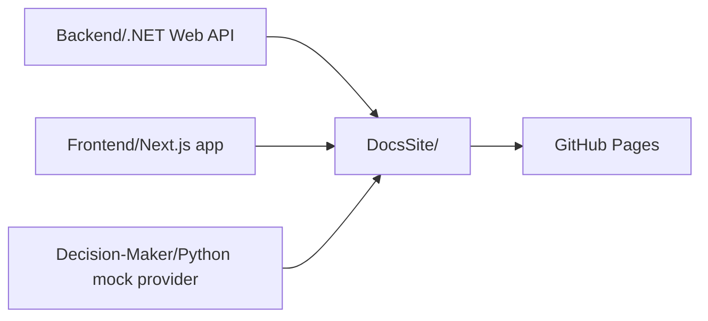

import { Callout, Cards } from 'nextra/components'

# Reading the Reader Docs

Reading the Reader is a researcher-operated adaptive reading platform. It connects to Tobii eye trackers, runs controlled reading sessions, mirrors the participant view in real time, and applies context-aware micro-interventions while preserving an architecture that future teams can extend.

<Callout type="info">
  This standalone docs app is the hosted copy of the full project documentation currently maintained under the repository `docs/` folder.
</Callout>

## Monorepo Structure

## Applications

- `Backend/`: ASP.NET Core backend, realtime runtime, provider protocol, Tobii integration, persistence, and replay/export support.
- `Frontend/`: researcher and participant-facing Next.js application.
- `Decision-Maker/`: Python mock external decision provider.
- `DocsSite/`: standalone static documentation app hosted separately from the frontend.

## Start Here

<Cards>
  <Cards.Card title="Platform Overview" href="/overview/platform-overview/">
    What the project is, who it is for, and how the main pieces fit together.
  </Cards.Card>
  <Cards.Card title="Supported Capabilities" href="/overview/supported-capabilities/">
    Current features, supported workflows, and explicit scope boundaries.
  </Cards.Card>
  <Cards.Card title="Local Setup" href="/development/local-setup/">
    How to run the frontend, backend, mock provider, and docs site locally.
  </Cards.Card>
  <Cards.Card title="Backend Architecture" href="/backend/architecture/">
    Full backend architecture document, including transport surfaces, orchestration, and persistence.
  </Cards.Card>
  <Cards.Card title="Frontend Integration" href="/integration/frontend-client-guide/">
    Full browser-facing REST and WebSocket integration guide for `/api` and `/ws`.
  </Cards.Card>
  <Cards.Card title="Provider Integration" href="/integration/provider-protocol/">
    Full external AI provider integration handoff for `/ws/provider`.
  </Cards.Card>
  <Cards.Card title="Black-Box Contract" href="/integration/black-box-contract/">
    Full black-box contract with concrete request, payload, and sequence examples.
  </Cards.Card>
  <Cards.Card title="Data Export Analysis" href="/backend/data-export-analysis/">
    What replay/export currently contains, what replay actually consumes, and where the gaps are.
  </Cards.Card>
  <Cards.Card title="Calibration & Validation" href="/project/calibration-validation/">
    Calibration and validation rationale, quality thresholds, and experimenter guidance.
  </Cards.Card>
  <Cards.Card title="Requirements" href="/project/requirements/">
    Full user stories, functional requirements, non-functional requirements, and actor descriptions.
  </Cards.Card>
  <Cards.Card title="Thesis Proposal" href="/project/thesis-proposal/">
    Full thesis framing, objectives, research questions, planned methods, and references.
  </Cards.Card>
</Cards>

## Docs Index

- `backend/` in the repo contains architecture and integration notes for the backend runtime.
- `frontend/` in the repo contains calibration, requirements, and thesis-planning material.
- The docs site keeps app-owned copies of those documents so they can be hosted independently on GitHub Pages.

## Recommended Reading Paths

- New contributor: start with [/overview/platform-overview/](/overview/platform-overview/), then [/overview/repository-structure/](/overview/repository-structure/), then [/development/local-setup/](/development/local-setup/).
- Frontend or researcher workflow work: read [/overview/supported-capabilities/](/overview/supported-capabilities/), then [/integration/frontend-client-guide/](/integration/frontend-client-guide/).
- Backend or architecture work: read [/backend/architecture/](/backend/architecture/), then [/backend/data-export-analysis/](/backend/data-export-analysis/), then [/backend/architecture-proposal/](/backend/architecture-proposal/).
- External AI team: read [/integration/provider-protocol/](/integration/provider-protocol/), then [/integration/black-box-contract/](/integration/black-box-contract/), then [/integration/external-provider-roadmap/](/integration/external-provider-roadmap/).
