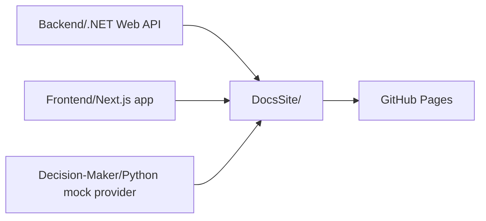

import { Callout, Cards } from 'nextra/components'

# Reading the Reader Docs

Reading the Reader is a researcher-operated adaptive reading platform. It connects to Tobii eye trackers, runs controlled reading sessions, mirrors the participant view in real time, and applies context-aware micro-interventions while preserving an architecture that future teams can extend.

<Callout type="info">
  This standalone docs app is the hosted reference for architecture, backend integration, external AI integration, and thesis-facing project context.
</Callout>

## Monorepo Structure

## Applications

- `Backend/`: ASP.NET Core backend, realtime runtime, provider protocol, Tobii integration, persistence, and replay/export support.
- `Frontend/`: researcher and participant-facing Next.js application.
- `Decision-Maker/`: Python mock external decision provider.
- `DocsSite/`: standalone static documentation app hosted separately from the frontend.

## Start Here

<Cards>
  <Cards.Card title="Backend Architecture" href="/backend/architecture/">
    High-level backend surfaces, components, and request flow.
  </Cards.Card>
  <Cards.Card title="Provider Integration" href="/integration/provider-protocol/">
    External AI provider protocol, messages, and flow.
  </Cards.Card>
  <Cards.Card title="Black-Box Contract" href="/integration/black-box-contract/">
    Interface contract for an external AI team treating the backend as a black box.
  </Cards.Card>
  <Cards.Card title="Requirements" href="/project/requirements/">
    Functional and architectural project requirements.
  </Cards.Card>
  <Cards.Card title="Thesis Proposal" href="/project/thesis-proposal/">
    Thesis framing, objectives, and research questions.
  </Cards.Card>
</Cards>

## What This Site Covers

- backend architecture and integration surfaces
- external AI provider contracts and example payloads
- project and thesis context
- deployable, hosted documentation for collaborators outside the main app
