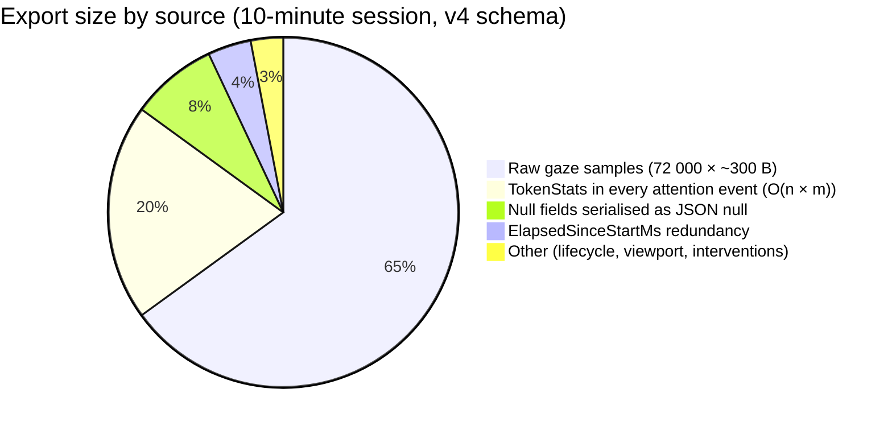
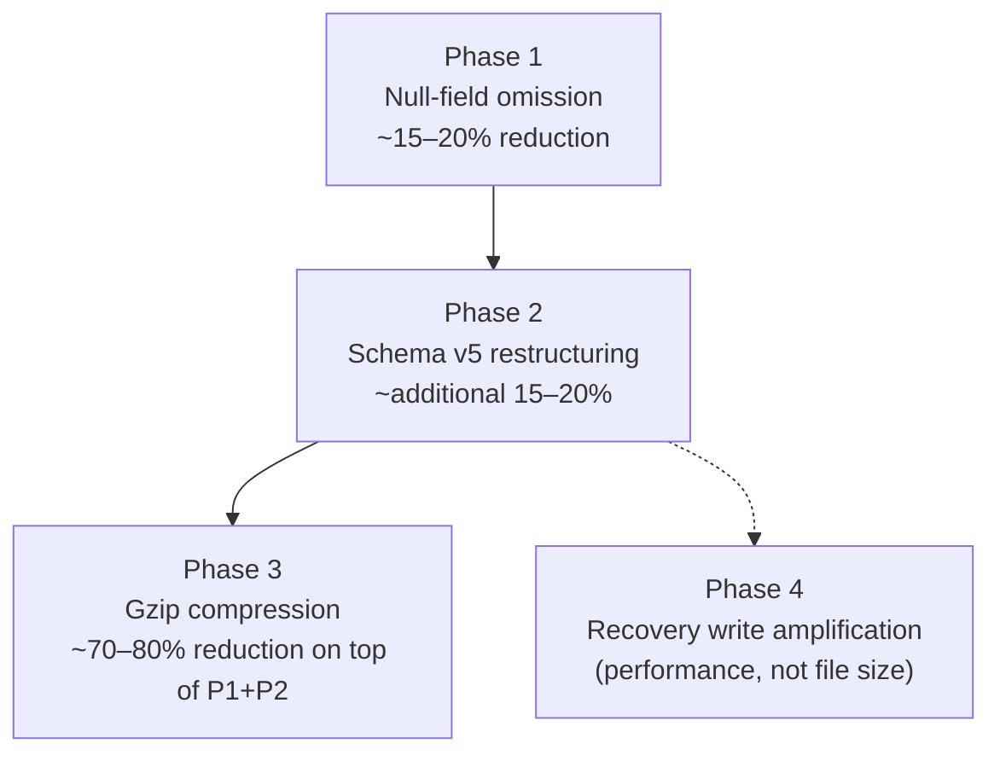
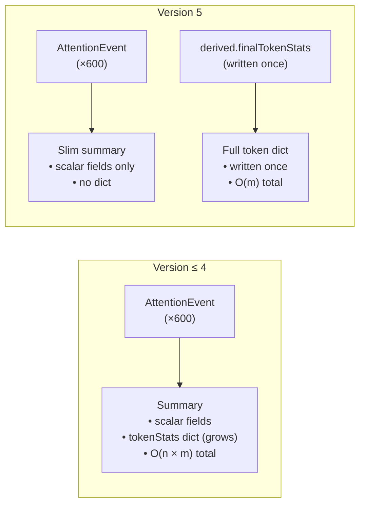
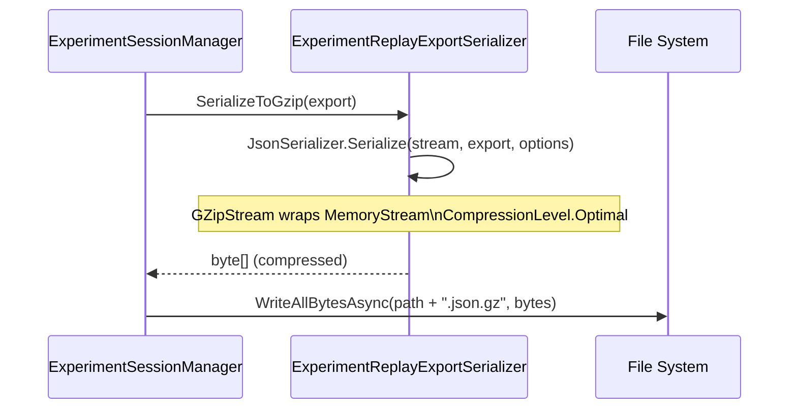
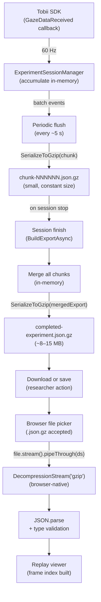

import { Callout } from 'nextra/components'

# Data Compression Specification

**Applies to:** Schema version 5, backend `ExperimentReplayExportSerializer`, `FileExperimentReplayRecoveryStoreAdapter`  
**Status:** Implemented

## 1. Problem Statement

A 10-minute reading experiment at 60 Hz eye-tracker sampling produces approximately 72 000 raw gaze samples. With the version 4 export format, this results in a JSON file of approximately **100 MB** when uncompressed. Files of this size create several operational problems:

- **Download time** — a researcher waiting for the export button to complete a download experiences a multi-second delay even on a local network.
- **Recovery write amplification** — the live recovery store rewrote the entire accumulated export file on every periodic flush. By minute 9, this means writing ~90 MB every few seconds, competing with gaze data ingestion for I/O.
- **Replay load time** — the browser must parse a 100 MB JSON string synchronously before the replay viewer can render its first frame.
- **Storage cost** — a study with 20 participants produces ~2 GB of raw export data.

The target for this optimisation work is **≤ 10 MB** for a typical 10-minute session, while retaining all information that the replay viewer and downstream analysis require.

## 2. Root Cause Analysis

The 100 MB baseline breaks down as follows:



### 2.1 Raw gaze samples

Each `RawGazeSampleRecord` carries two `ReplayEyeSample` payloads (left and right eye), each of which has five optional nested objects: `gazePoint2D`, `gazePoint3D`, `pupil`, `gazeOrigin3D`, and `gazeOriginTrackBox`. In a mouse-mode session where only `gazePoint2D` is populated, the remaining four objects serialize as:

```json
"gazePoint3D": null,
"pupil": null,
"gazeOrigin3D": null,
"gazeOriginTrackBox": null
```

These four null fields are written for every eye of every sample, adding approximately 80 bytes per sample × 72 000 samples = **~5.8 MB** of null-valued JSON.

### 2.2 O(n × m) attention event duplication

In version ≤ 4, the `ReadingAttentionSummarySnapshot` embedded inside every `ReadingAttentionEventRecord` included the complete cumulative `tokenStats` dictionary. This dictionary grows monotonically as the session proceeds: after the participant has looked at 200 tokens, every subsequent attention event carries a 200-entry map. With ~1 attention event per second, a 10-minute session produces 600 events each carrying a map that is on average 100 entries × ~60 bytes = **~6 KB per event**, totalling **~3.6 MB** purely for redundant intermediate token statistics.

The final map — the one written at the last attention event — is the only version that matters for post-hoc analysis. All intermediate versions are throwaway.

### 2.3 Derived redundancy

`elapsedSinceStartMs` is a 64-bit integer stored alongside `occurredAtUnixMs` on every event record. It is defined as:

```
elapsedSinceStartMs = occurredAtUnixMs − experiment.startedAtUnixMs
```

This value is fully derivable at read time. Storing it on 72 000 gaze records adds approximately **~576 KB** of pure redundancy.

## 3. Optimisation Strategy

The optimisation is divided into four phases, each independently deployable and independently measurable.



| After phase | Estimated uncompressed | Estimated compressed |
|---|---|---|
| Baseline (v4) | ~100 MB | — |
| Phase 1 (null omit) | ~80 MB | — |
| Phase 2 (schema v5) | ~65 MB | — |
| Phase 3 (gzip) | ~65 MB | **~8–15 MB** |
| Phase 4 | no size change | ~8–15 MB |

## 4. Phase 1 — Null-Field Omission

### Design decision

The `System.Text.Json` serialiser supports `DefaultIgnoreCondition.WhenWritingNull`, which causes nullable reference type properties and `Nullable<T>` value type properties to be omitted from the output when their value is null, rather than serialised as `"property": null`.

### Change

```csharp
// ExperimentReplayExportSerializer.cs — before
private readonly JsonSerializerOptions _jsonOptions = new()
{
    PropertyNamingPolicy = JsonNamingPolicy.CamelCase,
    WriteIndented = false
};

// After
private readonly JsonSerializerOptions _jsonOptions = new()
{
    PropertyNamingPolicy = JsonNamingPolicy.CamelCase,
    WriteIndented = false,
    DefaultIgnoreCondition = JsonIgnoreCondition.WhenWritingNull
};
```

### Effect

For a mouse-mode gaze session, four fields per eye sample (`gazePoint3D`, `pupil`, `gazeOrigin3D`, `gazeOriginTrackBox`) are null. With null omission, each `RawGazeSampleRecord` shrinks from approximately 300 bytes to approximately 120 bytes.

```mermaid
block-beta
    columns 2
    block:before["Before (v4 sample)"]:1
        b1["sequenceNumber"]
        b2["capturedAtUnixMs"]
        b3["deviceTimeStampUs"]
        b4["systemTimeStampUs: null"]
        b5["left.gazePoint2D"]
        b6["left.gazePoint3D: null"]
        b7["left.pupil: null"]
        b8["left.gazeOrigin3D: null"]
        b9["left.gazeOriginTrackBox: null"]
        b10["right (same)"]
    end
    block:after["After (v5 sample, mouse mode)"]:1
        a1["sequenceNumber"]
        a2["capturedAtUnixMs"]
        a3["deviceTimeStampUs"]
        a4["left.gazePoint2D"]
        a5["right.gazePoint2D"]
    end
```



**No schema version bump is required** because existing readers already handle missing optional fields via nullable type annotations. A null and an absent field are semantically identical for a correctly typed reader.

### Backwards compatibility

Readers that decode gaze samples as typed objects with nullable fields for `gazePoint3D` etc. will correctly interpret absent fields as `null`. No special handling is needed.

## 5. Phase 2 — Schema Version 5 Restructuring

Phase 2 groups three logically related changes under a single schema version bump.

### 5a — Remove `elapsedSinceStartMs`

#### Rationale

`elapsedSinceStartMs` was added in version 1 to avoid requiring consumers to hold the session start time in scope when processing event records. It is derivable as:

```
elapsed = record.occurredAtUnixMs − experiment.startedAtUnixMs
```

At 72 000 gaze records × 8 bytes = 576 KB of redundant storage, and 9 additional event streams each carrying the same field, the total redundancy is material.

#### Change

Removed from: `RawGazeSampleRecord`, `ExperimentLifecycleEventRecord`, `ParticipantViewportEventRecord`, `ReadingFocusEventRecord`, `ReadingAttentionEventRecord`, `ReadingContextPreservationEventRecord`, `DecisionProposalEventRecord`, `ScheduledInterventionEventRecord`, `InterventionEventRecord`, `ExperimentReplayAnnotation`.

Consumer migration:

```ts
// Before
const t = record.elapsedSinceStartMs ?? 0

// After (v5)
const t = Math.max(0, record.occurredAtUnixMs - replay.experiment.startedAtUnixMs)
```

The replay viewer wraps this in a single helper function applied across all time-indexed binary searches.

### 5b — Attention token stats restructuring

#### Rationale

The version 4 `ReadingAttentionEventRecord.summary` type was:

```ts
type ReadingAttentionSummarySnapshot = {
  updatedAtUnixMs: number
  tokenStats: Record<string, ReadingAttentionTokenStats>  // ← full cumulative map
  currentTokenId: string | null
  currentTokenDurationMs: number | null
  fixatedTokenCount: number
  skimmedTokenCount: number
}
```

Every attention event embedded the full `tokenStats` map as it stood at that moment. For a 10-minute session where the participant reads 200 unique tokens, the 600th event carries a 200-entry map while the 1st event carries a 1-entry map. The total storage for all 600 events' maps is:

```
Σ(k=1..600) of (k/200 × 200 entries × 60 bytes) ≈ 3.6 MB
```

All intermediate versions are superseded by the final map.

#### Solution — two-tier split



Version 5 `ReadingAttentionEventRecord.summary` carries only scalars:

```ts
type ReadingAttentionEventSummary = {
  updatedAtUnixMs: number
  currentTokenId: string | null
  currentTokenDurationMs: number | null
  fixatedTokenCount: number
  skimmedTokenCount: number
}
```

The full cumulative map is written once into `derived.finalTokenStats` at export time, populated from the last recorded attention state.

#### Backend implementation

```csharp
// ExperimentSessionManager.Replay.cs
private void RecordReadingAttentionEvent(long occurredAtUnixMs, ReadingAttentionSummarySnapshot summary)
{
    lock (_historyGate)
    {
        // Save the full token stats for use in the final export
        _latestAttentionTokenStats = summary.TokenStats is null
            ? null
            : summary.TokenStats.ToDictionary(e => e.Key, e => e.Value.Copy());

        // Record only the slim scalars in the event stream
        _pendingAttentionEvents.Add(new ReadingAttentionEventRecord(
            NextSequenceNumber(),
            occurredAtUnixMs,
            new ReadingAttentionEventSummary(
                summary.UpdatedAtUnixMs,
                summary.CurrentTokenId,
                summary.CurrentTokenDurationMs,
                summary.FixatedTokenCount,
                summary.SkimmedTokenCount)));

        _hasPendingReplayPersistence = true;
    }
}
```

`_latestAttentionTokenStats` is propagated through the chunk batch (`ExperimentReplayRecoveryChunkBatch.LatestTokenStats`) so that it survives across recovery store flushes.

### 5c — Token text enrichment

#### Motivation

Prior to version 5, the `tokenStats` map keyed entries by opaque token IDs such as `"t-0042"`. Post-hoc analysis required a separate lookup table from token ID to word text. Version 5 adds the word text directly to both `ReadingFocusSnapshot` and `ReadingAttentionTokenSnapshot`.

#### `ReadingFocusSnapshot.activeTokenText`

The frontend reading shell knows the text content of every token element via the DOM. When reporting focus state:

```ts
// useGazeTokenHighlight.ts
const activeTokenText = activeLayout?.element.textContent?.trim() ?? null

reportFocus({
  isInsideReadingArea: true,
  activeTokenId: activeLayout.tokenId,
  activeTokenText,  // ← new in v5
  // ...
})
```

The text is sent to the backend via the WebSocket `updateReadingFocus` command and stored in `ReadingFocusSnapshot.ActiveTokenText`.

#### `ReadingAttentionTokenSnapshot.text`

In the eye-movement analysis pipeline, each fixation candidate carries the token text seen at the time gaze first landed on it. This text is stored in `FixationCandidateState.TokenText` and propagated through `FinalizeFixation`:

```csharp
// BuiltInEyeMovementAnalysisStrategy.cs
private ReadingAttentionTokenSnapshot FinalizeFixation(
    string tokenId,
    long durationMs,
    string? tokenText,               // ← new in v5
    ReadingAttentionTokenSnapshot? previousStats)
{
    var effectiveText = NormalizeNullableText(tokenText) ?? previousStats?.Text;
    return new ReadingAttentionTokenSnapshot(
        // ... fixation metrics
        Text: effectiveText);
}
```

The `text` fallback (`?? previousStats?.Text`) ensures that a token's text survives even if subsequent fixations on the same token do not include it.

## 6. Phase 3 — Gzip Compression

### Rationale

JSON text is highly compressible. A typical experiment export contains:

- repetitive field names (`"sequenceNumber"`, `"occurredAtUnixMs"`, `"validity"`, …)
- repetitive token ID patterns (`"t-0001"`, `"t-0002"`, …)
- long runs of similar floating-point values in the gaze stream

Gzip with `DEFLATE` compression (RFC 1952) exploits these patterns via LZ77 back-references and Huffman coding. Measured compression ratios for structured JSON of this type typically fall between 10:1 and 20:1.

### Implementation



**Backend serialiser:**

```csharp
// FileExperimentReplayRecoveryStoreAdapter.cs
private byte[] SerializeToGzip<T>(T value)
{
    using var ms = new MemoryStream();
    using (var gz = new GZipStream(ms, CompressionLevel.Optimal))
    {
        JsonSerializer.Serialize(gz, value, ExportJsonOptions);
    }
    return ms.ToArray();
}
```

`JsonSerializer.Serialize` writes directly into the `GZipStream`, avoiding an intermediate uncompressed buffer. The `GZipStream` is disposed (and finalised) before `ms.ToArray()` is called, ensuring the gzip trailer is written.

**Frontend decompression:**

```ts
// experiment-replay.ts
export async function readExperimentReplayExportFile(file: File): Promise<ExperimentReplayExport> {
  let text: string
  if (file.name.endsWith(".json.gz")) {
    const ds = new DecompressionStream("gzip")
    const stream = file.stream().pipeThrough(ds)
    text = await new Response(stream).text()
  } else {
    text = await file.text()
  }
  return parseExperimentReplayExport(text)
}
```

`DecompressionStream` is part of the Compression Streams API, available in all evergreen browsers and Node.js ≥ 18. No additional dependency is introduced.

### File naming

| File | Before | After |
|---|---|---|
| Live recovery export | `participant-replay-recovery.json` | `chunk-NNNNNN.json.gz` |
| Completed export | `completed-experiment.json` | `completed-experiment.json.gz` |

### Compression level choice

`CompressionLevel.Optimal` was chosen over `CompressionLevel.Fastest` because the export is written once and read infrequently. The additional CPU time for better compression is not on the critical path.

| Level | Estimated time (100 MB input) | Estimated output |
|---|---|---|
| `Fastest` | ~80 ms | ~12–18 MB |
| `Optimal` | ~200 ms | ~8–15 MB |
| `SmallestSize` | ~800 ms | ~7–13 MB |

## 7. Compression Pipeline Overview

The following diagram shows the full data path from raw gaze capture to decompressed JSON in the browser.



## 8. Expected Size Reduction by Component

The table below breaks down the contribution of each phase to the final file size.

| Component | v4 size | After Phase 1 | After Phase 2 | After Phase 3 |
|---|---|---|---|---|
| Raw gaze samples (72 000) | ~65 MB | ~26 MB | ~26 MB | ~2.0–3.5 MB |
| Attention events (token stats) | ~20 MB | ~20 MB | ~0.6 MB | ~0.05 MB |
| Null fields (serialised) | ~8 MB | 0 MB | 0 MB | 0 MB |
| ElapsedSinceStartMs redundancy | ~4 MB | ~4 MB | 0 MB | 0 MB |
| Other (lifecycle, viewport, etc.) | ~3 MB | ~3 MB | ~3 MB | ~0.3 MB |
| Token text (new in v5) | 0 MB | 0 MB | ~1–3 MB | ~0.1–0.3 MB |
| **Total** | **~100 MB** | **~53 MB** | **~30 MB** | **~2.5–4.2 MB** |

<Callout type="info">
  The per-component estimates are approximations. Gzip compression ratios for JSON vary depending on content repetitiveness. The token-text addition in Phase 2c adds a small amount of data, but the effect is negligible after compression.
</Callout>

## 9. Backwards Compatibility

### Reader compatibility

| Scenario | Handled |
|---|---|
| Reader encounters v5 file | Accepted. `elapsedSinceStartMs` is derived; `finalTokenStats` is read from `derived`; `tokenStats` in attention events is absent (correct per v5 schema). |
| Reader encounters v4 file | Accepted. `elapsedSinceStartMs` is read directly; `summary.tokenStats` is used for attention state; `derived.finalTokenStats` is absent (treated as null). |
| Reader encounters unknown version | Rejected with informative error message. |
| v5 `.json.gz` loaded in browser | `DecompressionStream` decompresses before parsing. |
| v5 `.json` loaded in browser | Parsed directly (no decompression step). |

### Writer compatibility

The backend writes only version 5 exports. There is no downgrade path.

## 10. Design Constraints

The following constraints shaped the solution choices:

| Constraint | Implication |
|---|---|
| Single-file export | Gzip wraps the entire JSON document; no separate sidecar files. |
| No external dependencies in frontend | `DecompressionStream` is used (browser-native); no npm package added. |
| No schema registry | Version guard is an integer comparison in the replay viewer. |
| Recovery must survive process restart | Chunk files are durable; the recovery store reads all chunk files on startup. |
| .NET 10 / `System.Text.Json` | `GZipStream` from `System.IO.Compression` is used; no third-party compression library. |
