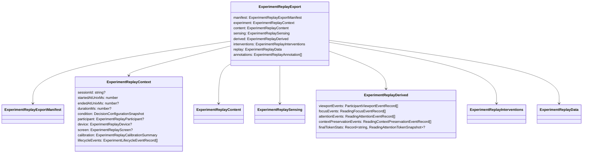
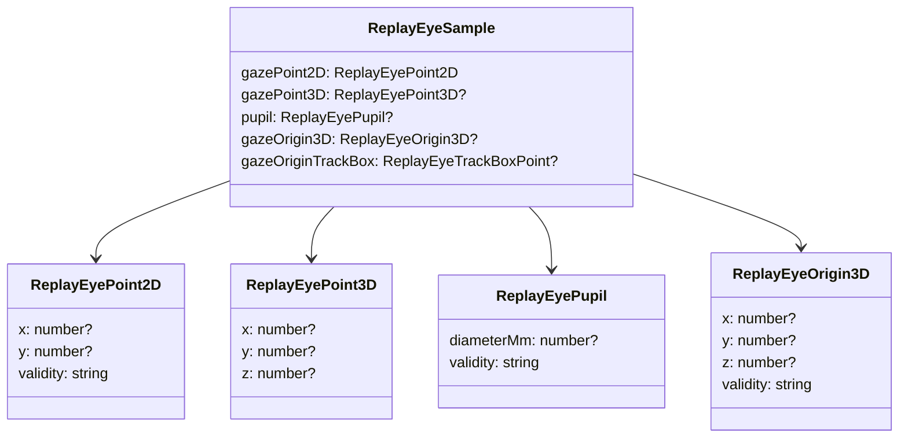

import { Callout } from 'nextra/components'

# Export Format Specification

**Schema identifier:** `rtr.experiment-export`  
**Current version:** 5  
**Serialisation:** UTF-8 JSON, camelCase property names, null fields omitted, gzip-compressed (`.json.gz`)

<Callout type="info">
  Version 5 is a breaking change from version 4. The replay viewer enforces a version guard and rejects any export whose `manifest.version` is not in the accepted set `{2, 3, 4, 5}`.
</Callout>

## 1. Purpose

The experiment replay export is a self-contained, single-file archive of one reading experiment session. It stores:

- session metadata and context (participant, device, calibration)
- the reading content and presentation baseline
- all raw gaze samples captured during the session
- all derived behavioural event streams (focus, attention, viewport)
- all intervention and decision proposal events
- a final token-level attention summary
- researcher annotations

The file is designed to support three use cases:

1. **Full session replay** — scrubbing through the participant view, gaze overlay, and intervention timeline in the replay viewer.
2. **Experimental reproducibility** — recording what condition ran, what device was used, and what calibration quality was achieved.
3. **Downstream analysis** — providing a structured, machine-readable archive for post-hoc statistical analysis of reading behaviour and intervention effects.

## 2. Top-Level Document Structure



## 3. Manifest

The manifest is the first field read during import and determines whether the file is accepted or rejected.

```ts
type ExperimentReplayExportManifest = {
  schema: string             // always "rtr.experiment-export"
  version: number            // current: 5
  exportedAtUnixMs: number
  completionSource: string   // "researcher-ui" | "participant-view" | "recovery" | ...
  exportProfile: string
  producer: ExperimentReplayExportProducer
  savedName?: string | null
}

type ExperimentReplayExportProducer = {
  appName: string
  backendSdk: string
  backendSdkVersion: string
  exporterVersion: string
}
```

### Version history

| Version | Change |
|---|---|
| 1 | Initial schema. All event records carry `elapsedSinceStartMs`. `ReadingAttentionEventRecord.summary` embeds the full `tokenStats` dictionary. |
| 2 | Added `ExperimentReplayAnnotation[]`. |
| 3 | Added `ExperimentReplayScreen` to context. |
| 4 | Added `sourceSetupId` and `contentHash` to content block. |
| 5 | Removed `elapsedSinceStartMs` from all event records. Extracted `tokenStats` from per-event attention records into `derived.finalTokenStats`. Added `activeTokenText` to `ReadingFocusSnapshot`. Added `text` to `ReadingAttentionTokenSnapshot`. |

## 4. Context Block

The context block describes the experimental session that produced this export.

```ts
type ExperimentReplayContext = {
  sessionId: string | null
  startedAtUnixMs: number        // Unix epoch, milliseconds
  endedAtUnixMs: number | null
  durationMs: number | null      // = endedAtUnixMs - startedAtUnixMs when both are present
  condition: DecisionConfigurationSnapshot
  participant: ExperimentReplayParticipant | null
  device: ExperimentReplayDevice | null
  screen: ExperimentReplayScreen | null
  calibration: ExperimentReplayCalibrationSummary
  lifecycleEvents: ExperimentLifecycleEventRecord[]
}
```

### Participant

Participant fields are all optional to support pseudonymous exports.

```ts
type ExperimentReplayParticipant = {
  name: string
  age: number | null
  sex: string | null
  existingEyeCondition: string | null
  readingProficiency: string | null
}
```

### Calibration summary

The calibration summary is a compact representation of the calibration quality at the time the session started. Full per-point calibration data is not exported in the replay archive.

```ts
type ExperimentReplayCalibrationSummary = {
  pattern: string | null             // e.g. "5-point"
  applied: boolean
  validationPassed: boolean
  quality: string | null             // "excellent" | "good" | "acceptable" | "poor"
  averageAccuracyDegrees: number | null
  averagePrecisionDegrees: number | null
  sampleCount: number
}
```

### Lifecycle events

Lifecycle events mark session-level transitions. In version 5, `elapsedSinceStartMs` is absent — elapsed time is derived as `occurredAtUnixMs - experiment.startedAtUnixMs`.

```ts
type ExperimentLifecycleEventRecord = {
  sequenceNumber: number
  eventType: string    // "session-started" | "session-stopped" | ...
  source: string
  occurredAtUnixMs: number
}
```

## 5. Content Block

The content block stores the reading material used in the session, together with provenance and tokenisation metadata.

```ts
type ExperimentReplayContent = {
  documentId: string
  title: string
  markdown: string           // full UTF-8 Markdown body
  sourceSetupId: string | null
  updatedAtUnixMs: number
  contentHash: string        // SHA-256 of the canonical markdown
  tokenization: {
    strategy: string         // e.g. "word-boundary"
    version: string
  }
}
```

<Callout type="warning">
  The `markdown` field stores the complete reading text. Exports that include full markdown should be treated as potentially sensitive if the reading material is unpublished.
</Callout>

## 6. Sensing Block — Raw Gaze Samples

The sensing block contains the raw biometric signal captured during the session.

```ts
type ExperimentReplaySensing = {
  gazeSamples: RawGazeSampleRecord[]
}

type RawGazeSampleRecord = {
  sequenceNumber: number
  capturedAtUnixMs: number
  deviceTimeStampUs: number        // device-clock microseconds
  systemTimeStampUs: number | null // OS-clock microseconds (may be absent)
  left: ReplayEyeSample | null
  right: ReplayEyeSample | null
}
```

### Eye sample structure



Gaze point coordinates are normalised to `[0, 1]` in screen space. A value of `(0.5, 0.5)` represents the screen centre. Validity strings follow the Tobii SDK enumeration: `"Valid"`, `"Invalid"`.

With null-field omission (Phase 1 of the compression optimisation), optional fields (`gazePoint3D`, `pupil`, `gazeOrigin3D`, `gazeOriginTrackBox`, `systemTimeStampUs`) are absent from the JSON when null rather than written as `"field": null`.

## 7. Derived Block — Behavioural Events

The derived block contains events produced by the real-time analysis pipeline running on the backend. These events represent interpreted reading behaviour, not raw sensor data.

```ts
type ExperimentReplayDerived = {
  viewportEvents: ParticipantViewportEventRecord[]
  focusEvents: ReadingFocusEventRecord[]
  attentionEvents: ReadingAttentionEventRecord[]
  contextPreservationEvents: ReadingContextPreservationEventRecord[]
  finalTokenStats: Record<string, ReadingAttentionTokenSnapshot> | null
}
```

### Viewport events

```ts
type ParticipantViewportEventRecord = {
  sequenceNumber: number
  occurredAtUnixMs: number
  viewport: ParticipantViewportSnapshot
}

type ParticipantViewportSnapshot = {
  isConnected: boolean
  scrollProgress: number       // [0, 1]
  scrollTopPx: number
  viewportWidthPx: number
  viewportHeightPx: number
  contentHeightPx: number
  contentWidthPx: number
  updatedAtUnixMs: number
  activePageIndex: number
  pageCount: number
  lastPageTurnAtUnixMs: number | null
  screen: ParticipantScreenSnapshot | null
}
```

### Focus events

Focus events describe where in the content the participant was looking, as determined by the gaze-to-token mapping algorithm.

```ts
type ReadingFocusEventRecord = {
  sequenceNumber: number
  occurredAtUnixMs: number
  focus: ReadingFocusSnapshot
}

type ReadingFocusSnapshot = {
  isInsideReadingArea: boolean
  normalizedContentX: number | null
  normalizedContentY: number | null
  activeTokenId: string | null
  activeBlockId: string | null
  activeSentenceId: string | null
  updatedAtUnixMs: number
  activeTokenText: string | null    // added in v5: the word text at the gaze focus point
}
```

### Attention events (v5 slim format)

In version 5, the per-event attention record carries only scalar summary fields. The full cumulative token statistics dictionary has been moved to `derived.finalTokenStats`.

```ts
// Version 5 slim event summary — no tokenStats dictionary
type ReadingAttentionEventSummary = {
  updatedAtUnixMs: number
  currentTokenId: string | null
  currentTokenDurationMs: number | null
  fixatedTokenCount: number
  skimmedTokenCount: number
}

type ReadingAttentionEventRecord = {
  sequenceNumber: number
  occurredAtUnixMs: number
  summary: ReadingAttentionEventSummary
}
```

### Final token stats (v5)

The `finalTokenStats` map is written once, at the end of the session. It records cumulative fixation and skim metrics for every token the participant looked at, keyed by token ID.

```ts
type ReadingAttentionTokenSnapshot = {
  fixationMs: number         // total fixation time on this token
  fixationCount: number      // number of distinct fixation events
  skimCount: number          // number of skim events (below fixation threshold)
  maxFixationMs: number      // longest single fixation
  lastFixationMs: number     // duration of the most recent fixation
  text: string | null        // added in v5: the word text for this token ID
}
```

<Callout type="info">
  In version ≤ 4, each `ReadingAttentionEventRecord.summary` embedded the full cumulative `tokenStats` dictionary. For a 10-minute session with 200 unique tokens, this produced O(n × m) duplication where n = number of attention events and m = number of distinct tokens encountered so far. Version 5 eliminates this by writing `finalTokenStats` once.
</Callout>

## 8. Interventions Block

```ts
type ExperimentReplayInterventions = {
  decisionProposals: DecisionProposalEventRecord[]
  scheduledInterventions: ScheduledInterventionEventRecord[]
  interventionEvents: InterventionEventRecord[]
}
```

### Decision proposal events

```ts
type DecisionProposalEventRecord = {
  sequenceNumber: number
  occurredAtUnixMs: number
  proposal: DecisionProposalSnapshot
}

type DecisionProposalSnapshot = {
  proposalId: string
  conditionLabel: string
  providerId: string
  executionMode: string
  status: string              // "pending" | "approved" | "rejected" | "superseded" | "auto-applied"
  signal: DecisionSignalSnapshot
  rationale: string
  proposedAtUnixMs: number
  resolvedAtUnixMs: number | null
  resolutionSource: string | null
  appliedInterventionId: string | null
  proposedIntervention: ApplyInterventionCommand
}
```

### Intervention events

```ts
type InterventionEventRecord = {
  sequenceNumber: number
  occurredAtUnixMs: number
  intervention: InterventionEventSnapshot
}

type InterventionEventSnapshot = {
  id: string
  source: string
  trigger: string
  reason: string
  appliedAtUnixMs: number
  appliedBoundary: string
  waitDurationMs: number | null
  appliedPresentation: ReadingPresentationSnapshot
  appliedAppearance: ReaderAppearanceSnapshot
  affectedPresentationProperties: string[]
  moduleId: string | null
  parameters: Record<string, string | null> | null
}
```

## 9. Replay Baseline Block

The `replay` block stores the initial reading configuration that was active when the session started. The replay viewer uses this to set the initial state of the reader shell before replaying events.

```ts
type ExperimentReplayData = {
  baseline: {
    presentation: ReadingPresentationSnapshot
    appearance: ReaderAppearanceSnapshot
  }
}

type ReadingPresentationSnapshot = {
  fontFamily: string
  fontSizePx: number
  lineWidthPx: number
  lineHeight: number
  letterSpacingEm: number
  editableByResearcher: boolean
}

type ReaderAppearanceSnapshot = {
  themeMode: string
  palette: string
  appFont: string
}
```

## 10. Annotations

Annotations are researcher-authored notes attached to specific positions in the replay timeline.

```ts
type ExperimentReplayAnnotation = {
  id: string
  sequenceNumber: number
  occurredAtUnixMs: number
  author: string | null
  category: string | null
  note: string
  targetTokenId: string | null
  targetBlockId: string | null
}
```

## 11. Elapsed Time Derivation (v5)

In version 5, `elapsedSinceStartMs` is no longer stored on any event record. Consumers must derive it:

```ts
function elapsedMs(record: { occurredAtUnixMs: number }, ctx: { startedAtUnixMs: number }): number {
  return Math.max(0, record.occurredAtUnixMs - ctx.startedAtUnixMs)
}
```

For gaze samples, the field is `capturedAtUnixMs`:

```ts
function gazeElapsedMs(sample: RawGazeSampleRecord, ctx: ExperimentReplayContext): number {
  return Math.max(0, sample.capturedAtUnixMs - ctx.startedAtUnixMs)
}
```

The replay viewer uses `occurredAtUnixMs` as the primary time source for binary-search indexing into all event arrays.

## 12. Serialisation Contract

| Property | Value |
|---|---|
| File extension | `.json.gz` |
| Content encoding | gzip (RFC 1952), `CompressionLevel.Optimal` |
| Inner format | UTF-8 JSON |
| Property naming | camelCase (`JsonNamingPolicy.CamelCase`) |
| Null fields | Omitted (`DefaultIgnoreCondition.WhenWritingNull`) |
| Number precision | Default `System.Text.Json` double precision |
| Date representation | Unix epoch milliseconds (`long`) |

## 13. Import Validation

The replay viewer validates an imported file against the following conditions before building the frame index:

```ts
// Pseudocode for the import guard
if (
  !isRecord(parsed) ||
  !isRecord(parsed.manifest) ||
  parsed.manifest.schema !== "rtr.experiment-export" ||
  !ACCEPTED_VERSIONS.includes(parsed.manifest.version)   // {2, 3, 4, 5}
) {
  throw new Error("Unsupported replay format.")
}
```

The replay viewer accepts `.json.gz` files (decompressed via `DecompressionStream`) as well as plain `.json` files and the legacy `.csv` envelope format.
