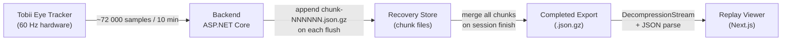

import { Callout, Cards } from 'nextra/components'

# Technology Specification

This section contains the formal technical specifications for the Reading the Reader platform, written to support the master's thesis defence. Each document describes a design problem, the architectural decisions taken to address it, and the resulting implementation.

<Callout type="info">
  These specifications describe the system as implemented at schema version 5, released as part of the export size and recovery optimisation work. All file-size figures are estimates based on a simulated 10-minute session at 60 Hz eye-tracker sampling.
</Callout>

## What This Section Covers

The three specifications below address the experiment data pipeline — from the moment a gaze sample is captured through to the point where a researcher opens a replay export for analysis.

## Documents

<Cards>
  <Cards.Card title="Export Format Specification" href="/technical-specification/export-format-specification/">
    Formal specification of the experiment replay export format, schema version 5.
    Covers all record types, event streams, versioning policy, and the JSON serialisation contract.
  </Cards.Card>
  <Cards.Card title="Data Compression" href="/technical-specification/data-compression/">
    Four-phase optimisation strategy that reduces a 10-minute export from ~100 MB to ~8–15 MB.
    Covers null-field omission, schema restructuring, token text enrichment, and gzip compression.
  </Cards.Card>
  <Cards.Card title="Recovery Architecture" href="/technical-specification/recovery-architecture/">
    Append-only chunk file design that replaces the O(n²) monolithic recovery write pattern.
    Covers the write path, crash recovery, final export assembly, and durability guarantees.
  </Cards.Card>
</Cards>

## Relationship to Other Documents

| This specification | Builds on |
|---|---|
| Export Format Specification | [Data Export Analysis](/backend/data-export-analysis/) |
| Data Compression | Export Format Specification (this section) |
| Recovery Architecture | [Backend Architecture](/backend/architecture/) |

## Design Principles Applied

The specifications in this section apply four recurring design principles drawn from the thesis architecture argument:

1. **Separation of concerns** — serialisation format, compression, and recovery are independent layers that can be changed without coupling.
2. **Append-only writes** — the recovery store grows by appending new chunk files; it never rewrites existing data during a live session.
3. **Derivability** — any value that can be derived from other exported fields at read time (e.g. elapsed time since start) is not stored twice.
4. **Backwards compatibility by version guard** — the replay viewer explicitly checks the schema version and rejects unknown versions rather than silently mis-parsing them.
