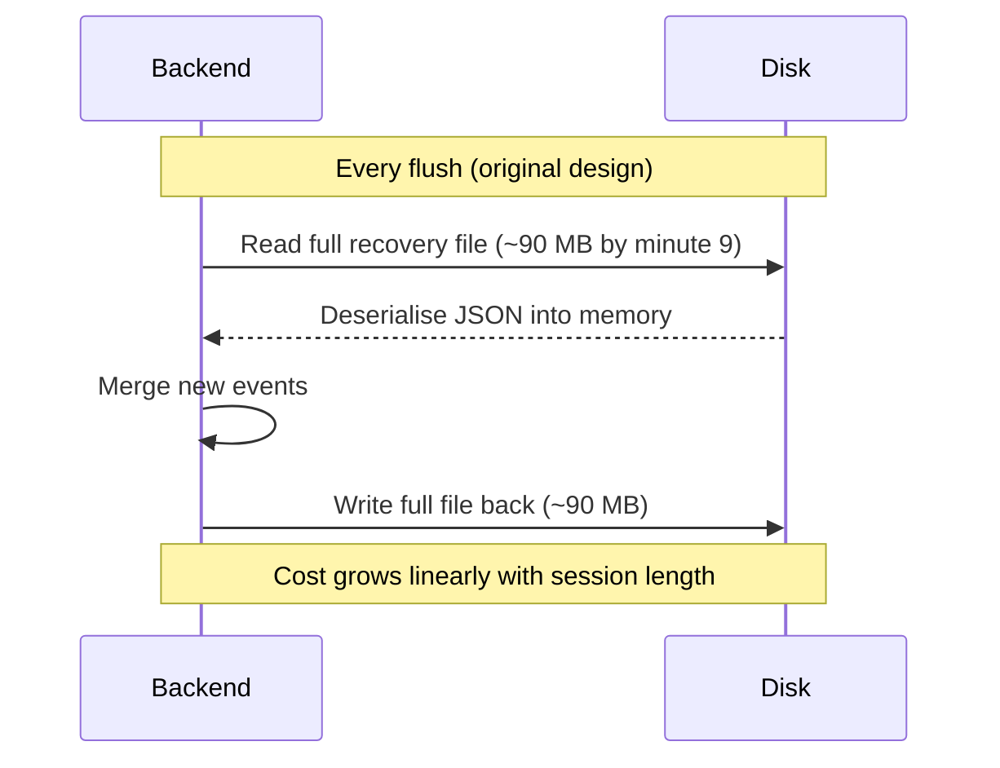
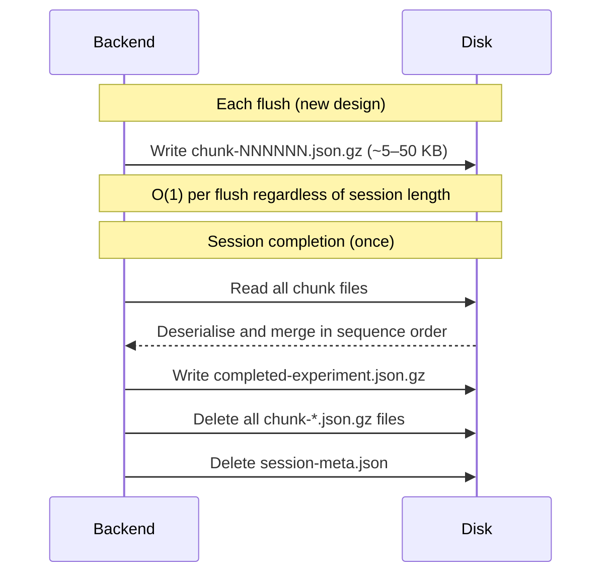
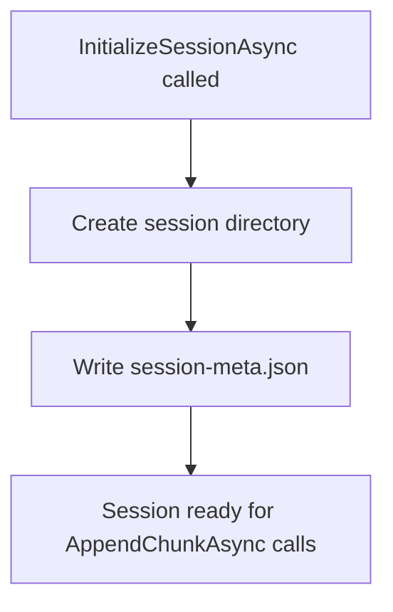
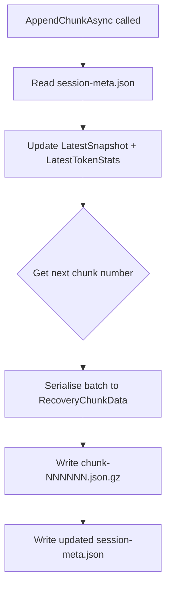
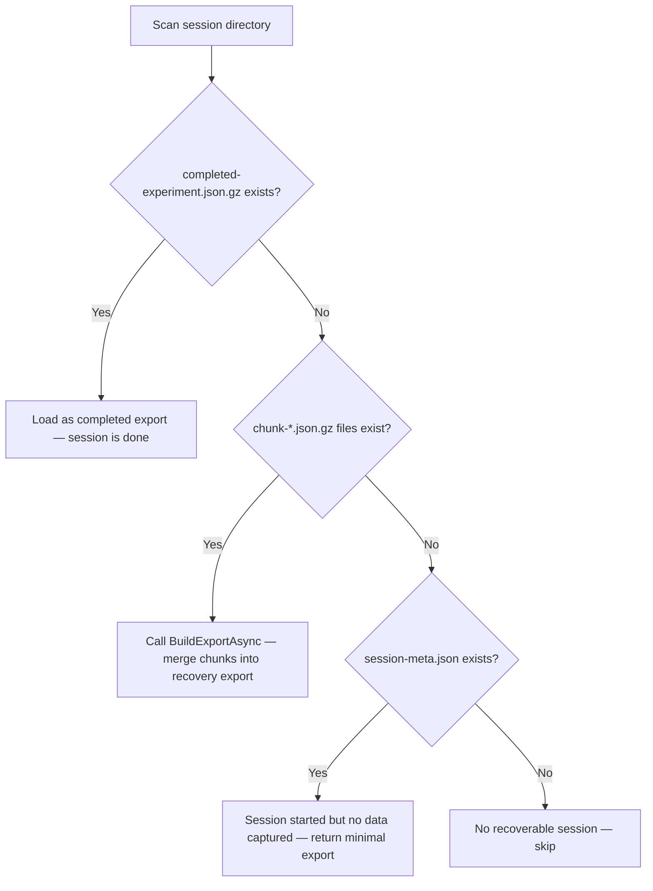

import { Callout } from 'nextra/components'

# Recovery Architecture

**Component:** `FileExperimentReplayRecoveryStoreAdapter`  
**Pattern:** Append-only chunk files  
**Problem solved:** O(n²) write amplification in live session persistence

<Callout type="info">
  This document covers the recovery store design introduced alongside schema version 5. The chunk-file pattern was developed in tandem with the data compression work and replaces the earlier monolithic recovery export that caused severe I/O amplification in long sessions.
</Callout>

## 1. Problem Statement

Every reading session must survive unexpected termination — browser crash, network drop, or server restart — so that researchers do not lose experiment data mid-session. The recovery store is the component responsible for keeping a durable copy of accumulated session data on disk throughout the session lifetime.

### The O(n²) Write Pattern

The original recovery design used a single monolithic file (`participant-replay-recovery.json`). On each backend flush (every few seconds), the recovery adapter:

1. Read the full existing file from disk into memory
2. Deserialised the JSON into a complete `ExperimentReplayExport` object
3. Merged newly arrived events into the in-memory aggregate
4. Re-serialised the entire merged document back to JSON
5. Wrote the full file back to disk

This is O(n²) in session length: as the session accumulates events, the file grows, and each flush reads and writes an ever-larger file. In a 10-minute session at 60 Hz with a flush every 5 seconds, the adapter would perform 120 read-deserialise-merge-serialise-write cycles. By the ninth minute each cycle operated on ~90 MB of JSON, producing a write amplification factor that made the tail of a session increasingly I/O-bound.



### Quantified Impact

| Session time | Recovery file size | Per-flush read + write |
|---|---|---|
| 1 min | ~10 MB | ~20 MB I/O |
| 5 min | ~50 MB | ~100 MB I/O |
| 10 min | ~100 MB | ~200 MB I/O |
| 10 min (with gzip) | ~8–12 MB | ~16–24 MB I/O |

Even with gzip compression (Phase 3), the monolithic pattern still requires decompressing and re-compressing the entire file on every flush. The structural problem cannot be solved by compression alone.

## 2. Solution: Append-Only Chunk Files

The revised architecture abandons the monolithic recovery file entirely. Instead, each flush writes a small, numbered chunk file containing only the events from that batch:

```
sessions/
  participant-1-<uuid>/
    session-meta.json          ← session metadata (snapshot, start time)
    chunk-000001.json.gz       ← first flush batch
    chunk-000002.json.gz       ← second flush batch
    chunk-000003.json.gz       ← third flush batch
    …
```

On session completion, `BuildExportAsync` reads all chunk files once, merges them in sequence-number order, and produces the final `ExperimentReplayExport`. The chunk files are then deleted and replaced with the single completed export.



### Asymptotic Improvement

| Operation | Old design | New design |
|---|---|---|
| Per-flush I/O | O(n) — grows with session length | O(1) — fixed batch size |
| Total session I/O | O(n²) | O(n) |
| Final export assembly | O(n) — already accumulated | O(n) — single merge pass |
| Crash recovery | O(n) — read full file | O(n) — read all chunks |

## 3. On-Disk Structure

### Session Directory

Each session is stored in a directory named `participant-<name>-<uuid>` under the configured persistence root:

```
<persistence-root>/
  participant-alice-3f8c…/
    session-meta.json          ← written once at InitializeSessionAsync
    chunk-000001.json.gz
    chunk-000002.json.gz
    …
    chunk-NNNNNN.json.gz
```

After a successful session finish:

```
<persistence-root>/
  participant-alice-3f8c…/
    completed-experiment.json.gz   ← final merged export
```

The chunk files and metadata file are deleted when `MarkCompletedAsync` is called.

### Chunk File Format

Each chunk file is a gzip-compressed JSON object of the `RecoveryChunkData` type:

```ts
// Conceptual TypeScript equivalent of RecoveryChunkData
type RecoveryChunkData = {
  flushedAtUnixMs: number
  lifecycleEvents?: ExperimentLifecycleEventRecord[] | null
  gazeSamples?: RawGazeSampleRecord[] | null
  viewportEvents?: ParticipantViewportEventRecord[] | null
  focusEvents?: ReadingFocusEventRecord[] | null
  attentionEvents?: ReadingAttentionEventRecord[] | null
  contextPreservationEvents?: ReadingContextPreservationEventRecord[] | null
  decisionProposalEvents?: DecisionProposalEventRecord[] | null
  scheduledInterventionEvents?: ScheduledInterventionEventRecord[] | null
  interventionEvents?: InterventionEventRecord[] | null
  latestTokenStats?: Record<string, ReadingAttentionTokenSnapshot> | null
}
```

Null-field omission applies at chunk serialisation time, so chunk files for flushes that contain only gaze samples and no intervention events will omit all intervention arrays.

### Session Metadata File

`session-meta.json` is a small uncompressed JSON file written once at session initialisation:

```ts
// Conceptual shape of RecoverySessionMetadata
type RecoverySessionMetadata = {
  sessionId: string
  sessionDirectoryPath: string
  latestSnapshot: ExperimentSessionSnapshot
  startedAtUnixMs: number
  latestTokenStats?: Record<string, ReadingAttentionTokenSnapshot> | null
}
```

The `latestSnapshot` and `latestTokenStats` fields are updated in-place on each `AppendChunkAsync` call. Token stats are stored here as a fallback so that if the final chunk files happen not to contain token stats (e.g. a session with no attention events), the metadata still carries the last known stats.

## 4. Write Path

### Session Initialisation

`InitializeSessionAsync` creates the session directory and writes `session-meta.json`. No chunk files are written at this point.



### Chunk Append

`AppendChunkAsync` is called on every backend flush. The operation is:

1. Read `session-meta.json` into memory (small file, constant cost)
2. Update `LatestSnapshot` and `LatestTokenStats` on the in-memory metadata
3. Determine the next chunk number (thread-safe counter)
4. Serialise the flush batch into `RecoveryChunkData` and write `chunk-NNNNNN.json.gz`
5. Write the updated `session-meta.json` back to disk



Chunk numbering uses a zero-padded six-digit counter (`000001`, `000002`, …) so that lexicographic sort order matches event arrival order. This allows crash recovery to process chunks in the correct sequence without relying on file modification times.

### Completed Export

`MarkCompletedAsync` is called when the session ends normally. The operation is:

1. Serialise the provided `ExperimentReplayExport` document to `completed-experiment.json.gz`
2. Delete all `chunk-*.json.gz` files
3. Delete `session-meta.json`

The completed export is written before the chunk files are deleted. If the process crashes between the write and the delete, the completed export takes precedence at recovery time: any consumer looking for the final export will find `completed-experiment.json.gz` and treat the session as complete.

## 5. Crash Recovery

### Recovery Decision Tree

When the backend restarts and detects an incomplete session directory, it consults the following decision tree:



### Merge Logic

`BuildExportAsync` reads all chunk files in chunk-number order and merges their event arrays. The merge strategy is:

- Each event list is concatenated across all chunks
- Events are sorted by `sequenceNumber` to restore canonical ordering
- The final token stats are taken from the last chunk that carries a non-null `latestTokenStats` field, falling back to `session-meta.json`'s `LatestTokenStats`
- Session end time is set to the `flushedAtUnixMs` of the last chunk

```csharp
// Merge helper used for each event list
static T[] Merge<T>(
    RecoveryChunkData[] chunks,
    Func<RecoveryChunkData, T[]?> selector,
    Func<T, long> getSequenceNumber)
    => chunks
        .SelectMany(c => selector(c) ?? [])
        .OrderBy(getSequenceNumber)
        .ToArray();
```

### Durability Guarantees

| Failure scenario | Data preserved |
|---|---|
| Process crash mid-session | All events in completed chunk files |
| Process crash during `AppendChunkAsync` (after chunk write, before meta update) | All events in that chunk; metadata reflects previous state |
| Process crash during `AppendChunkAsync` (before chunk write) | Events in that batch are lost; all prior batches preserved |
| Process crash during `MarkCompletedAsync` (after completed export, before chunk delete) | Session fully recoverable; chunk files are redundant but harmless |
| Process crash during `MarkCompletedAsync` (before completed export write) | Session recoverable from chunk files |

The worst-case data loss is one flush batch — the events that were in memory but not yet written to disk when the crash occurred. Given a flush interval of approximately 5 seconds at 60 Hz, this corresponds to at most ~5 seconds of session data.

## 6. Serialisation

Both chunk files and the completed export use the same gzip + JSON serialisation pipeline:

```csharp
private byte[] SerializeToGzip<T>(T value)
{
    using var ms = new MemoryStream();
    using (var gz = new GZipStream(ms, CompressionLevel.Optimal))
        JsonSerializer.Serialize(gz, value, ExportJsonOptions);
    return ms.ToArray();
}

private T? DeserializeFromGzip<T>(byte[] bytes)
{
    using var ms = new MemoryStream(bytes);
    using var gz = new GZipStream(ms, CompressionMode.Decompress);
    return JsonSerializer.Deserialize<T>(gz, ExportJsonOptions);
}
```

The `ExportJsonOptions` instance enforces:
- camelCase property naming (`JsonNamingPolicy.CamelCase`)
- null-field omission (`DefaultIgnoreCondition.WhenWritingNull`)

This means individual chunk files are valid gzip JSON documents that could be inspected independently in isolation, without needing to merge them.

## 7. Concurrency Model

The recovery store is accessed by a single background worker (`ExperimentStateCheckpointWorker`) that fires at a fixed interval. The chunk number counter uses a `Lock` to prevent duplicate chunk numbers if the worker were ever invoked concurrently, but in normal operation writes are sequential.

Reading the session metadata file on every `AppendChunkAsync` call is acceptable because the metadata file is small (a few kilobytes) and the I/O cost is negligible compared to writing the chunk file.

## 8. Relationship to the Export Format

The chunk-file recovery architecture is a purely operational concern — it is invisible to the final export consumer. The `ExperimentReplayExport` document produced by `BuildExportAsync` has identical structure whether it came from merging chunk files (crash recovery path) or from the live `ExperimentSessionManager` (normal completion path). The only observable difference is the `manifest.completionSource` field:

| Path | `completionSource` value |
|---|---|
| Normal session finish via researcher UI | `"researcher-ui"` |
| Crash recovery on restart | `"recovery"` |
| Export triggered from participant view | `"participant-view"` |

The replay viewer accepts all `completionSource` values and does not alter its behaviour based on how the export was produced.

## 9. Design Principles

This architecture applies two of the four principles stated in the Technology Specification overview:

**Append-only writes** — the recovery store never rewrites existing chunk data during a live session. Each flush is a new file. Existing chunk files are immutable once written.

**Separation of concerns** — the serialisation format, compression, and recovery file layout are independent layers. Switching from JSON to a binary format, or changing the compression algorithm, requires changes only inside `FileExperimentReplayRecoveryStoreAdapter` — the `ExperimentSessionManager` and the export format specification are unaffected.
