# Reading the Reader — User Guide

A handbook for researchers operating the Reading the Reader adaptive reading platform.

## 1. Overview

Reading the Reader is a **researcher-operated** adaptive reading system. It connects to a
Tobii eye tracker, runs a controlled reading session for an invited participant, mirrors the
participant's screen for the researcher in real time, and can apply context-aware
micro-interventions while the participant reads. After a session, all data can be exported or
replayed for analysis.

A typical experiment moves through these stages:

1. **Prepare content** — save one or more reading texts as reusable *reading materials*.
2. **Compose a template** — combine materials into a reusable *experiment template* with
   presentation defaults and a runtime strategy.
3. **Run a session** — follow the guided stepper to set up the tracker, baseline, participant
   details, and calibration, then start reading.
4. **Monitor live** — watch the participant's gaze, attention, and struggle signals; trigger or
   approve interventions.
5. **Export / replay** — save the recorded session and review it later.

## 2. Before You Start

| Requirement | Detail |
|--------------------|------------------------------------------------------------|
| **Browser** | A Chromium-based browser is recommended. Fullscreen permission is required for calibration and the live view. |
| **Eye tracker** | A Tobii device connected to the Windows machine (for real eye-tracking sessions). |
| **Backend running** | The backend service must be running and reachable by the frontend. |
| **Two screens (recommended)** | One screen for the **Participant View**, one for the **Researcher Live View**. |
| **Content format** | Reading materials are **Markdown only**. PDF is not supported. |

> **Tip:** If you do not have hardware available, switch to **Mouse mode** in Settings to run a
> demo where the participant's mouse position acts as synthetic gaze. See
> [Sensing Modes](#7-sensing-modes-explained).

## 3. Tour of the Workspace

The workspace is where the researcher prepares, runs, and reviews experiments. The left
**sidebar** is the primary navigation the researcher uses to move between the reading-material
library, experiment templates, the live session view, replay, and settings. Each sidebar item is
described below.

| Sidebar item | What it's for |
|--------------------|------------------------------------------------------------|
| **Home** | The researcher dashboard. Lists "Ready to run" templates and drafts; start or edit a template from here. |
| **Material Library** | Create, edit, export, and delete reusable reading materials. |
| **Experiment Templates** | Manage reusable experiment setups (ready / drafts / archived). Duplicate, export, edit, delete. |
| **Researcher Live** | The live monitoring view of the currently running session. |
| **Participant View** | Opens the participant-facing flow (opens in a new tab — put this on the participant's screen). |
| **Replay** | Load a saved or exported session and play it back frame by frame. |
| **Settings** | Input mode, calibration point count, and reading-view (ReaderShell) defaults. |

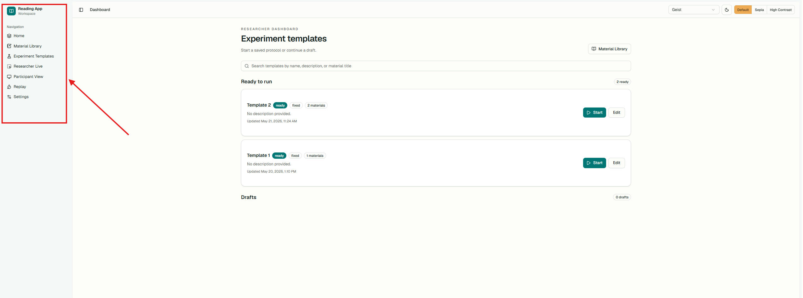

The **top bar** (right side) holds the app font selector, light/dark mode toggle, and color
palette toggle. These affect the app appearance.

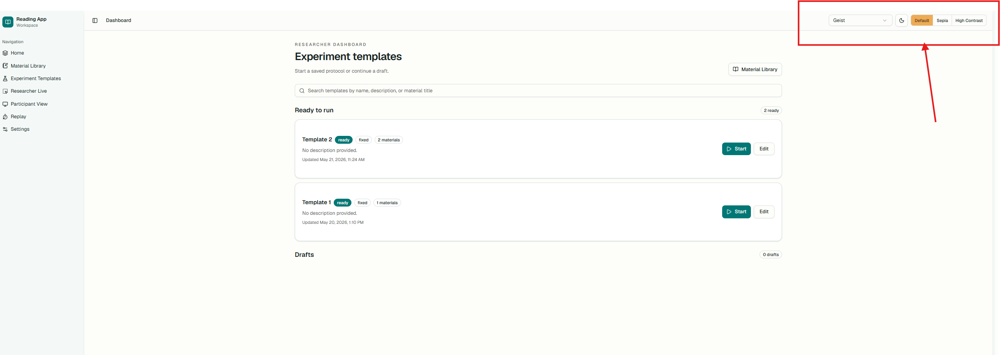

## 4. Quick Start (5-minute run)

If you just want to get a session going, follow this condensed path. Each step links to its full
section below.

1. **Create at least one reading material** → [§5.1](#51-create-a-reading-material)
2. **Build a template** from that material and mark it **Ready** → [§5.2](#52-build-an-experiment-template)
3. From **Home**, click **Start** on the ready template → [§5.3](#53-run-an-experiment-session)
4. Open the **Participant View** on the participant's screen → [§5.4](#54-the-participant-view)
5. Complete **Step 1–4** of the stepper (tracker → baseline → participant info → calibration)
6. Click **Start reading session**, then open **Researcher Live** to monitor → [§5.6](#56-the-live-researcher-view)
7. When done, **Finish experiment** and **export** the data → [§5.7](#57-finishing--exporting-a-session)

## 5. Step-by-Step Workflows

### 5.1 Create a Reading Material

A *reading material* is one Markdown text plus its comprehension quiz and presentation defaults,
saved as a reusable baseline.

1. In the sidebar, open **Material Library**.

   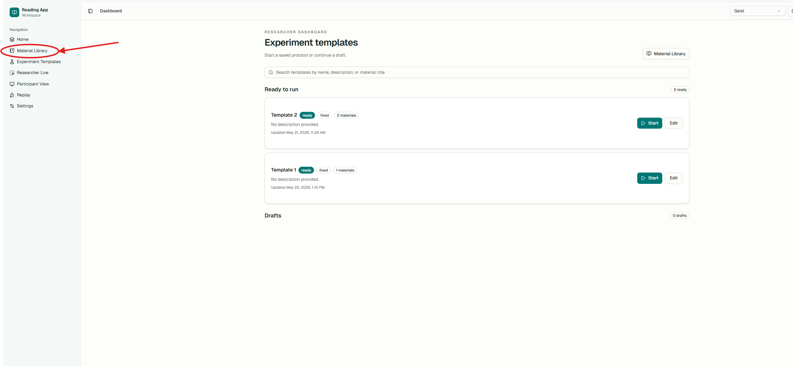

2. Click **New material** (top-right).

   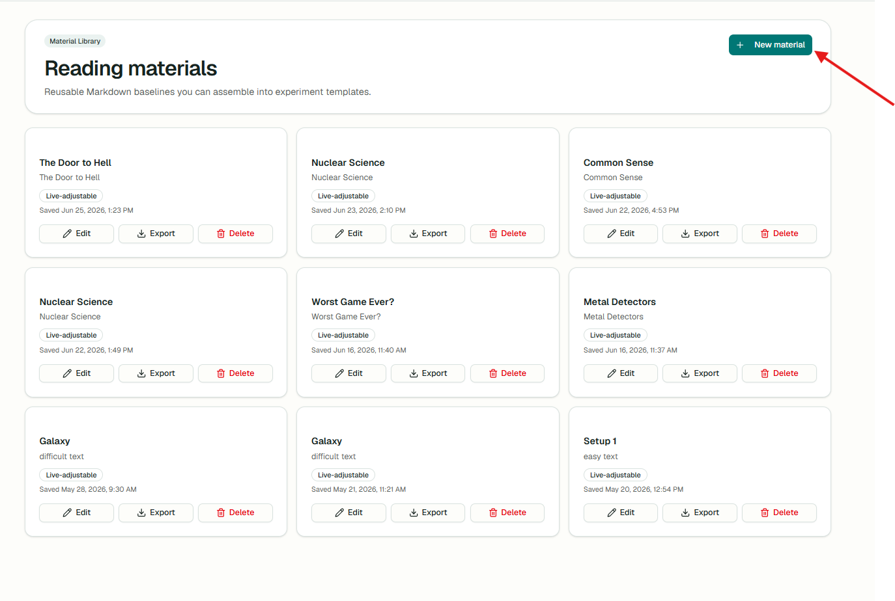

3. Fill in the **Reading text** card:
   - **Setup name** — the internal name shown to researchers (required).
   - **Text title** — the title the participant sees (required).
   - **Markdown text** — paste your Markdown, or click **Import .md** to load a file
     (`.md`, `.markdown`, `.txt`). The title can auto-fill from the filename.

   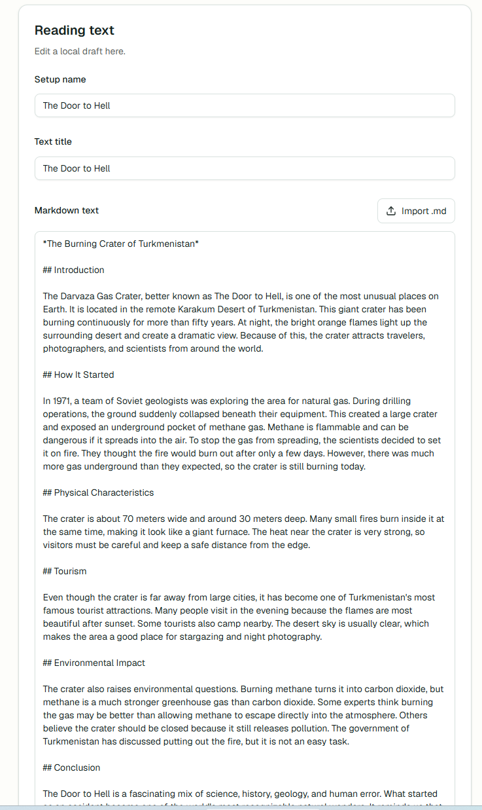

4. *(Optional)* Add a **Comprehension quiz**. Each question needs at least two options and one
   marked correct. The quiz is shown to the participant after they finish this text.

   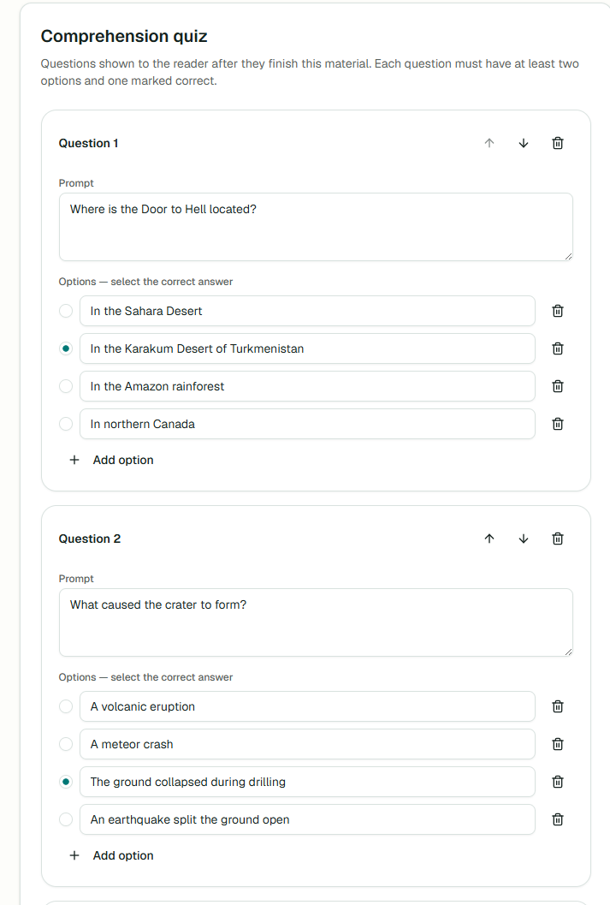

5. Adjust **Presentation settings** — font family, font size, line width, line height, letter
   spacing. Use the **Live preview** panel on the right to see the participant's reading view
   update as you change values.

   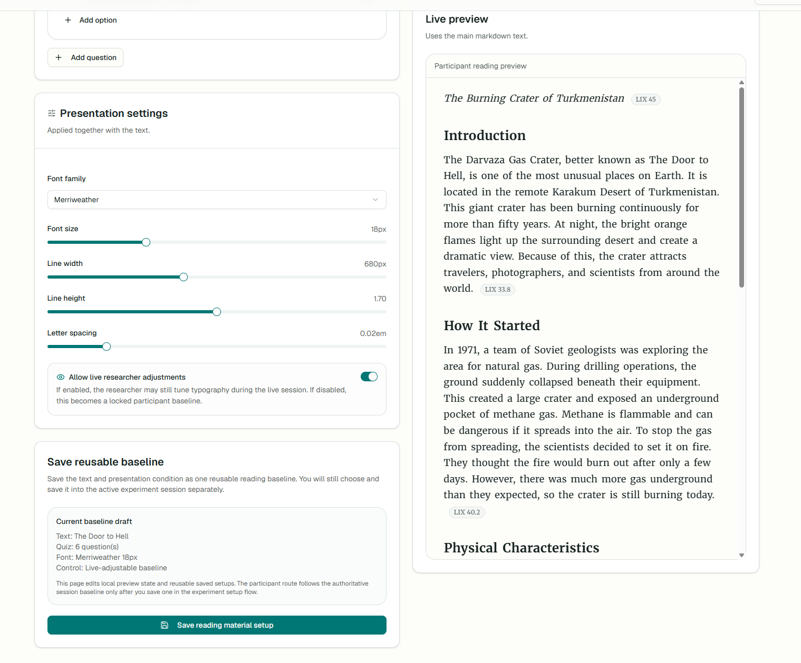

6. Toggle **Allow live researcher adjustments**:
   - **On** → a *live-adjustable baseline* (the researcher can still tune typography mid-session).
   - **Off** → a *locked baseline*.
7. Click **Save reading material setup**. You return to the Material Library.

> **Import / Export:** Use **Import JSON** (top-right of the editor) to load a previously
> exported material, and the **Export** button on a library card to download one as
> `*.reading-material.json`.

### 5.2 Build an Experiment Template

An *experiment template* is a reusable sequence of texts plus presentation defaults, order mode,
runtime strategy, and a calibration requirement.

1. Open **Experiment Templates** → click **New template** (or **Home → continue a draft**).

   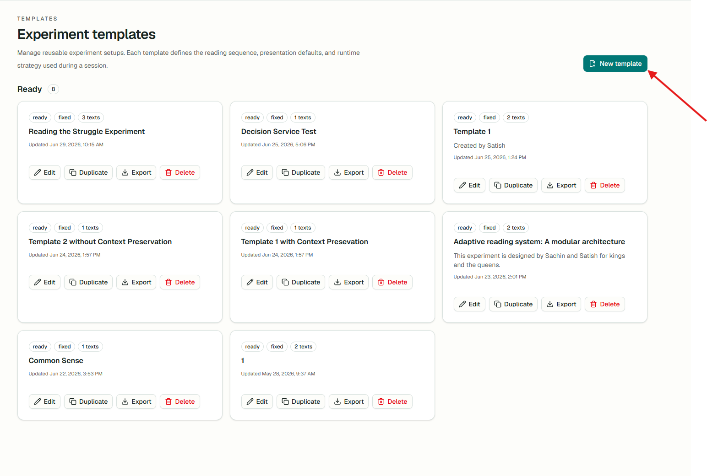

2. In **Template settings**, set:
   - **Template name** (required) and an optional **Description**.
   - **Status** — `Draft`, `Ready`, or `Archived`. Only **Ready** templates can be started from Home.
   - **Material order** — `Fixed order` or `Fully random at session start`.
   - **Decision strategy** — the runtime decision plugin/mode (see [§8](#8-runtime-plugins-decision--eye-analysis)).
   - **Require calibration** — keep enabled for real eye-tracker sessions.
   - **Default font / size / line width / live adjustments** — applied as defaults to added texts.

   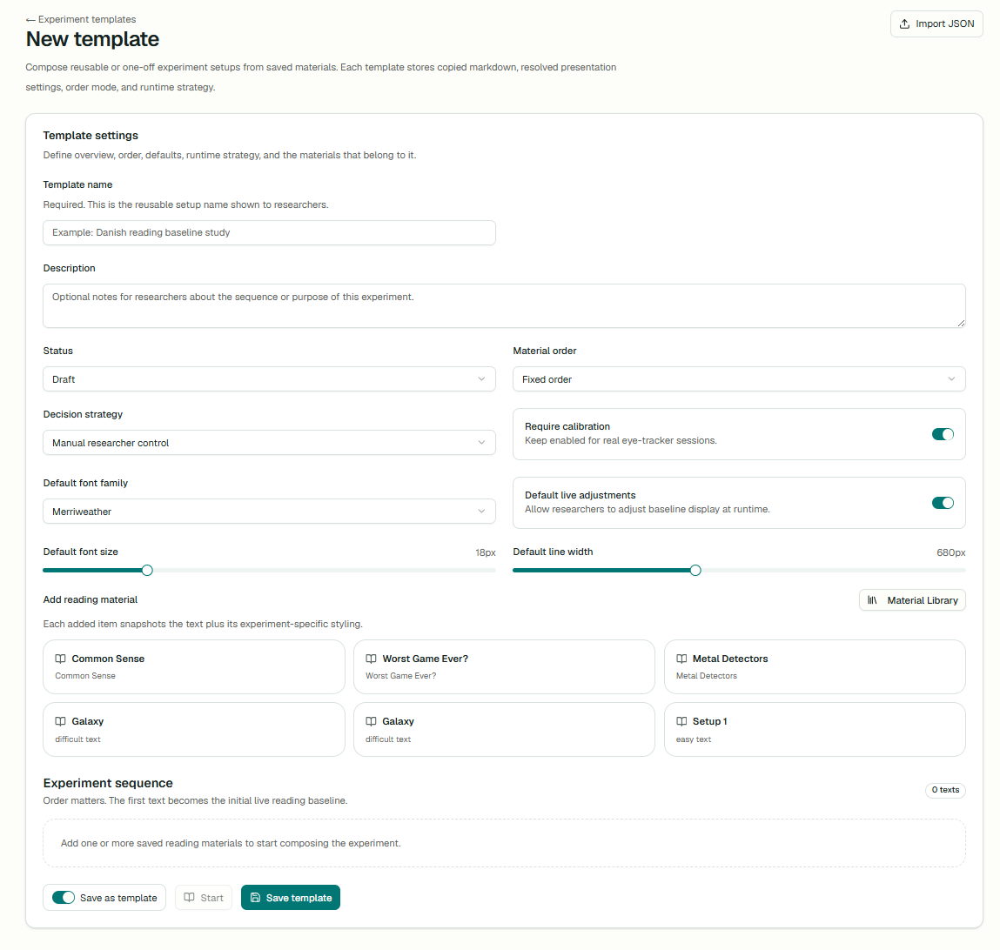

3. Under **Add reading material**, click any saved material to add it to the sequence. Each added
   item *snapshots* the text and its styling into the template.

   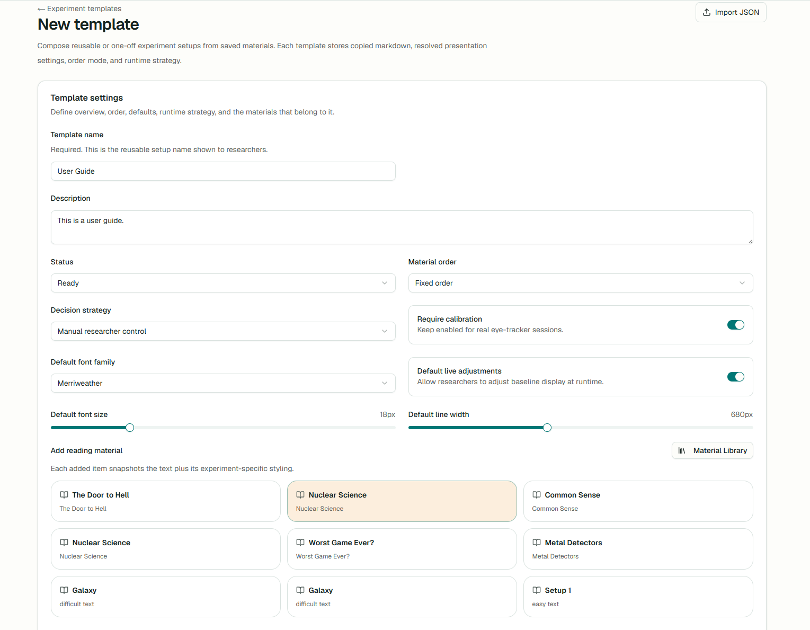

4. Arrange the **Experiment sequence**:
   - The **first text becomes the initial live reading baseline**.
   - Use the up/down arrows to reorder, the trash icon to remove.
   - Per text, override **displayed title, font, size, line width, line height, letter spacing**, and
     **Allow live presentation adjustments**.

   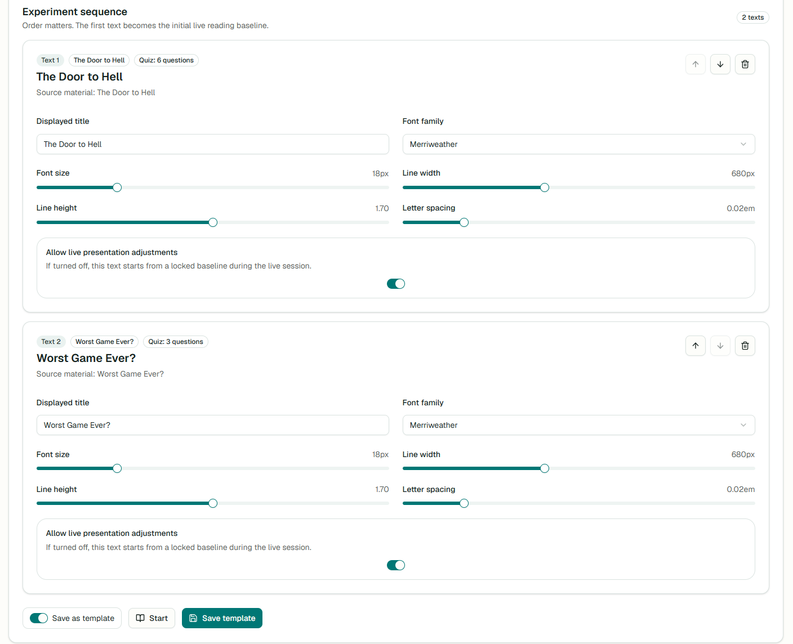

5. Finish:
   - **Save template** (or **Update template**) — keeps you in the library.
   - **Start** — saves and jumps straight into a session for this template. (Turn off **Save as
     template** first if you want a one-off run that is not stored.)

> **Duplicate / Export:** From the template library, use **Duplicate** to clone a setup as a new
> draft, or **Export** to download it as `*.experiment-template.json`. **Import JSON** is at the
> top-right of the template editor.

### 5.3 Run an Experiment Session

Sessions are driven by a **4-step stepper**. The researcher completes Steps 1–2 (preparation); the
participant completes Steps 3–4. Start a session by clicking **Start** on a ready template (Home),
or **Start** from the template editor.

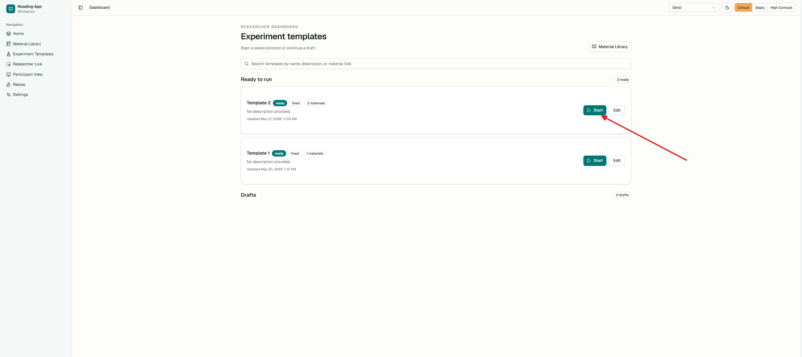

The left rail shows all four steps with status badges (`Done`, `Current`, `Available`, `Locked`)
and an owner badge (Researcher / Participant).

#### Step 1 — Choose eyetracker *(Researcher)*

> This step's content depends on the active **input mode** (Settings → Input mode). In **Mouse
> mode** it shows a "Mouse input is active" card and completes automatically. The steps below
> describe full **Eyetracker** mode (also used for **Eyetracker + face**).

1. Pick the device from the **eyetracker** dropdown (shown as *name / model / serial*). Click the
   refresh icon to re-scan if your device is missing.
2. Upload the device **licence** file (drag-and-drop or browse). Optionally tick **save licence**
   and/or **overwrite existing licence**.
3. Confirm the selection. Click **Save researcher setup** to continue.

   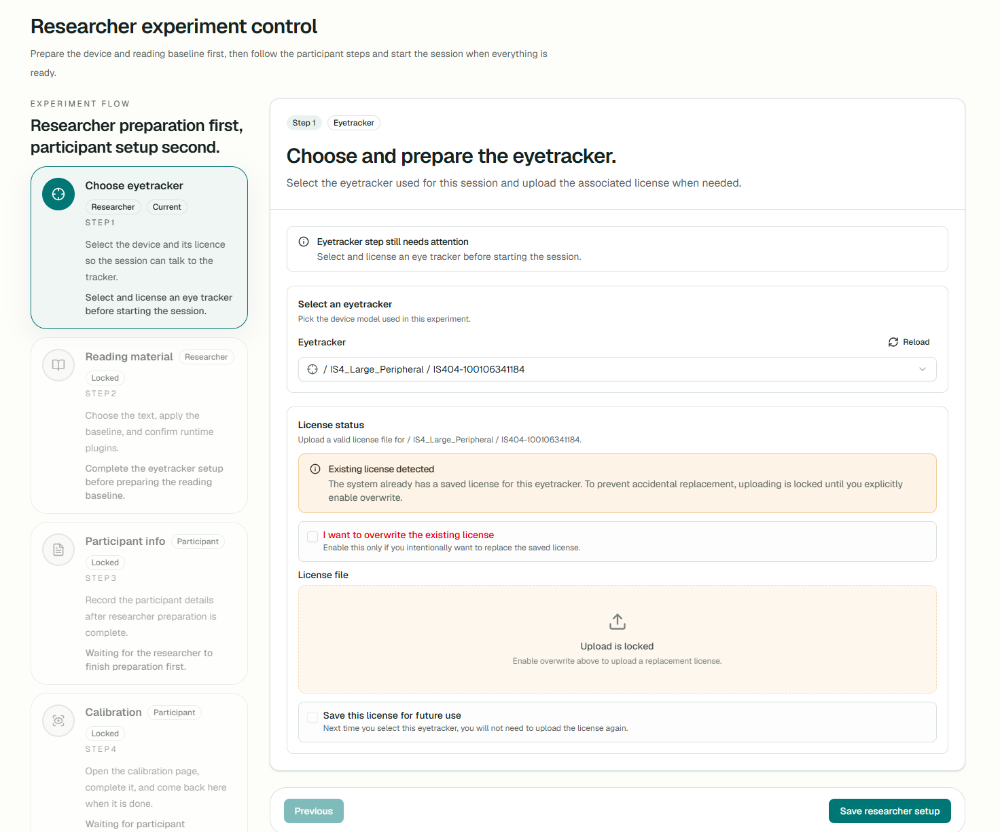

#### Step 2 — Reading material *(Researcher)*

1. Pick a **reusable experiment** (Ready templates appear as cards). Its first text becomes the
   live reading baseline. *(If you started from a template, this selection is locked.)*
2. Confirm the **Runtime plugins**:
   - **Decision plugin** — Manual / Rule-based (advisory or autonomous) / external Decision-maker.
   - **Eye analyzer** — Built-in analyzer or an external Eye analyzer service.
   - Status badges show whether each external service is *Connected*, *Built-in*, or *Unavailable*.
3. Review the selection summary, then click **Apply baseline & continue**.

   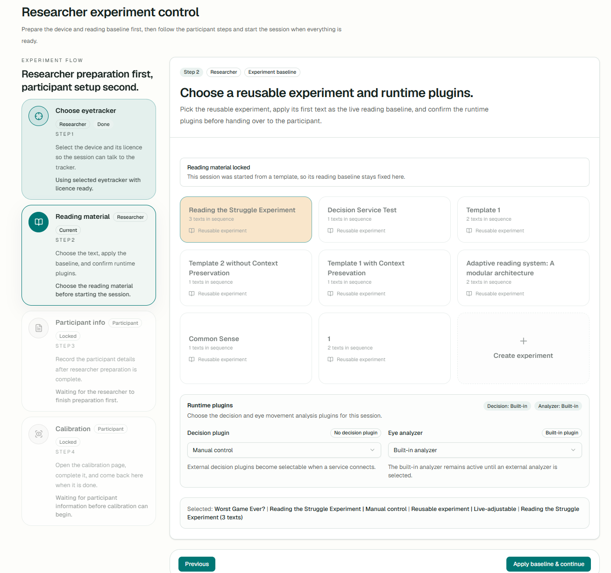

#### Step 3 — Participant info *(Participant)*

Recorded on the participant's screen (or by the researcher). Fields: **Name, Age, Sex, Existing eye
condition, Reading proficiency**. All are required and validated. Click **Continue to calibration**.

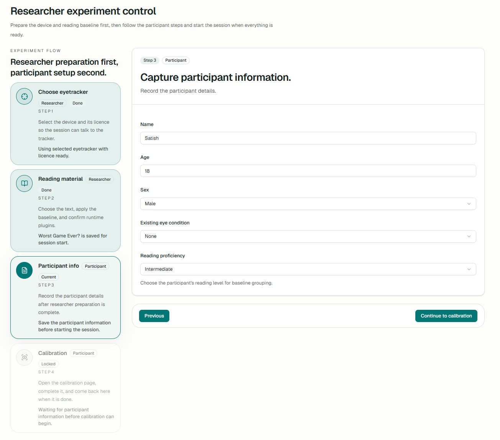

#### Step 4 — Calibration *(Participant)*

Opens the full-screen calibration routine. See [§5.5](#55-calibration). When validation passes, the
participant returns here automatically.

#### Start the session

Once all four steps show **Done**, the final button becomes **Start reading session**. Clicking it:
- (Researcher start) → opens **Researcher Live**.
- (Participant start) → opens the **Reading** page on the participant screen.

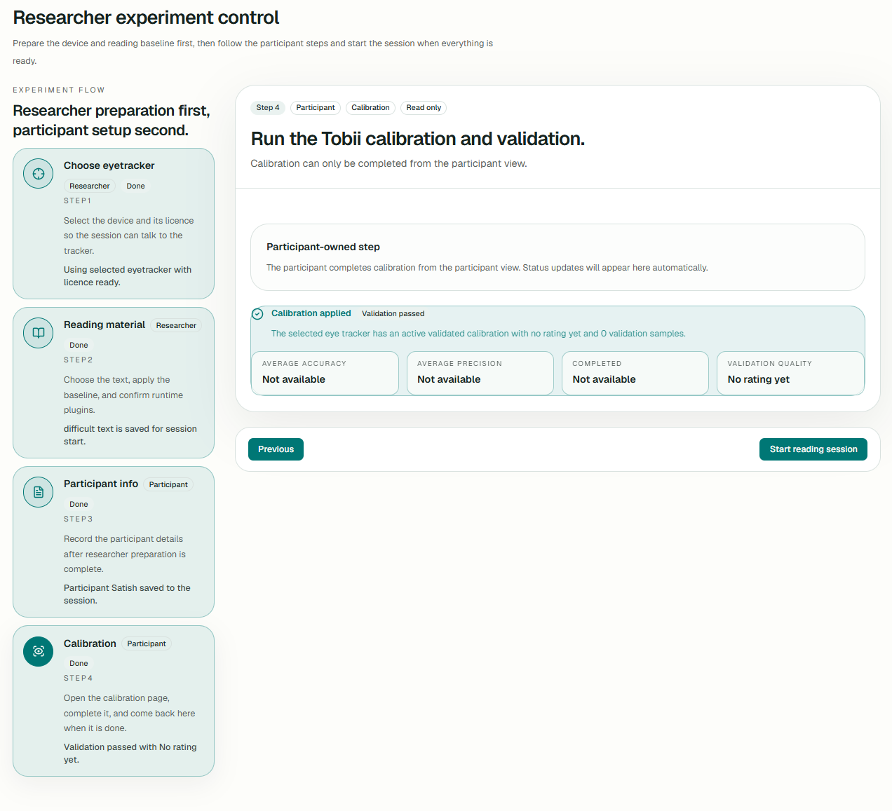

### 5.4 The Participant View

Open **Participant View** from the sidebar (it opens in a new tab) and place it on the
participant's screen.

- Before the researcher begins setup, the page shows a **waiting** card ("Experiment has not
  started yet" / "Your session is being prepared").

  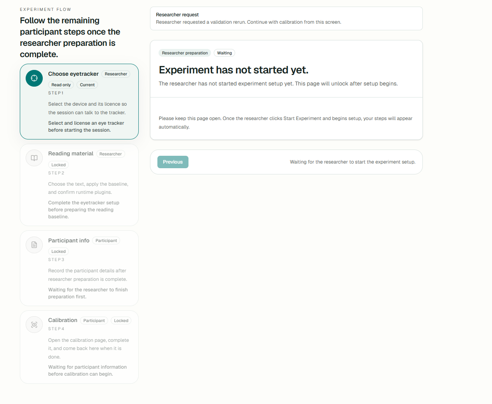

  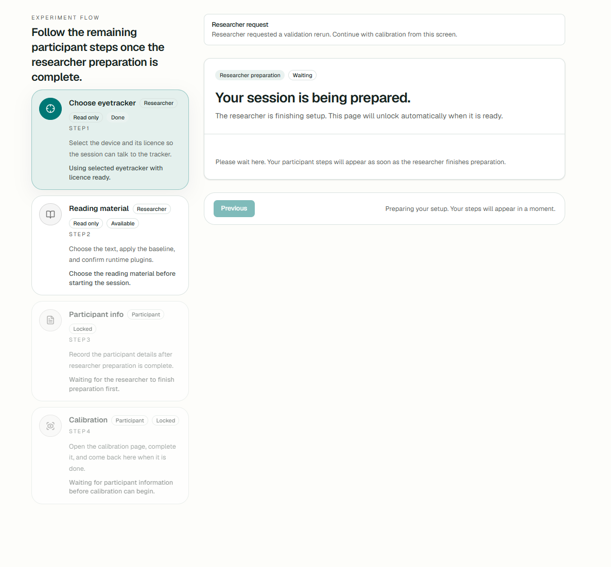

- Once researcher preparation (Steps 1–2) is ready, the participant's steps (3–4) unlock
  automatically.
- After participant info and calibration are complete, the page shows **"Waiting for the
  researcher to start the session."**

  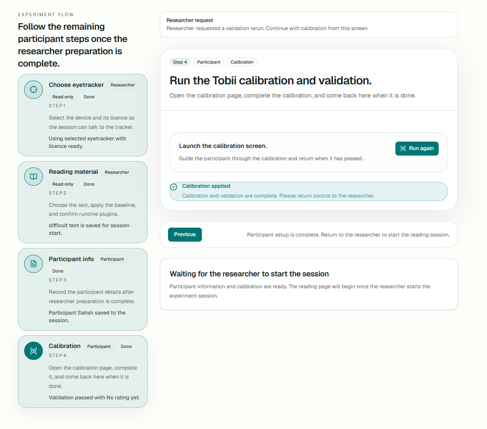

  The reading page begins automatically when the researcher starts the session.

> **Re-run calibration:** If the researcher requests a calibration or validation re-run, the
> participant sees a notice and is routed back into calibration.

### 5.5 Calibration

Calibration maps the participant's gaze to the screen and then **validates** the result against a
quality threshold. It runs in **full screen** and must stay visible — leaving full screen or hiding
the tab interrupts the run.

1. On the **Ready** screen, the participant looks at the center of each target. A gaze-preview
   overlay helps confirm tracking. Click **Start**.

   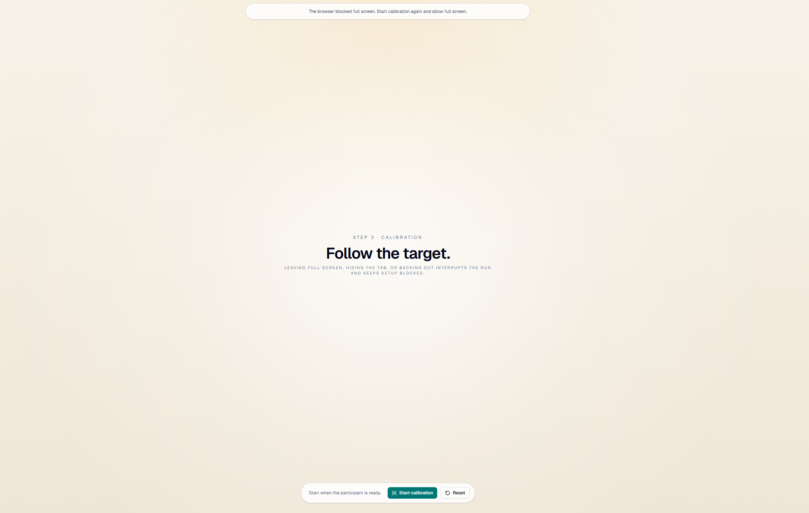

2. **Calibration run** — a target moves point-to-point; the participant holds their gaze on each.

   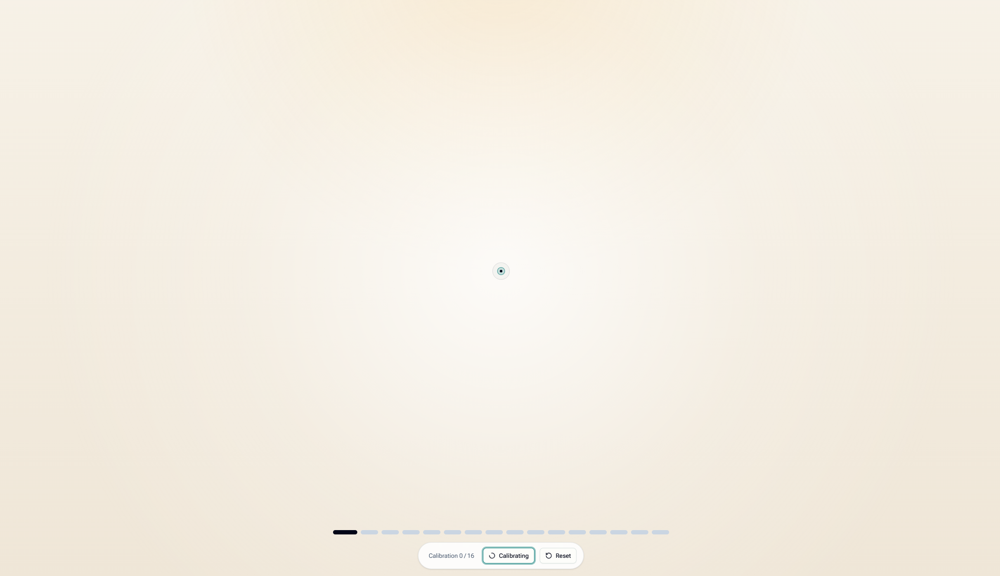

3. **Validation run** — repeats with validation targets to measure **accuracy** and **precision**.
4. **Review** *(researcher mode)* — shows quality, average accuracy/precision, and sample count.
   - If it **passed**, accept and return to the workflow.
   - If it **failed**, **Rerun validation** or **Start** a fresh calibration.

   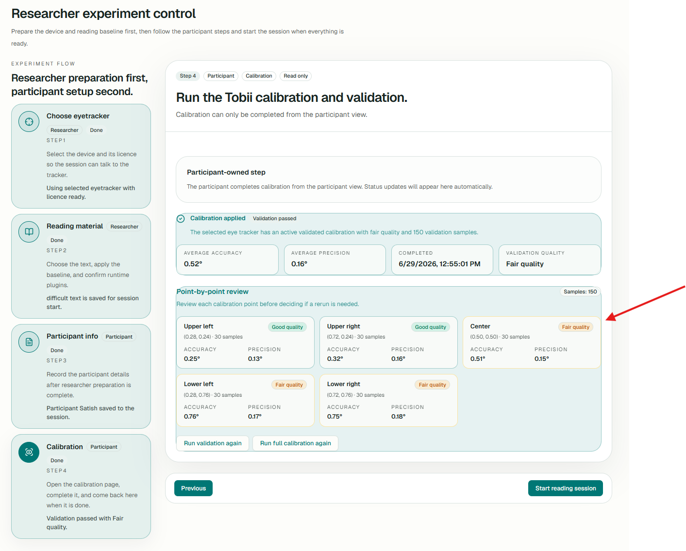

5. If a run is interrupted or rejected, a **failure** panel offers **Reset** or **Return to setup**.

> **Note:** In participant mode, a passing validation routes the participant straight back to their
> setup; the metrics review is a researcher-mode step.

### 5.6 The Live Researcher View

Open **Researcher Live** to monitor the active session. It runs full screen and is laid out in
three columns.

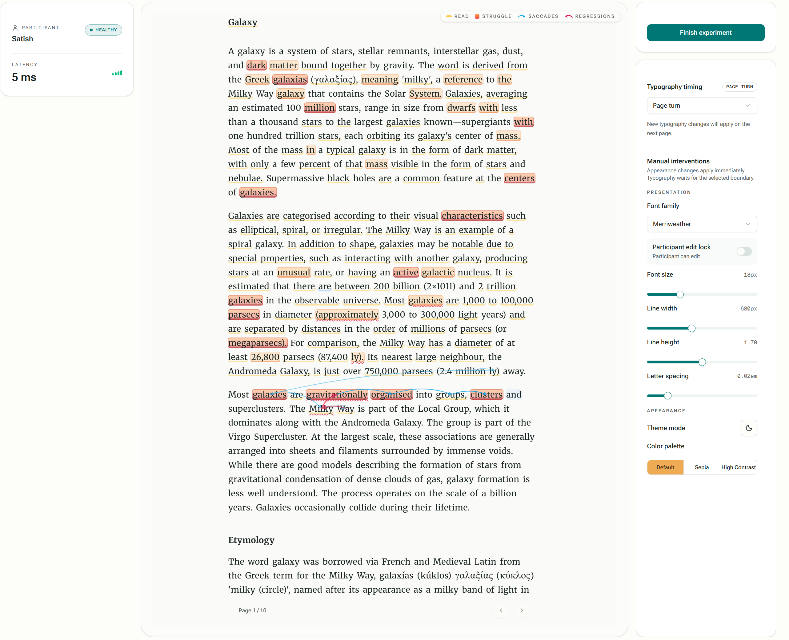

**Left column — Live controls & signals**
- Participant name and connection status.
- **Sample rate (Hz)**, **gaze validity rate**, and **latency (ms)**.
- **Struggle signals** (when the external eye analyzer is connected and selected).

**Center column — Live reader (mirror)**
- A real-time mirror of what the participant sees, with their gaze focus highlighted.
- **Follow participant** keeps the mirror locked to the participant's scroll position.
- A trust banner appears when the mirror is only *approximate* (e.g. not full screen) — click
  **Enter full screen** to restore an exact mirror.
- Optional overlays (fixation heatmap, saccade path / "reading dynamics") via the reader controls.

**Right column — Interventions**
- **Trigger an intervention** manually from the available intervention modules (e.g. typography or
  appearance changes), with a reason.
- **Approve / reject** decision proposals coming from a decision plugin (advisory mode).
- **Apply pending intervention now** to commit a queued change immediately.
- Set the **intervention commit boundary** (when a layout change is allowed to take effect).
- **Advance to the next text** in a multi-text experiment sequence.

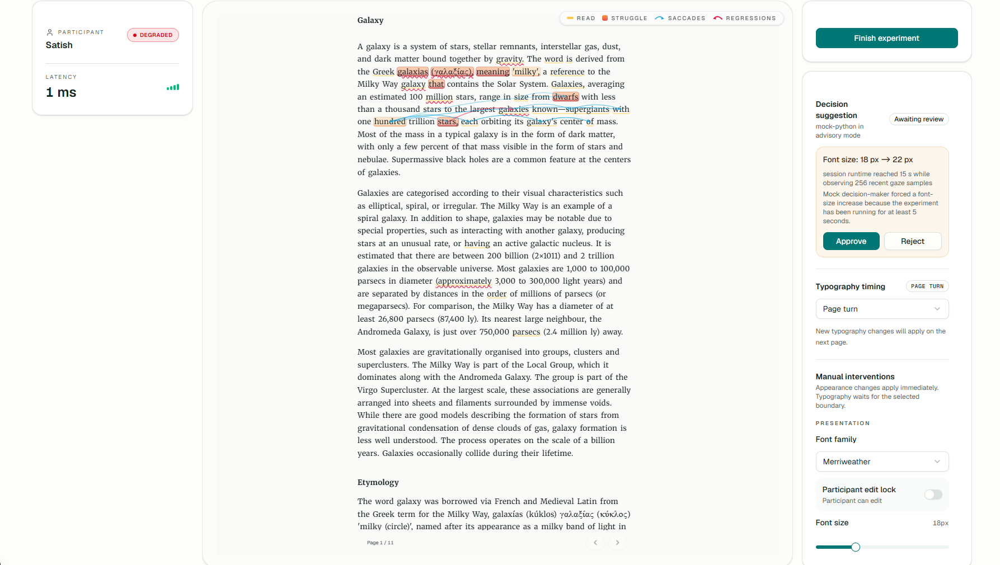

### 5.7 Finishing & Exporting a Session

When the session is finished:

1. In the **Researcher Live** view (or its empty/complete state), click **Finish experiment**.

   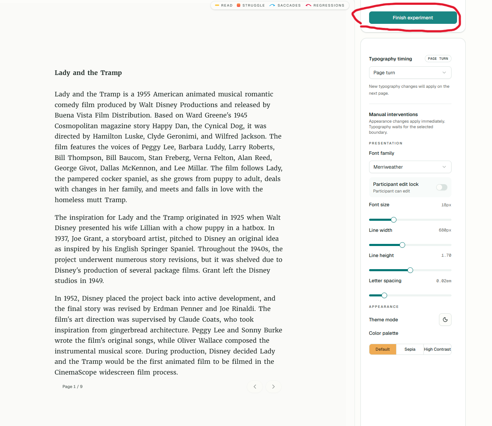

2. After finishing, the completion actions appear. You can:
   - **Start new experiment** — resets state and returns to the setup flow.
   - **Download** the data as **JSON**, **CSV**, **Processed**, or **Telemetry**.
   - **Save** the replay export (JSON or CSV) into the app under a name, so it appears in **Replay**.

   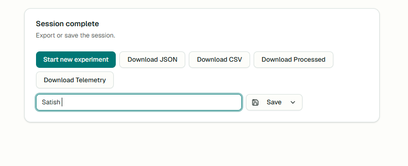

> **Naming:** The export name defaults to the reading title or participant name; edit it before
> saving or downloading.

### 5.8 Replay a Saved Session

Open **Replay** to review a recorded session.

1. **Load a session**:
   - Drag-and-drop or browse for an exported file, **or**
   - Pick one of the **saved exports** listed on the upload screen.
   - You can also **convert** a saved export into a processed report from here.

   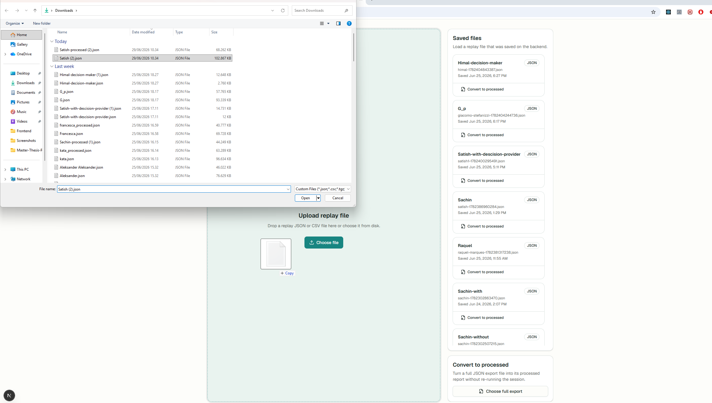

2. The replay opens in a three-column layout:
   - **Left** — playback controls: play/pause, restart, scrubber, **playback speed**, reader
     overlay options, and load/clear.
   - **Center** — the reconstructed reading view at the current time, including gaze focus, saccade
     paths, and any quiz/finish screens that occurred.
   - **Right** — metadata and a **key-events timeline** (click an event to seek), plus oculomotor
     counts (**fixations, saccades, regressions**).

   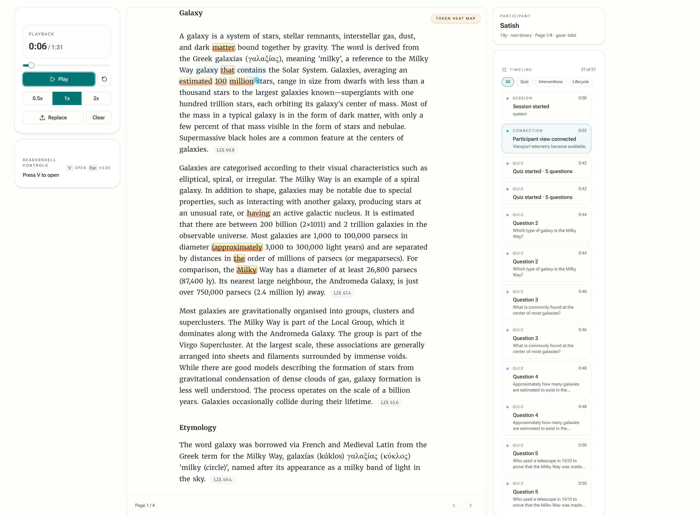

## 6. Settings

Open **Settings** from the sidebar. There are three sections (tabs):

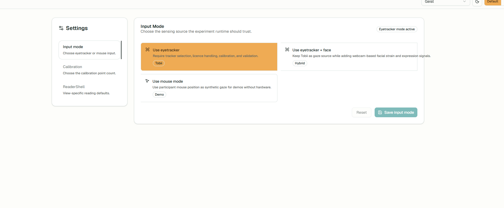

| Section | What it controls |
|--------------------|------------------------------------------------------------|
| **Input mode** | The sensing source: **Use eyetracker** (Tobii), **Use eyetracker + face** (Tobii gaze + webcam facial signals), or **Use mouse mode** (demo). Choose, then **Save**. See [§7](#7-sensing-modes-explained). |
| **Calibration** | The number of calibration points used during a calibration run. |
| **ReaderShell** | View-specific reading defaults for the researcher mirror and the replay reader (e.g. which overlays are on by default). |

> The chosen input mode changes **Step 1** of the experiment stepper accordingly.

## 7. Sensing Modes Explained

| Mode | Badge | Behavior |
|--------------------|------------|------------------------------------------------------------|
| **Use eyetracker** | Tobii | Requires tracker selection, licence handling, calibration, and validation. The standard real-experiment mode. |
| **Use eyetracker + face** | Hybrid | Tobii stays the authoritative gaze source; a webcam adds facial strain/expression signals. If the webcam is unavailable, gaze still runs but facial signals are degraded. |
| **Use mouse mode** | Demo | The participant's mouse position is used as synthetic gaze. Skips tracker selection, licence, and hardware checks — ideal for demos without hardware. |

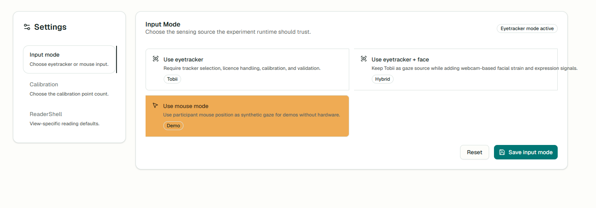

## 8. Runtime Plugins (Decision & Eye Analysis)

The platform separates **who decides on interventions** from **who analyzes eye movement**. Both are
selectable per session in **Step 2**, and a default decision strategy is stored on each template.

**Decision plugin** options:

| Option | Meaning |
|--------------------|------------------------------------------------------------|
| **Manual control** | Interventions stay fully researcher-operated. No decision plugin. |
| **Rule-based advisory** | Built-in rules *propose* interventions for the researcher to approve. |
| **Rule-based autonomous** | Built-in rules *apply* supported interventions automatically. |
| **Decision-maker advisory** | A connected external service proposes interventions. |
| **Decision-maker autonomous** | A connected external service requests interventions automatically. |

**Eye analyzer** options:

| Option | Meaning |
|--------------------|------------------------------------------------------------|
| **Built-in analyzer** | Backend thresholds provide fixation/saccade state. |
| **Eye analyzer service** | A connected external service supplies fixation/saccade and struggle state. |

> External options are only selectable when the corresponding service is **connected** and supports
> the chosen mode. Otherwise the option shows **— unavailable** and the built-in option remains
> active.

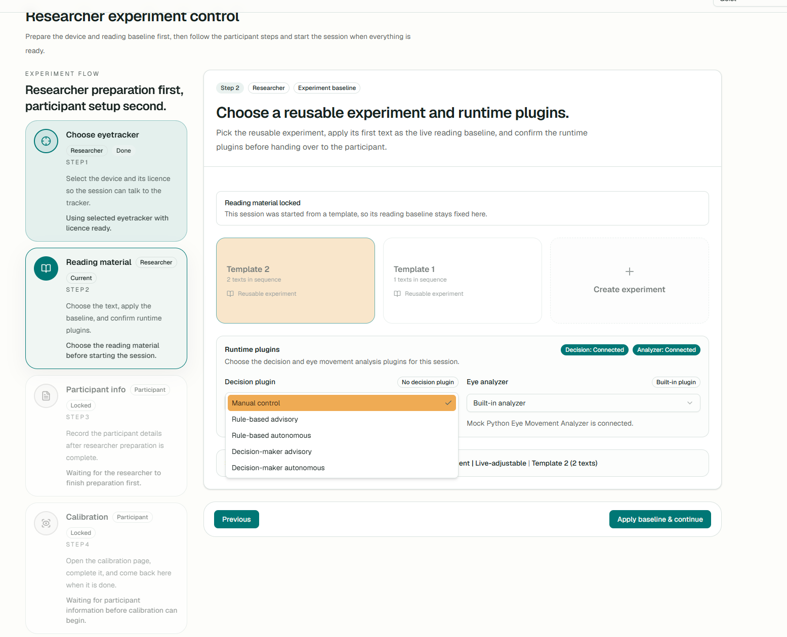

## 9. Troubleshooting & FAQ

**The participant page is stuck on "waiting".**
The researcher hasn't finished Steps 1–2 yet, or the session hasn't started. Complete researcher
preparation; the participant steps unlock automatically.

**Calibration keeps getting interrupted.**
Calibration must stay in **full screen** and remain the visible tab for the whole run. If the
browser blocks full screen, start again and allow it. Don't switch tabs or windows during the run.

**An external decision/analyzer option says "unavailable".**
The external service isn't connected (or doesn't support that mode). Reconnect the service, or pick
a built-in option.

**The live mirror shows an "approximate" banner.**
The researcher view isn't in full screen, or participant viewport data is missing. Click **Enter
full screen** to restore an exact mirror.

**I can't start a template from Home.**
Only templates with status **Ready** appear under "Ready to run". Open the template, set its status
to **Ready** (it must contain at least one text), and save.

**Can I run without hardware?**
Yes — switch **Settings → Input mode** to **Use mouse mode**.

**What content formats are supported?**
Markdown only. PDF is intentionally not supported.

**Where do my exports go?**
Downloads save to your browser's download folder. **Saved** exports live inside the app and appear
in **Replay**.

## 10. Glossary

| Term | Definition |
|--------------------|------------------------------------------------------------|
| **Reading material** | One Markdown text + comprehension quiz + presentation defaults, saved for reuse. |
| **Experiment template** | A reusable, ordered sequence of texts with defaults, order mode, and a runtime strategy. |
| **Baseline** | The text + presentation condition applied at the start of the live reading session. |
| **Live-adjustable vs Locked** | Whether the researcher may change typography during the live session. |
| **Sensing / input mode** | The gaze source: eyetracker, eyetracker + face, or mouse. |
| **Decision plugin** | The component that decides whether/when to apply an intervention. |
| **Eye analyzer** | The component that derives fixation, saccade, and struggle state from gaze. |
| **Intervention** | A context-aware micro-change to the reading view (e.g. typography/appearance). |
| **Validation** | The post-calibration quality check measuring accuracy and precision. |
| **Replay** | Frame-by-frame playback of a recorded session. |

