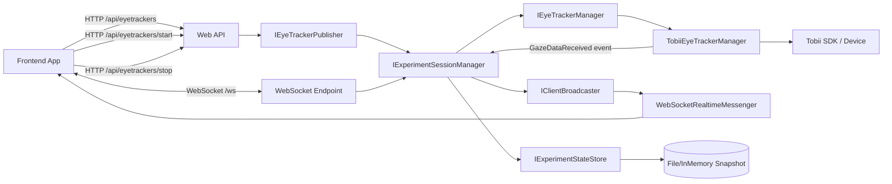
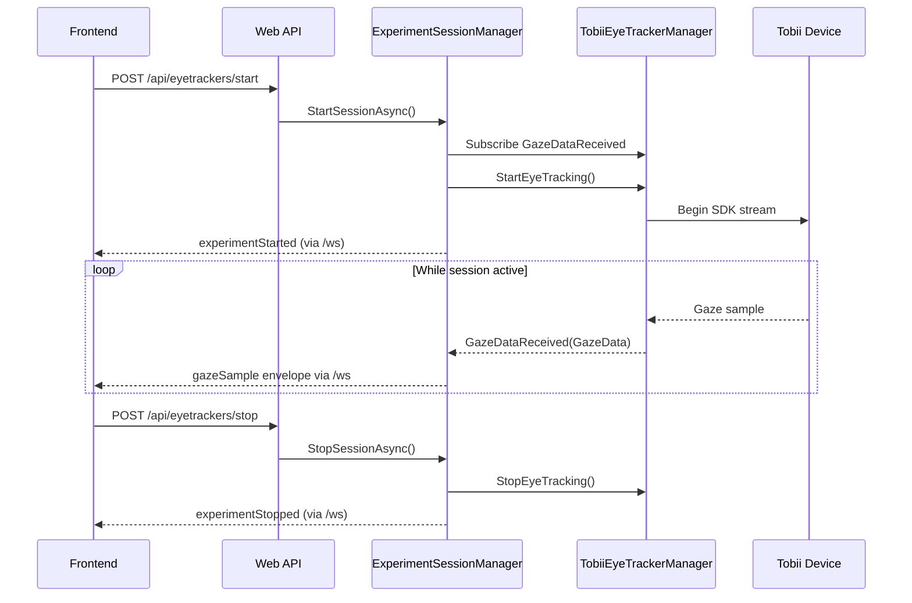

# Backend Architecture

## Purpose
The backend exposes two integration surfaces:

- **REST endpoints** (FastEndpoints under `/api`) for eye-tracker discovery and explicit start/stop.
- **Realtime WebSocket channel** (`/ws`) for low-latency session control and gaze sample streaming to frontend clients.

The architecture is organized into:

- `WebApi`: HTTP/WebSocket transport and endpoint wiring.
- `core.Application`: session orchestration and message routing.
- `core.Domain`: core entities (`GazeData`, `ExperimentSession`, `EyeTrackerDevice`).
- `infrastructure.TobiiEyetracker`: Tobii SDK adapter and gaze event source.
- `infrastructure.RealtimeMessenger`: WebSocket connection registry and broadcast transport.
- `infrastructure.Realtime.Persistence`: optional periodic snapshot checkpointing.

## High-Level Component Diagram


## Request and Data Flow


## Eye-Tracker Data Collection
Data collection is driven by `TobiiEyeTrackerManager`:

- On **Windows**, it uses `Tobii.Research` APIs.
- `StartEyeTracking()` discovers connected trackers and picks the first available tracker.
- It attempts to load/apply a Tobii license file if present.
- It subscribes to Tobii SDK's `GazeDataReceived` callback.
- Each SDK callback is mapped into backend `GazeData` and raised through `IEyeTrackerManager.GazeDataReceived`.

`GazeData` fields currently produced:

- `deviceTimeStamp`
- `leftEyeX`, `leftEyeY`, `leftEyeValidity`
- `rightEyeX`, `rightEyeY`, `rightEyeValidity`

On **non-Windows** environments, the manager is a mock implementation (device discovery mock + no real Tobii stream).

## Session Lifecycle and Realtime Routing
`ExperimentSessionManager` is the core orchestrator:

- Guards start/stop with a `SemaphoreSlim` lifecycle gate.
- Tracks active session metadata (`sessionId`, start/stop timestamps, sample count, latest sample).
- Subscribes/unsubscribes to `GazeDataReceived` when session starts/stops.
- Broadcasts realtime events using `IClientBroadcaster`.

Broadcast behavior:

- On start: emits `experimentStarted` with full snapshot.
- During run: emits `gazeSample` for each incoming gaze event.
- On stop: emits `experimentStopped` with full snapshot.

## Transport Contracts
### REST APIs
All FastEndpoints are prefixed with `/api`:

- `GET /api/eyetrackers`: returns `EyeTrackerDevice[]`.
- `POST /api/eyetrackers/start`: starts session/tracking.
- `POST /api/eyetrackers/stop`: stops session/tracking.

### WebSocket Endpoint
- URL: `/ws` (no `/api` prefix).
- Inbound frame format:
```json
{
  "type": "startExperiment",
  "payload": {}
}
```
- Outbound frame format:
```json
{
  "type": "gazeSample",
  "sentAtUnixMs": 1740000000000,
  "payload": {
    "deviceTimeStamp": 123,
    "leftEyeX": 0.42,
    "leftEyeY": 0.51,
    "leftEyeValidity": "Valid",
    "rightEyeX": 0.44,
    "rightEyeY": 0.52,
    "rightEyeValidity": "Valid"
  }
}
```

Supported inbound `type` values include:

- `ping`
- `startExperiment`
- `stopExperiment`
- `getExperimentState`
- `researcherCommand` (`payload.command` can be start/stop)

Common outbound `type` values include:

- `pong`
- `experimentStarted`
- `experimentStopped`
- `experimentState`
- `gazeSample`
- `error`

## Persistence and Recovery Snapshot
Realtime persistence module periodically checkpoints `ExperimentSessionSnapshot`:

- Provider is configurable: `InMemory` (default) or `File`.
- Interval is configurable via `RealtimePersistence.CheckpointIntervalMilliseconds` (minimum enforced: `250ms`).
- File mode writes JSON snapshots to configured `SnapshotFilePath`.

This is best-effort persistence for state observability/recovery support, not a full historical gaze archive.

## Key Practical Notes
- WebSocket is required for realtime gaze ingestion on frontend.
- REST `start/stop` and WebSocket `startExperiment/stopExperiment` both control the same session manager.
- If there is no Tobii device on Windows, start will fail.
- If running on non-Windows, you will not receive real Tobii gaze samples.
