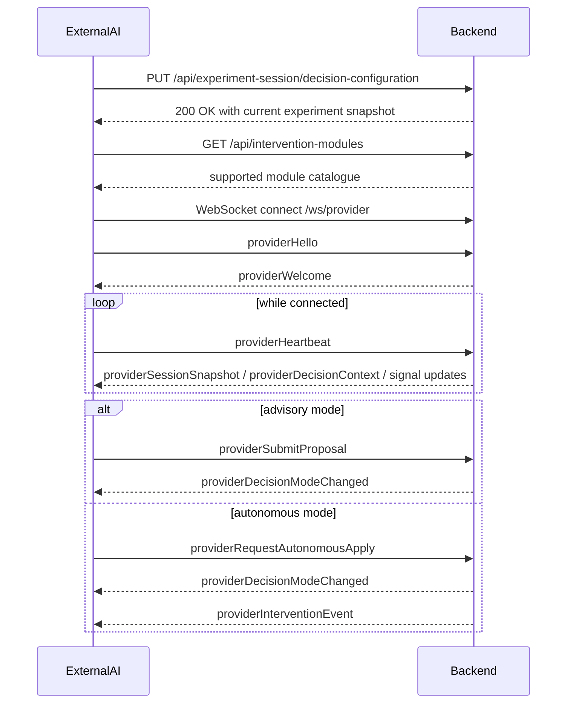

# External AI <-> Backend Black-Box Contract

This document defines the integration contract between:

- the Reading the Reader backend
- an external AI decision module

The purpose of this document is to let each side treat the other as a black box.

That means:

- the external AI team should not need to know backend internals
- the backend should not need to know AI implementation details
- both sides only rely on transport contracts, payload contracts, and behavioral guarantees

## 1. Black-Box Boundary

The contract boundary is:

- REST for configuration and capability discovery
- WebSocket for realtime provider communication

The external AI module must treat the backend as a system that:

- owns experiment state
- owns session state
- owns decision state
- owns intervention validation
- owns intervention application

The backend must treat the external AI module as a system that:

- receives decision-relevant signals
- computes suggestions or apply requests
- returns structured decisions through the provider protocol

Neither side should depend on the other side's internal architecture, libraries, storage model, threading model, or implementation language.

## 2. Responsibilities

### Backend responsibilities

- Expose stable provider-facing contracts.
- Authenticate the external provider.
- Publish authoritative session and reading signals.
- Validate provider messages.
- Validate interventions.
- Create authoritative proposals in advisory mode.
- Apply authoritative interventions in autonomous mode.

### External AI responsibilities

- Connect and register as a provider.
- Keep the provider connection alive.
- Consume the backend's signals.
- Produce valid proposal or autonomous-apply messages.
- Preserve correlation ids and session ids from the contract.
- Avoid making assumptions about backend internals.

## 3. Interfaces

## REST interface

### 3.1 Configure external decision mode

Endpoint:

`PUT /api/experiment-session/decision-configuration`

Purpose:

- enable the external provider path
- choose advisory or autonomous execution
- optionally pause automation

Example request:

```http
PUT /api/experiment-session/decision-configuration HTTP/1.1
Content-Type: application/json

{
  "conditionLabel": "External AI",
  "providerId": "external",
  "executionMode": "advisory",
  "automationPaused": false
}
```

Example response:

```json
{
  "sessionId": "f0c2ce58-9249-489a-ae5f-4c5d8e2cb8b5",
  "isActive": true,
  "externalProviderStatus": {
    "isConnected": false,
    "status": "disconnected",
    "providerId": null,
    "displayName": null,
    "supportsAdvisoryExecution": false,
    "supportsAutonomousExecution": false,
    "supportedInterventionModuleIds": [],
    "lastHeartbeatAtUnixMs": null
  },
  "decisionConfiguration": {
    "conditionLabel": "External AI",
    "providerId": "external",
    "executionMode": "advisory"
  },
  "decisionState": {
    "automationPaused": false,
    "activeProposal": null,
    "recentProposalHistory": []
  }
}
```

### 3.2 Discover supported intervention modules

Endpoint:

`GET /api/intervention-modules`

Purpose:

- allow the external AI module to discover supported module ids and parameters

Example request:

```http
GET /api/intervention-modules HTTP/1.1
Accept: application/json
```

Example response:

```json
[
  {
    "moduleId": "font-size",
    "displayName": "Font size",
    "description": "Changes the participant reading font size.",
    "group": "presentation",
    "sortOrder": 20,
    "parameters": [
      {
        "key": "fontSizePx",
        "displayName": "Font size",
        "description": "Font size in pixels for participant reading text.",
        "valueKind": "integer",
        "required": true,
        "defaultValue": "18",
        "unit": "px",
        "minValue": 14,
        "maxValue": 28,
        "step": 2,
        "options": []
      }
    ]
  },
  {
    "moduleId": "palette",
    "displayName": "Color palette",
    "description": "Changes the participant reading palette.",
    "group": "appearance",
    "sortOrder": 70,
    "parameters": [
      {
        "key": "palette",
        "displayName": "Color palette",
        "description": "Palette applied to the participant reading surface.",
        "valueKind": "string",
        "required": true,
        "defaultValue": "default",
        "unit": null,
        "minValue": null,
        "maxValue": null,
        "step": null,
        "options": [
          { "value": "default", "displayName": "Default", "description": null },
          { "value": "sepia", "displayName": "Sepia", "description": null },
          { "value": "high-contrast", "displayName": "High contrast", "description": null }
        ]
      }
    ]
  }
]
```

### 3.3 Read current session snapshot

Endpoint:

`GET /api/experiment-session`

Purpose:

- obtain the current authoritative session snapshot
- recover after reconnect
- inspect current decision mode and session id

Example request:

```http
GET /api/experiment-session HTTP/1.1
Accept: application/json
```

Example response:

```json
{
  "sessionId": "f0c2ce58-9249-489a-ae5f-4c5d8e2cb8b5",
  "isActive": true,
  "startedAtUnixMs": 1710000000000,
  "stoppedAtUnixMs": null,
  "externalProviderStatus": {
    "isConnected": true,
    "status": "active",
    "providerId": "my-ai-provider",
    "displayName": "My AI Provider",
    "supportsAdvisoryExecution": true,
    "supportsAutonomousExecution": true,
    "supportedInterventionModuleIds": ["font-size", "line-height"],
    "lastHeartbeatAtUnixMs": 1710000005000
  },
  "decisionConfiguration": {
    "conditionLabel": "External AI",
    "providerId": "external",
    "executionMode": "advisory"
  },
  "decisionState": {
    "automationPaused": false,
    "activeProposal": null,
    "recentProposalHistory": []
  },
  "readingSession": {
    "content": {
      "documentId": "text-001",
      "title": "Example Text",
      "markdown": "# Example\\n\\nThis is sample reading content.",
      "sourceSetupId": "setup-123",
      "updatedAtUnixMs": 1710000000000,
      "usesSavedSetup": true
    },
    "presentation": {
      "fontFamily": "merriweather",
      "fontSizePx": 18,
      "lineWidthPx": 680,
      "lineHeight": 1.8,
      "letterSpacingEm": 0,
      "editableByResearcher": true,
      "isPresentationLocked": false
    },
    "appearance": {
      "themeMode": "light",
      "palette": "default",
      "appFont": "geist"
    },
    "focus": {
      "isInsideReadingArea": true,
      "normalizedContentX": 0.51,
      "normalizedContentY": 0.28,
      "activeTokenId": "token-42",
      "activeBlockId": "paragraph-3",
      "updatedAtUnixMs": 1710000001200
    },
    "attentionSummary": {
      "updatedAtUnixMs": 1710000001234,
      "tokenStats": {},
      "currentTokenId": "token-42",
      "currentTokenDurationMs": 1450,
      "fixatedTokenCount": 37,
      "skimmedTokenCount": 12
    }
  }
}
```

## WebSocket interface

### 3.4 Provider WebSocket endpoint

Endpoint:

- `ws://localhost:5190/ws/provider`
- `wss://<host>/ws/provider`

Protocol version:

- `provider.v1`

### 3.5 Provider envelope

Example envelope:

```json
{
  "type": "providerHello",
  "protocolVersion": "provider.v1",
  "providerId": "my-ai-provider",
  "sessionId": null,
  "correlationId": null,
  "sentAtUnixMs": 1710000000000,
  "payload": {
    "providerId": "my-ai-provider",
    "displayName": "My AI Provider",
    "protocolVersion": "provider.v1",
    "authToken": "shared-secret-here",
    "supportsAdvisoryExecution": true,
    "supportsAutonomousExecution": true,
    "supportedInterventionModuleIds": ["font-size", "line-height"]
  }
}
```

## 4. Contracted Provider Messages

## External AI -> Backend

### 4.1 Register provider

Message type:

`providerHello`

Example request:

```json
{
  "type": "providerHello",
  "protocolVersion": "provider.v1",
  "providerId": "my-ai-provider",
  "sessionId": null,
  "correlationId": null,
  "sentAtUnixMs": 1710000000000,
  "payload": {
    "providerId": "my-ai-provider",
    "displayName": "My AI Provider",
    "protocolVersion": "provider.v1",
    "authToken": "shared-secret-here",
    "supportsAdvisoryExecution": true,
    "supportsAutonomousExecution": true,
    "supportedInterventionModuleIds": ["font-size", "line-height"]
  }
}
```

Example response:

```json
{
  "type": "providerWelcome",
  "protocolVersion": "provider.v1",
  "providerId": "my-ai-provider",
  "sessionId": null,
  "correlationId": null,
  "sentAtUnixMs": 1710000000100,
  "payload": {
    "providerId": "my-ai-provider",
    "displayName": "My AI Provider",
    "acceptedProtocolVersion": "provider.v1",
    "status": "active",
    "registeredAtUnixMs": 1710000000100,
    "heartbeatTimeoutMilliseconds": 15000
  }
}
```

### 4.2 Heartbeat

Message type:

`providerHeartbeat`

Example request:

```json
{
  "type": "providerHeartbeat",
  "protocolVersion": "provider.v1",
  "providerId": "my-ai-provider",
  "sessionId": null,
  "correlationId": null,
  "sentAtUnixMs": 1710000005000,
  "payload": {
    "providerId": "my-ai-provider",
    "protocolVersion": "provider.v1",
    "sentAtUnixMs": 1710000005000
  }
}
```

### 4.3 Submit advisory proposal

Message type:

`providerSubmitProposal`

Use only when backend execution mode is `advisory`.

Example request:

```json
{
  "type": "providerSubmitProposal",
  "protocolVersion": "provider.v1",
  "providerId": "my-ai-provider",
  "sessionId": "f0c2ce58-9249-489a-ae5f-4c5d8e2cb8b5",
  "correlationId": "ctx-1710000001234",
  "sentAtUnixMs": 1710000001300,
  "payload": {
    "providerId": "my-ai-provider",
    "sessionId": "f0c2ce58-9249-489a-ae5f-4c5d8e2cb8b5",
    "correlationId": "ctx-1710000001234",
    "proposalId": "6b3d6d15-50b6-4d8e-b7a0-9d7885c2d31a",
    "executionMode": "advisory",
    "rationale": "Sustained fixation suggests a small font-size increase.",
    "signalSummary": "current token dwell time exceeded 1200 ms",
    "providerObservedAtUnixMs": 1710000001234,
    "proposedIntervention": {
      "moduleId": "font-size",
      "trigger": "attention-summary",
      "reason": "Increase font size to reduce local reading strain.",
      "presentation": {
        "fontFamily": null,
        "fontSizePx": 20,
        "lineWidthPx": null,
        "lineHeight": null,
        "letterSpacingEm": null,
        "editableByResearcher": null
      },
      "appearance": {
        "themeMode": null,
        "palette": null,
        "appFont": null
      },
      "parameters": {
        "fontSizePx": "20"
      }
    }
  }
}
```

### 4.4 Request autonomous apply

Message type:

`providerRequestAutonomousApply`

Use only when backend execution mode is `autonomous`.

Example request:

```json
{
  "type": "providerRequestAutonomousApply",
  "protocolVersion": "provider.v1",
  "providerId": "my-ai-provider",
  "sessionId": "f0c2ce58-9249-489a-ae5f-4c5d8e2cb8b5",
  "correlationId": "ctx-1710000002234",
  "sentAtUnixMs": 1710000002300,
  "payload": {
    "providerId": "my-ai-provider",
    "sessionId": "f0c2ce58-9249-489a-ae5f-4c5d8e2cb8b5",
    "correlationId": "ctx-1710000002234",
    "executionMode": "autonomous",
    "rationale": "Current state matches the provider rule for autonomous adaptation.",
    "signalSummary": "current token dwell time exceeded 1200 ms",
    "providerObservedAtUnixMs": 1710000002234,
    "requestedIntervention": {
      "moduleId": "font-size",
      "trigger": "attention-summary",
      "reason": "Increase font size to reduce local reading strain.",
      "presentation": {
        "fontFamily": null,
        "fontSizePx": 20,
        "lineWidthPx": null,
        "lineHeight": null,
        "letterSpacingEm": null,
        "editableByResearcher": null
      },
      "appearance": {
        "themeMode": null,
        "palette": null,
        "appFont": null
      },
      "parameters": {
        "fontSizePx": "20"
      }
    }
  }
}
```

### 4.5 Report provider-side error

Message type:

`providerError`

Example request:

```json
{
  "type": "providerError",
  "protocolVersion": "provider.v1",
  "providerId": "my-ai-provider",
  "sessionId": null,
  "correlationId": null,
  "sentAtUnixMs": 1710000003000,
  "payload": {
    "providerId": "my-ai-provider",
    "code": "inference-timeout",
    "message": "The provider exceeded its inference timeout.",
    "detail": "Falling back to no-op decisions until the model recovers."
  }
}
```

## Backend -> External AI

### 4.6 Welcome

Message type:

`providerWelcome`

Example payload:

```json
{
  "providerId": "my-ai-provider",
  "displayName": "My AI Provider",
  "acceptedProtocolVersion": "provider.v1",
  "status": "active",
  "registeredAtUnixMs": 1710000000100,
  "heartbeatTimeoutMilliseconds": 15000
}
```

### 4.7 Full session snapshot

Message type:

`providerSessionSnapshot`

Example payload:

```json
{
  "sessionId": "f0c2ce58-9249-489a-ae5f-4c5d8e2cb8b5",
  "isActive": true,
  "startedAtUnixMs": 1710000000000,
  "stoppedAtUnixMs": null,
  "externalProviderStatus": {
    "isConnected": true,
    "status": "active",
    "providerId": "my-ai-provider",
    "displayName": "My AI Provider",
    "supportsAdvisoryExecution": true,
    "supportsAutonomousExecution": true,
    "supportedInterventionModuleIds": ["font-size", "line-height"],
    "lastHeartbeatAtUnixMs": 1710000005000
  },
  "decisionConfiguration": {
    "conditionLabel": "External AI",
    "providerId": "external",
    "executionMode": "advisory"
  },
  "decisionState": {
    "automationPaused": false,
    "activeProposal": null,
    "recentProposalHistory": []
  }
}
```

### 4.8 Decision context

Message type:

`providerDecisionContext`

Example payload:

```json
{
  "sessionId": "f0c2ce58-9249-489a-ae5f-4c5d8e2cb8b5",
  "conditionLabel": "External AI",
  "providerId": "external",
  "executionMode": "advisory",
  "automationPaused": false,
  "isSessionActive": true,
  "startedAtUnixMs": 1710000000000,
  "stoppedAtUnixMs": null,
  "presentation": {
    "fontFamily": "merriweather",
    "fontSizePx": 18,
    "lineWidthPx": 680,
    "lineHeight": 1.8,
    "letterSpacingEm": 0,
    "editableByResearcher": true,
    "isPresentationLocked": false
  },
  "appearance": {
    "themeMode": "light",
    "palette": "default",
    "appFont": "geist"
  },
  "focus": {
    "isInsideReadingArea": true,
    "normalizedContentX": 0.51,
    "normalizedContentY": 0.28,
    "activeTokenId": "token-42",
    "activeBlockId": "paragraph-3",
    "updatedAtUnixMs": 1710000001200
  },
  "attentionSummary": {
    "updatedAtUnixMs": 1710000001234,
    "tokenStats": {},
    "currentTokenId": "token-42",
    "currentTokenDurationMs": 1450,
    "fixatedTokenCount": 37,
    "skimmedTokenCount": 12
  },
  "participantViewport": {
    "isConnected": true,
    "scrollProgress": 0.42,
    "scrollTopPx": 1140,
    "viewportWidthPx": 1280,
    "viewportHeightPx": 900,
    "contentHeightPx": 2700,
    "contentWidthPx": 760,
    "updatedAtUnixMs": 1710000001180
  },
  "recentInterventions": []
}
```

### 4.9 Gaze sample

Message type:

`providerGazeSample`

Example payload:

```json
{
  "deviceTimeStamp": 123456789,
  "systemTimeStamp": 1710000001234,
  "leftEyeX": 0.42,
  "leftEyeY": 0.51,
  "leftEyeValidity": "Valid",
  "rightEyeX": 0.44,
  "rightEyeY": 0.52,
  "rightEyeValidity": "Valid"
}
```

### 4.10 Decision mode update

Message type:

`providerDecisionModeChanged`

Example payload:

```json
{
  "decisionConfiguration": {
    "conditionLabel": "External AI",
    "providerId": "external",
    "executionMode": "advisory"
  },
  "decisionState": {
    "automationPaused": false,
    "activeProposal": {
      "proposalId": "6b3d6d15-50b6-4d8e-b7a0-9d7885c2d31a",
      "conditionLabel": "External AI",
      "providerId": "my-ai-provider",
      "executionMode": "advisory",
      "status": "pending",
      "signal": {
        "signalType": "external-provider",
        "summary": "current token dwell time exceeded 1200 ms",
        "observedAtUnixMs": 1710000001234,
        "confidence": null
      },
      "rationale": "Sustained fixation suggests a small font-size increase.",
      "proposedAtUnixMs": 1710000001234,
      "resolvedAtUnixMs": null,
      "resolutionSource": null,
      "appliedInterventionId": null,
      "proposedIntervention": {
        "source": "my-ai-provider",
        "trigger": "attention-summary",
        "reason": "Increase font size to reduce local reading strain.",
        "moduleId": "font-size",
        "parameters": {
          "fontSizePx": "20"
        },
        "presentation": {
          "fontFamily": null,
          "fontSizePx": 20,
          "lineWidthPx": null,
          "lineHeight": null,
          "letterSpacingEm": null,
          "editableByResearcher": null
        },
        "appearance": {
          "themeMode": null,
          "palette": null,
          "appFont": null
        }
      }
    },
    "recentProposalHistory": []
  }
}
```

## 5. How To Interpret The Intervention Module Catalogue

When the backend returns the intervention module list, it is telling the external AI system:

- which intervention types the backend supports
- which parameter keys are valid
- which values are allowed
- how the backend will validate and normalize the request

The external AI should treat this list as an executable contract, not just descriptive metadata.

### 5.1 What each top-level field means

#### `moduleId`

This is the backend's canonical identifier for the intervention.

How the backend treats it:

- It uses `moduleId` to select the intervention module implementation.
- If `moduleId` is present, the backend validates `parameters` against that module.
- If `moduleId` is invalid, the request is rejected.

How the external AI should treat it:

- Use it as the stable operation id.
- Send exactly the same string back in `proposedIntervention.moduleId` or `requestedIntervention.moduleId`.
- Do not invent new module ids unless the backend has added them to the catalogue.

Example:

- `font-size` means "run the backend module that changes participant font size"
- `palette` means "run the backend module that changes the reading palette"

#### `displayName`

This is a human-readable label.

How the backend treats it:

- It is descriptive only.
- It is not used as a command key.

How the external AI should treat it:

- Use it for prompting, logs, dashboards, or explainability.
- Do not send it back as an identifier.

#### `description`

This is the backend's short explanation of what the module does.

How the backend treats it:

- It describes intended behavior.
- Validation still depends on `moduleId` and `parameters`, not on this string.

How the external AI should treat it:

- Use it to help the model choose between modules.
- Use it to explain why a suggested intervention is appropriate.

#### `group`

This tells you what kind of state the module changes.

Current meanings:

- `presentation`: changes typography or reading layout
- `appearance`: changes theme or palette
- `permissions`: changes whether participant-side controls are locked

How the backend treats it:

- Primarily as organization metadata
- The actual execution path still depends on `moduleId`

How the external AI should treat it:

- Use it to reason about intervention type
- Use it to separate low-risk visual changes from more disruptive layout changes

Important:

- `presentation` changes are more sensitive because the backend applies layout guardrails to some of them.

#### `sortOrder`

This is a display-order hint.

How the backend treats it:

- It is used for consistent ordering in the catalogue.

How the external AI should treat it:

- Optional metadata only
- Do not use it as a priority or strength score unless your own logic explicitly wants a stable ordering

### 5.2 What each parameter field means

Each module has one or more `parameters`.

#### `key`

This is the exact parameter name that must appear inside the intervention `parameters` object.

How the backend treats it:

- It validates using this exact key.
- If the required key is missing, the intervention is rejected.

How the external AI should treat it:

- Use the exact key name in the payload.

Example:

For `font-size`, send:

```json
{
  "moduleId": "font-size",
  "parameters": {
    "fontSizePx": "20"
  }
}
```

Do not send:

```json
{
  "moduleId": "font-size",
  "parameters": {
    "font_size": "20"
  }
}
```

#### `displayName`

Human-readable parameter label.

How the backend treats it:

- Informational only

How the external AI should treat it:

- Use it in prompts, operator tools, or logs

#### `description`

Human-readable explanation of the parameter.

How the backend treats it:

- Informational only

How the external AI should treat it:

- Use it to decide whether the parameter fits the detected reading state

#### `valueKind`

The expected logical type of the parameter.

Current meanings:

- `string`
- `integer`
- `number`
- `boolean`

How the backend treats it:

- The backend parses the string payload into the required type.
- Invalid parsing causes rejection.

How the external AI should treat it:

- Generate a value compatible with this type.
- Still send it as a string inside the `parameters` dictionary.

Examples:

- `fontSizePx` uses `integer`, so `"20"` is valid
- `lineHeight` uses `number`, so `"1.9"` is valid
- `locked` uses `boolean`, so `"true"` or `"false"` is valid

#### `required`

Whether the parameter must be present.

How the backend treats it:

- Missing required parameters cause validation failure.

How the external AI should treat it:

- Always include required parameters when using that module.

#### `defaultValue`

The backend's default or baseline value.

How the backend treats it:

- It documents the default baseline for that parameter.
- It is not automatically inserted into your request if you omit a required key.

How the external AI should treat it:

- Use it as a baseline or fallback.
- Use it to reason about whether a proposed value is a real change.

Example:

- `fontSizePx.defaultValue = "18"` means 18 px is the standard baseline
- proposing `"18"` is likely a no-op if the current value is already 18

#### `unit`

Presentation hint for measurement units.

Examples:

- `px`
- `em`
- `null` for dimensionless values

How the backend treats it:

- Informational only

How the external AI should treat it:

- Use it to avoid mixing concepts
- For example, `lineWidthPx` is pixel-based while `letterSpacingEm` is relative

#### `minValue` and `maxValue`

Allowed numeric range.

How the backend treats it:

- Values outside the range are rejected.

How the external AI should treat it:

- Constrain generated values to this range.
- Prefer conservative values inside the range, especially for layout-changing modules.

Examples:

- `fontSizePx` must stay between `14` and `28`
- `lineHeight` must stay between `1.2` and `2.2`
- `letterSpacingEm` must stay between `0` and `0.12`

#### `step`

Recommended increment size.

How the backend treats it:

- It documents the intended granularity.
- The backend module still validates range and parsing.

How the external AI should treat it:

- Prefer stepping in these increments.
- This keeps your suggestions aligned with the backend's intended adjustment rhythm.

Examples:

- `fontSizePx.step = 2` means prefer 18 -> 20, not 18 -> 19
- `lineWidthPx.step = 20` means prefer 680 -> 700, not 680 -> 687

#### `options`

Allowed enumerated values for string-like parameters.

How the backend treats it:

- If a module expects one of a fixed set of values, anything outside the set is rejected.

How the external AI should treat it:

- Only choose one of the listed `value` entries.
- Use `displayName` only for human-facing text, not for the returned command.

Example:

For `theme-mode`, valid values are:

- `light`
- `dark`

The AI should send:

```json
{
  "moduleId": "theme-mode",
  "parameters": {
    "themeMode": "dark"
  }
}
```

Not:

```json
{
  "moduleId": "theme-mode",
  "parameters": {
    "themeMode": "Dark"
  }
}
```

### 5.3 How the backend executes these values

The backend supports two ways of interpreting an intervention:

1. Preferred path: `moduleId` + `parameters`
2. Legacy patch path: direct presentation or appearance patch values

For the external AI integration, use the preferred path.

Why:

- it is stricter
- it is validated against the catalogue
- it is easier to keep stable as a black-box contract

### 5.4 How layout-affecting modules are treated

Some modules affect layout and reading flow more strongly than others.

Layout-affecting modules:

- `font-family`
- `font-size`
- `line-width`
- `line-height`
- `letter-spacing`

How the backend treats them:

- It checks whether the change exceeds an allowed step size.
- It applies cooldown protection between layout changes.
- If a change is too large, it may be suppressed.
- If a change is a no-op, it may be ignored.

Current backend guardrails:

- font size max step: `2 px`
- line width max step: `40 px`
- line height max step: `0.12`
- letter spacing max step: `0.02`
- layout cooldown: `1500 ms`

How the external AI should treat them:

- Prefer small, incremental changes.
- Do not jump from one extreme to another.
- Prefer one layout dimension at a time.

Good example:

- `font-size` from `18` to `20`

Risky example:

- `font-size` from `18` to `28` in one step

### 5.5 How non-layout modules are treated

Less layout-sensitive modules:

- `theme-mode`
- `palette`
- `participant-edit-lock`

How the backend treats them:

- They still go through validation.
- They do not use the same layout-step guardrails as typography/layout modules.

How the external AI should treat them:

- These are suitable when the adaptation goal is contrast, comfort, or locking participant controls rather than restructuring text layout.

## 6. Examples From The Current Mock Decision Maker

The current mock decision maker is the built-in `rule-based` strategy.

It is a good example of how an external AI provider should think, even though it runs inside the backend today.

### 6.1 What the mock strategy looks at

The mock strategy checks:

- session must be active
- automation must not be paused
- attention summary must exist
- current token duration must be at least `1200 ms`
- reading focus must be inside the reading area
- a recent intervention must not have been applied too recently

### 6.2 What the mock strategy chooses

When the conditions match, it chooses:

- `moduleId = "font-size"`
- parameter `fontSizePx`
- next value = current font size + `2`

That exactly matches the backend intervention catalogue:

- it uses the correct module id
- it uses the correct parameter key
- it respects the recommended step size
- it stays within min and max range

Concrete example based on the mock strategy:

Current reading state:

- current font size = `18`
- current token duration = `1450 ms`

Mock decision:

```json
{
  "moduleId": "font-size",
  "parameters": {
    "fontSizePx": "20"
  }
}
```

This is good because:

- `20` is an integer
- it uses the exact parameter key `fontSizePx`
- it follows the `step` value of `2`
- it stays inside `14..28`

### 6.3 How an external AI should imitate the good parts

The external AI should follow the same discipline:

- detect a signal from backend context
- choose one supported module
- choose valid parameters
- keep the change incremental
- send a rationale and signal summary

Example advisory proposal modeled after the mock strategy:

```json
{
  "type": "providerSubmitProposal",
  "protocolVersion": "provider.v1",
  "providerId": "my-ai-provider",
  "sessionId": "f0c2ce58-9249-489a-ae5f-4c5d8e2cb8b5",
  "correlationId": "ctx-1710000001234",
  "sentAtUnixMs": 1710000001300,
  "payload": {
    "providerId": "my-ai-provider",
    "sessionId": "f0c2ce58-9249-489a-ae5f-4c5d8e2cb8b5",
    "correlationId": "ctx-1710000001234",
    "proposalId": "6b3d6d15-50b6-4d8e-b7a0-9d7885c2d31a",
    "executionMode": "advisory",
    "rationale": "Sustained fixation suggests a small font-size increase.",
    "signalSummary": "current token dwell time exceeded 1200 ms",
    "providerObservedAtUnixMs": 1710000001234,
    "proposedIntervention": {
      "moduleId": "font-size",
      "trigger": "attention-summary",
      "reason": "Increase font size to reduce local reading strain.",
      "presentation": {
        "fontFamily": null,
        "fontSizePx": 20,
        "lineWidthPx": null,
        "lineHeight": null,
        "letterSpacingEm": null,
        "editableByResearcher": null
      },
      "appearance": {
        "themeMode": null,
        "palette": null,
        "appFont": null
      },
      "parameters": {
        "fontSizePx": "20"
      }
    }
  }
}
```

### 6.4 Example interpretations for the full catalogue

#### `theme-mode`

Meaning:

- switch between light and dark reading mode

Backend treatment:

- validates `themeMode` against `light` or `dark`
- updates `appearance.themeMode`

External AI treatment:

- use when the adaptation goal is visual comfort or contrast

Example:

```json
{
  "moduleId": "theme-mode",
  "parameters": {
    "themeMode": "dark"
  }
}
```

#### `palette`

Meaning:

- switch between approved color palettes

Backend treatment:

- validates `palette` against `default`, `sepia`, or `high-contrast`
- updates `appearance.palette`

External AI treatment:

- use when aiming for lower glare or stronger contrast

Example:

```json
{
  "moduleId": "palette",
  "parameters": {
    "palette": "sepia"
  }
}
```

#### `participant-edit-lock`

Meaning:

- decide whether the participant can change reading controls locally

Backend treatment:

- validates boolean `locked`
- internally maps this to `editableByResearcher = !locked`

External AI treatment:

- treat this as a control/permission intervention, not a typography change

Example:

```json
{
  "moduleId": "participant-edit-lock",
  "parameters": {
    "locked": "true"
  }
}
```

#### `font-family`

Meaning:

- switch to one of the approved reading fonts

Backend treatment:

- validates against the allowed set:
  - `geist`
  - `inter`
  - `space-grotesk`
  - `merriweather`

External AI treatment:

- use only if your strategy really wants a typeface change
- avoid frequent switching because it is a layout-affecting change

Example:

```json
{
  "moduleId": "font-family",
  "parameters": {
    "fontFamily": "inter"
  }
}
```

#### `font-size`

Meaning:

- increase or decrease text size

Backend treatment:

- validates integer range `14..28`
- uses layout guardrails for step size and cooldown

External AI treatment:

- best suited for incremental adaptation
- this is the module used by the mock decision maker

Example:

```json
{
  "moduleId": "font-size",
  "parameters": {
    "fontSizePx": "20"
  }
}
```

#### `line-width`

Meaning:

- change how wide the text column is

Backend treatment:

- validates integer range `520..920`
- uses layout guardrails

External AI treatment:

- use carefully because it changes line breaks and reading rhythm

Example:

```json
{
  "moduleId": "line-width",
  "parameters": {
    "lineWidthPx": "700"
  }
}
```

#### `line-height`

Meaning:

- change vertical spacing between lines

Backend treatment:

- validates numeric range `1.2..2.2`
- uses layout guardrails

External AI treatment:

- useful when you want to slightly open or tighten text density

Example:

```json
{
  "moduleId": "line-height",
  "parameters": {
    "lineHeight": "1.9"
  }
}
```

#### `letter-spacing`

Meaning:

- change the spacing between letters

Backend treatment:

- validates numeric range `0..0.12`
- uses layout guardrails

External AI treatment:

- use conservatively because even small changes may affect readability

Example:

```json
{
  "moduleId": "letter-spacing",
  "parameters": {
    "letterSpacingEm": "0.01"
  }
}
```

## 7. Behavioral Guarantees

The backend guarantees:

- It will reject invalid provider messages rather than silently applying them.
- It will remain authoritative over proposal creation and intervention application.
- It will require `sessionId` and execution mode to match current backend state.

The external AI module guarantees:

- It will send only provider-protocol messages on `/ws/provider`.
- It will keep `providerId`, `sessionId`, `correlationId`, and timestamps stable across its requests.
- It will not attempt to bypass backend validation.

## 8. Black-Box Sequence Diagram

This diagram intentionally hides internal backend implementation details.



## 9. Do Not Assume

The external AI module must not assume:

- how the backend stores sessions
- how the backend computes reading signals
- how the frontend renders interventions
- which language or framework the backend uses internally

The backend must not assume:

- which model vendor the AI module uses
- whether the AI uses rules, ML, or LLM inference internally
- whether the AI is stateful internally
- how the AI performs ranking or confidence scoring internally

## 10. Versioning Rule

Current provider protocol version:

- `provider.v1`

If the contract changes incompatibly, the protocol version must change instead of silently overloading the same message format.
