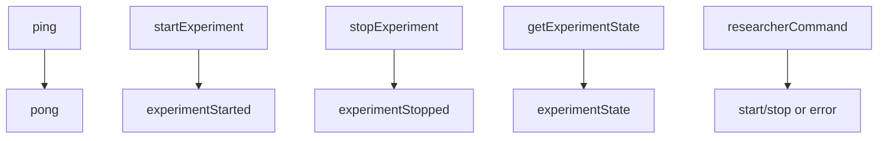
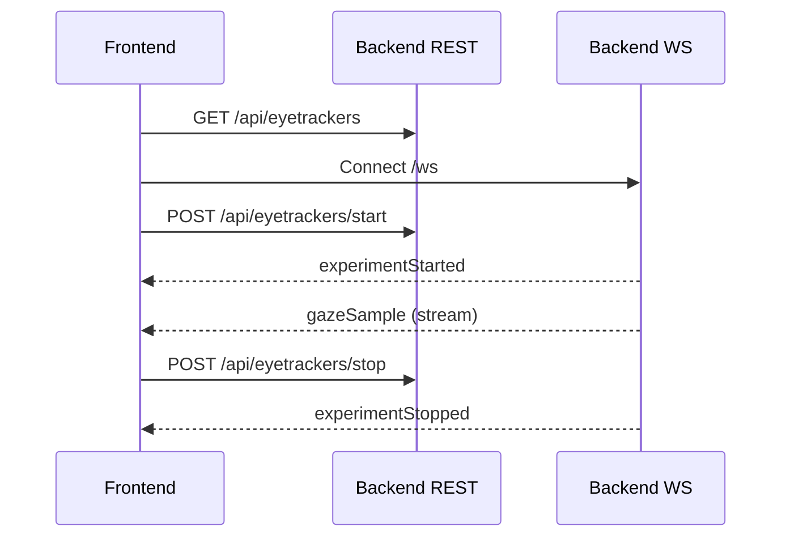

# Frontend Integration Guide

## Goal
Connect a frontend client to the backend to:

1. Discover available eye trackers.
2. Start/stop an experiment session.
3. Receive realtime gaze samples over WebSocket.

## Prerequisites
- Backend is running.
- Frontend can reach backend host/port.
- For real Tobii data: backend running on Windows with compatible Tobii device/SDK.

## Base URLs
Adjust for your environment:

- REST base: `https://<backend-host>:<port>/api`
- WebSocket base: `wss://<backend-host>:<port>/ws`

If running locally without TLS, use `http://` and `ws://`.

## Step 1: Discover Eye Trackers
Request:

```http
GET /api/eyetrackers
```

Example response:

```json
[
  {
    "name": "Tobii Pro Nano",
    "model": "IS5",
    "serialNumber": "TPN-12345"
  }
]
```

## Step 2: Open WebSocket Connection
Create one persistent WebSocket connection and keep it alive for the session.

Browser example:

```js
const ws = new WebSocket("wss://localhost:5001/ws");

ws.onopen = () => {
  console.log("WS connected");

  // optional keepalive
  ws.send(JSON.stringify({
    type: "ping",
    payload: {}
  }));

  // optional: ask current session snapshot
  ws.send(JSON.stringify({
    type: "getExperimentState",
    payload: {}
  }));
};

ws.onmessage = (event) => {
  const message = JSON.parse(event.data);
  const { type, sentAtUnixMs, payload } = message;

  switch (type) {
    case "gazeSample":
      // payload is GazeData
      // e.g., update UI/heatmap/store
      console.log("gaze", payload);
      break;

    case "experimentStarted":
    case "experimentStopped":
    case "experimentState":
      // payload is ExperimentSessionSnapshot
      console.log(type, payload);
      break;

    case "pong":
      console.log("pong", sentAtUnixMs);
      break;

    case "error":
      console.error("server error", payload);
      break;

    default:
      console.log("other", message);
  }
};

ws.onerror = (err) => console.error("WS error", err);
ws.onclose = () => console.log("WS closed");
```

## Step 3: Start Tracking
You can start through REST or WebSocket command.

REST option:

```http
POST /api/eyetrackers/start
```

WebSocket option:

```json
{
  "type": "startExperiment",
  "payload": {}
}
```

When started successfully, clients receive:

- `experimentStarted` snapshot
- then continuous `gazeSample` messages while session is active

## Step 4: Consume Gaze Data
Each realtime gaze message:

```json
{
  "type": "gazeSample",
  "sentAtUnixMs": 1740000000000,
  "payload": {
    "deviceTimeStamp": 123,
    "leftEyeX": 0.42,
    "leftEyeY": 0.51,
    "leftEyeValidity": "Valid",
    "rightEyeX": 0.44,
    "rightEyeY": 0.52,
    "rightEyeValidity": "Valid"
  }
}
```

Recommended client handling:

- Drop or flag samples with invalid eye validity.
- Buffer samples in memory by timestamp for charting.
- Throttle heavy rendering (for example every 50-100ms) to keep UI smooth.
- Keep raw stream in a store and compute derived metrics in selectors/workers.

## Step 5: Stop Tracking
REST option:

```http
POST /api/eyetrackers/stop
```

WebSocket option:

```json
{
  "type": "stopExperiment",
  "payload": {}
}
```

You should receive `experimentStopped` with final snapshot stats.

## Message Reference
### Client -> Server (`/ws`)


Envelope shape:

```json
{
  "type": "<messageType>",
  "payload": { }
}
```

### Server -> Client (`/ws`)
Envelope shape:

```json
{
  "type": "<messageType>",
  "sentAtUnixMs": 1740000000000,
  "payload": { }
}
```

## Minimal End-to-End Sequence


## Troubleshooting
- No gaze data but start succeeded:
  - Verify backend is on Windows with Tobii SDK/device.
  - Confirm frontend actually connected to `/ws` and receives non-gaze messages.
- WebSocket closes immediately:
  - Ensure URL uses correct scheme (`ws://` vs `wss://`) and host/port.
- Start fails:
  - Ensure at least one Tobii device is connected and discoverable.
- State looks stale:
  - Send `getExperimentState` over WebSocket to fetch latest snapshot.
