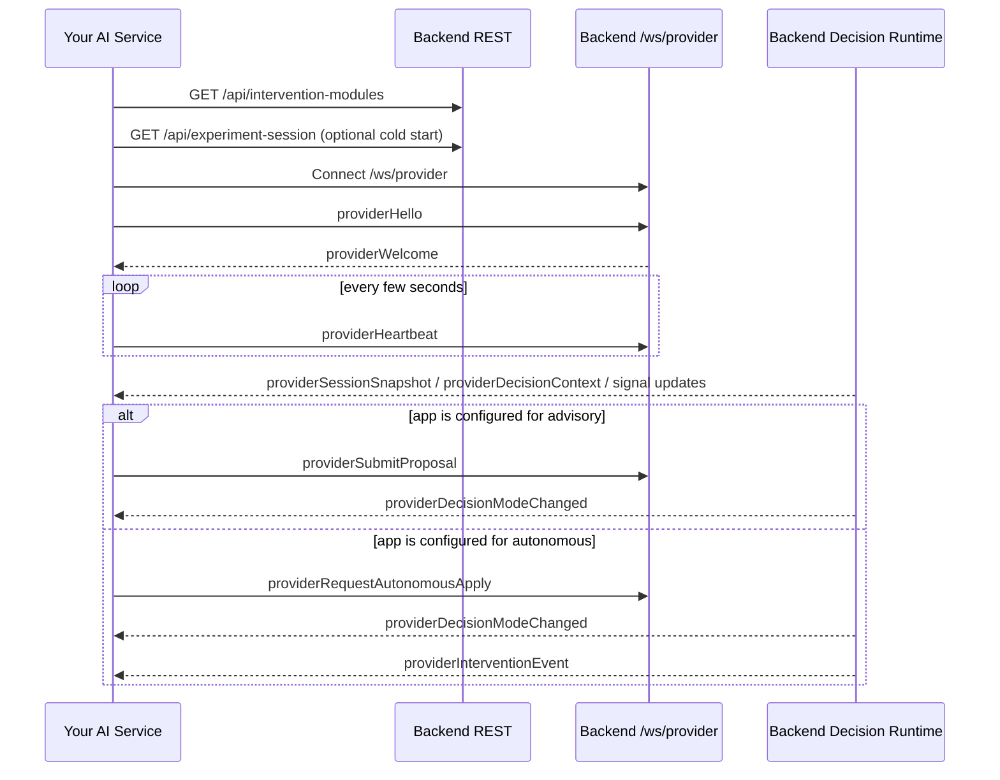

# External AI Provider Integration Guide

This document is the integration handoff for the other software team that wants to connect a real AI decision-maker to the Reading the Reader backend.

It describes:

- the boundary between your AI service and this app
- the transport interface and message contracts
- the backend-owned decision flow
- the intervention catalogue and validation expectations
- what is implemented now versus what is only reserved for later

## 1. Integration Boundary

There are two different realtime boundaries in this system:

- Browser clients use `/ws`
- External AI providers use `/ws/provider`

Do not reuse the browser protocol for the AI provider. The external provider is a separate actor with a separate contract.

Current backend role split:

- Reading The Reader backend remains the authority for experiment state, session lifecycle, decision lifecycle, intervention validation, and intervention application.
- Your AI module acts as an external decision provider.
- The frontend and researcher UI still approve, reject, or observe results through the normal app flow.

## 2. What Your AI Module Is Expected To Do

Your module should:

1. Open a WebSocket connection to `/ws/provider`.
2. Register itself with `providerHello`.
3. Keep the connection alive with `providerHeartbeat`.
4. Consume provider-facing session and reading signals from the backend.
5. Produce either:
   - `providerSubmitProposal` in `advisory` mode
   - `providerRequestAutonomousApply` in `autonomous` mode
6. Never apply interventions directly in the participant UI. The backend is the only authority that may create authoritative proposals or apply interventions.

## 3. Activation Flow

The external provider is only active when the backend decision configuration is set to:

- `providerId = "external"`
- `executionMode = "advisory"` or `executionMode = "autonomous"`

That configuration is changed through REST:

`PUT /api/experiment-session/decision-configuration`

Request body:

```json
{
  "conditionLabel": "External AI",
  "providerId": "external",
  "executionMode": "advisory",
  "automationPaused": false
}
```

Important:

- If the app is in `manual` or `rule-based`, your provider can still connect, but it will not receive the full external-decision runtime flow.
- The backend only publishes provider decision traffic when `providerId` is `external` and an active provider connection exists.

## 4. Discovery Endpoints You Should Use

Your provider should not hardcode intervention capabilities if it can avoid it.

### Get supported intervention modules

`GET /api/intervention-modules`

This returns the backend-supported module ids, parameter keys, types, ranges, and option lists.

Use this endpoint to align your model outputs with the backend's allowed intervention catalogue.

### Get current experiment session

`GET /api/experiment-session`

This returns the authoritative experiment snapshot, including:

- `sessionId`
- `isActive`
- `externalProviderStatus`
- `readingSession`
- `decisionConfiguration`
- `decisionState`

This endpoint is useful for diagnostics, manual recovery, or cold-start sanity checks.

## 5. Transport And Authentication

### WebSocket endpoint

- Local dev: `ws://localhost:5190/ws/provider`
- HTTPS dev/prod: `wss://<host>/ws/provider`

### Authentication

For the current implementation, provider authentication is a shared secret sent inside `providerHello.payload.authToken`.

Backend config:

- `ExternalProvider:SharedSecret`
- `ExternalProvider:HeartbeatTimeoutMilliseconds`

Current default code values:

- `SharedSecret = "change-me-local-provider-secret"`
- `HeartbeatTimeoutMilliseconds = 15000`

The backend currently allows only one active provider connection per backend instance.

## 6. Envelope Contract

Every provider message uses this envelope:

```json
{
  "type": "providerHello",
  "protocolVersion": "provider.v1",
  "providerId": "my-ai-provider",
  "sessionId": null,
  "correlationId": null,
  "sentAtUnixMs": 1710000000000,
  "payload": {}
}
```

### Envelope fields

- `type`: required message type
- `protocolVersion`: required, currently `provider.v1`
- `providerId`: provider identity when known
- `sessionId`: active experiment session id when relevant
- `correlationId`: correlation id for a decision request/response chain
- `sentAtUnixMs`: sender-side timestamp in Unix milliseconds
- `payload`: message-specific body

## 7. Implemented Provider Message Types

## Provider -> Backend

### `providerHello`

Send immediately after connecting.

```json
{
  "providerId": "my-ai-provider",
  "displayName": "My AI Provider",
  "protocolVersion": "provider.v1",
  "authToken": "shared-secret-here",
  "supportsAdvisoryExecution": true,
  "supportsAutonomousExecution": true,
  "supportedInterventionModuleIds": ["font-size", "line-height"]
}
```

Validation:

- `providerId` required
- `displayName` required
- `protocolVersion` must equal `provider.v1`
- `authToken` must match backend shared secret
- duplicate provider ids are rejected
- only one active provider is allowed

Backend response on success:

- `providerWelcome`

Backend response on failure:

- `providerError`
- connection closes

### `providerHeartbeat`

Send periodically after registration succeeds.

```json
{
  "providerId": "my-ai-provider",
  "protocolVersion": "provider.v1",
  "sentAtUnixMs": 1710000005000
}
```

Validation:

- provider must already be registered
- `providerId` must match the registered connection
- `protocolVersion` must equal `provider.v1`

### `providerSubmitProposal`

Use this only when the experiment is configured for external `advisory` mode.

```json
{
  "providerId": "my-ai-provider",
  "sessionId": "f0c2ce58-9249-489a-ae5f-4c5d8e2cb8b5",
  "correlationId": "ctx-1710000001234",
  "proposalId": "6b3d6d15-50b6-4d8e-b7a0-9d7885c2d31a",
  "executionMode": "advisory",
  "rationale": "Sustained fixation suggests a small font-size increase.",
  "signalSummary": "current token dwell time exceeded 1200 ms",
  "providerObservedAtUnixMs": 1710000001234,
  "proposedIntervention": {
    "moduleId": "font-size",
    "trigger": "attention-summary",
    "reason": "Increase font size to reduce local reading strain.",
    "presentation": {
      "fontFamily": null,
      "fontSizePx": 20,
      "lineWidthPx": null,
      "lineHeight": null,
      "letterSpacingEm": null,
      "editableByResearcher": null
    },
    "appearance": {
      "themeMode": null,
      "palette": null,
      "appFont": null
    },
    "parameters": {
      "fontSizePx": "20"
    }
  }
}
```

Backend behavior:

- validates provider registration and capability
- validates that external provider is the active decision provider
- validates that automation is not paused
- validates that the `sessionId` matches the active experiment session
- validates that backend execution mode is `advisory`
- validates the intervention payload against backend rules
- creates an authoritative pending proposal in backend state
- broadcasts proposal updates to the app UI

### `providerRequestAutonomousApply`

Use this only when the experiment is configured for external `autonomous` mode.

```json
{
  "providerId": "my-ai-provider",
  "sessionId": "f0c2ce58-9249-489a-ae5f-4c5d8e2cb8b5",
  "correlationId": "ctx-1710000002234",
  "executionMode": "autonomous",
  "rationale": "Current state matches the provider rule for autonomous adaptation.",
  "signalSummary": "current token dwell time exceeded 1200 ms",
  "providerObservedAtUnixMs": 1710000002234,
  "requestedIntervention": {
    "moduleId": "font-size",
    "trigger": "attention-summary",
    "reason": "Increase font size to reduce local reading strain.",
    "presentation": {
      "fontFamily": null,
      "fontSizePx": 20,
      "lineWidthPx": null,
      "lineHeight": null,
      "letterSpacingEm": null,
      "editableByResearcher": null
    },
    "appearance": {
      "themeMode": null,
      "palette": null,
      "appFont": null
    },
    "parameters": {
      "fontSizePx": "20"
    }
  }
}
```

Backend behavior:

- validates provider registration and autonomous capability
- validates that external provider is active
- validates that execution mode is `autonomous`
- validates session id and intervention payload
- applies the intervention through backend runtime rules
- records proposal history as `auto-applied`
- emits updated session, intervention, and decision-state messages

### `providerError`

Use this when your provider wants to report an internal degraded state or failure.

```json
{
  "providerId": "my-ai-provider",
  "code": "inference-timeout",
  "message": "The provider exceeded its inference timeout.",
  "detail": "Falling back to no-op decisions until the model recovers."
}
```

Current backend behavior:

- stores the latest provider error in the provider registry
- does not currently emit a dedicated provider-status event back to the provider

## Backend -> Provider

### `providerWelcome`

Sent after successful registration.

```json
{
  "providerId": "my-ai-provider",
  "displayName": "My AI Provider",
  "acceptedProtocolVersion": "provider.v1",
  "status": "active",
  "registeredAtUnixMs": 1710000000000,
  "heartbeatTimeoutMilliseconds": 15000
}
```

### `providerSessionSnapshot`

Sent when the backend publishes a full authoritative session snapshot to the provider.

Current implementation emits this when relevant session state changes while the external provider path is active, including:

- reading session configuration updates
- decision configuration changes
- experiment start
- experiment finish/reset/stop paths that publish updated snapshots

Important:

- The current implementation does not automatically send a full snapshot immediately after `providerWelcome`.
- If your provider needs an initial snapshot, either wait for the first published snapshot or call `GET /api/experiment-session` once after registration.

Payload type:

- full `ExperimentSessionSnapshot`

### `providerDecisionContext`

Sent when the backend evaluates the external decision strategy.

Payload type:

- `DecisionContextSnapshot`

This is the main input your AI should respond to.

Current payload fields:

- `sessionId`
- `conditionLabel`
- `providerId`
- `executionMode`
- `automationPaused`
- `isSessionActive`
- `startedAtUnixMs`
- `stoppedAtUnixMs`
- `presentation`
- `appearance`
- `focus`
- `attentionSummary`
- `participantViewport`
- `recentInterventions`

### `providerGazeSample`

Sent with authoritative gaze samples when the external provider path is active.

Payload type:

- `GazeData`

### `providerReadingFocusChanged`

Sent when reading focus changes.

Payload type:

- `ReadingFocusSnapshot`

### `providerViewportChanged`

Sent when participant viewport changes.

Payload type:

- `ParticipantViewportSnapshot`

### `providerAttentionSummaryChanged`

Sent when the backend receives an updated attention summary.

Payload type:

- `ReadingAttentionSummarySnapshot`

### `providerInterventionEvent`

Sent when an intervention is applied and recorded by the backend.

Payload type:

- `InterventionEventSnapshot`

### `providerDecisionModeChanged`

Sent when decision configuration or decision runtime state changes.

Payload type:

- `DecisionRealtimeUpdateSnapshot`

This includes:

- `decisionConfiguration`
- `decisionState`

## 8. Reserved But Not Reliably Emitted Yet

These message types exist in the protocol constants but should be treated as reserved for future expansion, not as guaranteed runtime behavior today:

- `providerSessionStateChanged`
- `providerStatusChanged`

Do not build a hard dependency on receiving these in the current version.

## 9. Current Decision Flow

This is how the current runtime works when `providerId = "external"`.

```mermaid
sequenceDiagram
    participant Participant as Participant UI (/ws)
    participant Backend as Reading The Reader Backend
    participant Provider as External AI (/ws/provider)
    participant Researcher as Researcher UI

    Participant->>Backend: viewport / focus / attention updates
    Backend->>Provider: providerViewportChanged
    Backend->>Provider: providerReadingFocusChanged
    Backend->>Provider: providerAttentionSummaryChanged
    Backend->>Provider: providerGazeSample
    Backend->>Provider: providerDecisionContext

    alt advisory mode
        Provider->>Backend: providerSubmitProposal
        Backend->>Backend: validate + create pending proposal
        Backend->>Researcher: decisionProposalChanged
        Researcher->>Backend: approveDecisionProposal / rejectDecisionProposal
        Backend->>Participant: interventionEvent or proposal rejection update
        Backend->>Provider: providerDecisionModeChanged
        Backend->>Provider: providerInterventionEvent
    else autonomous mode
        Provider->>Backend: providerRequestAutonomousApply
        Backend->>Backend: validate + apply intervention
        Backend->>Participant: interventionEvent
        Backend->>Researcher: decisionProposalChanged
        Backend->>Provider: providerDecisionModeChanged
        Backend->>Provider: providerInterventionEvent
    end
```

## 10. Recommended Integration Flow For Your Team

This is how your AI service should connect to the app.



## 11. Intervention Contract

An intervention sent by the provider contains:

- optional `moduleId`
- required `trigger`
- required `reason`
- `presentation` patch
- `appearance` patch
- optional `parameters`

The backend maps this to an internal `ApplyInterventionCommand`.

### Supported built-in module ids

Current built-in module ids:

- `font-family`
- `font-size`
- `line-width`
- `line-height`
- `letter-spacing`
- `theme-mode`
- `palette`
- `participant-edit-lock`

### Important rule

If you send `moduleId` and `parameters`, they must be valid according to the backend intervention module catalogue. The backend validates those values before accepting the proposal or apply request.

Examples of current constraints:

- `font-size`: integer between `14` and `28`
- `line-width`: integer between `520` and `920`
- `line-height`: number between `1.2` and `2.2`
- `letter-spacing`: number between `0` and `0.12`
- `theme-mode`: `light` or `dark`
- `palette`: `default`, `sepia`, or `high-contrast`

The exact source of truth is `GET /api/intervention-modules`.

## 12. Backend Validation Rules

Your provider messages will be rejected if any of these fail:

- unsupported protocol version
- missing required payload fields
- invalid shared secret
- provider id does not match the registered connection
- advisory command sent by a provider that does not support advisory mode
- autonomous command sent by a provider that does not support autonomous mode
- external provider is not the active decision provider
- decision automation is paused
- no active experiment session exists
- `sessionId` does not match the active session
- command `executionMode` does not match the backend execution mode
- intervention payload is invalid for the backend intervention runtime

On provider command rejection, the backend returns `providerError`.

## 13. Status Values You Should Expect

### Decision provider ids

- `manual`
- `rule-based`
- `external`

### Execution modes

- `advisory`
- `autonomous`

### Proposal statuses

- `pending`
- `approved`
- `rejected`
- `auto-applied`
- `superseded`
- `expired`

## 14. Recommended Provider Implementation Rules

- Treat the backend as authoritative. Your service should suggest, not own, session truth.
- Preserve `correlationId` across your internal inference pipeline so logs can be matched later.
- Use backend `sessionId` exactly as received. Do not invent your own session ids.
- Prefer `GET /api/intervention-modules` for capability discovery instead of hardcoding parameter schemas.
- Be tolerant of receiving partial signal updates before a fresh full snapshot.
- Keep heartbeats running even while no decision is currently being produced.
- If your model is degraded, send `providerError` and stop proposing interventions until healthy again.

## 15. What Is Not In Scope Yet

The current implementation does not yet guarantee:

- stale-heartbeat timeout enforcement that automatically degrades provider state
- a dedicated provider status event stream back to the provider
- replay/export preservation of every provider-side correlation field
- automatic initial `providerSessionSnapshot` immediately after registration

Those should be treated as future improvements, not current contract guarantees.
